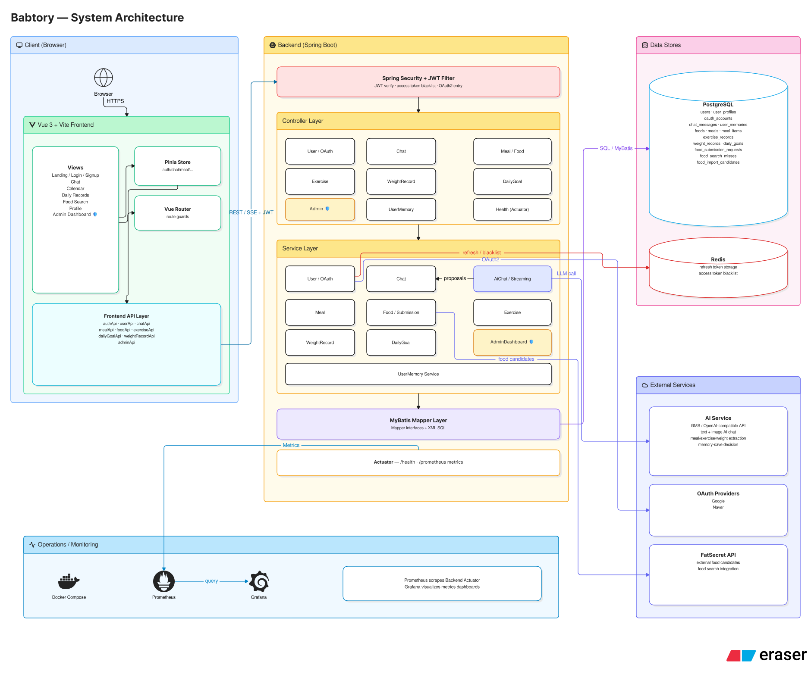
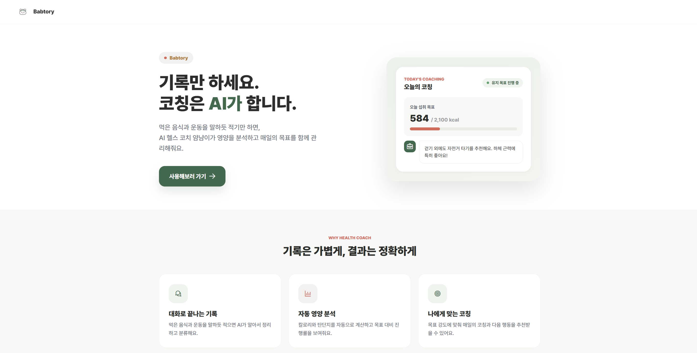
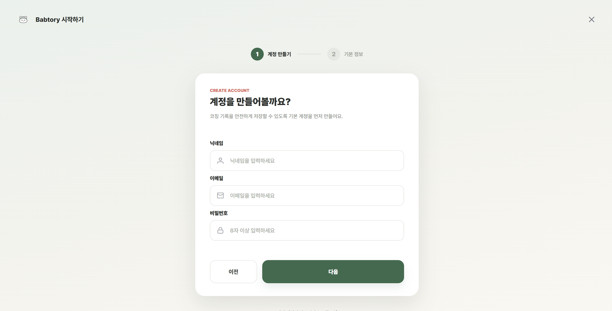
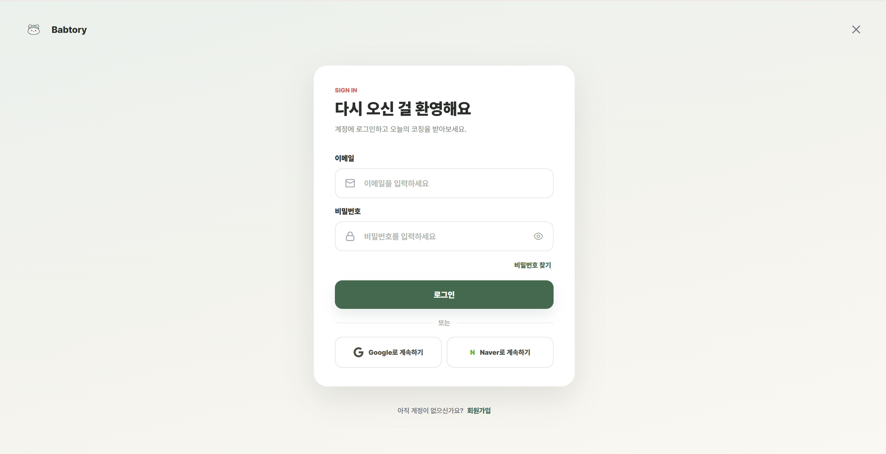
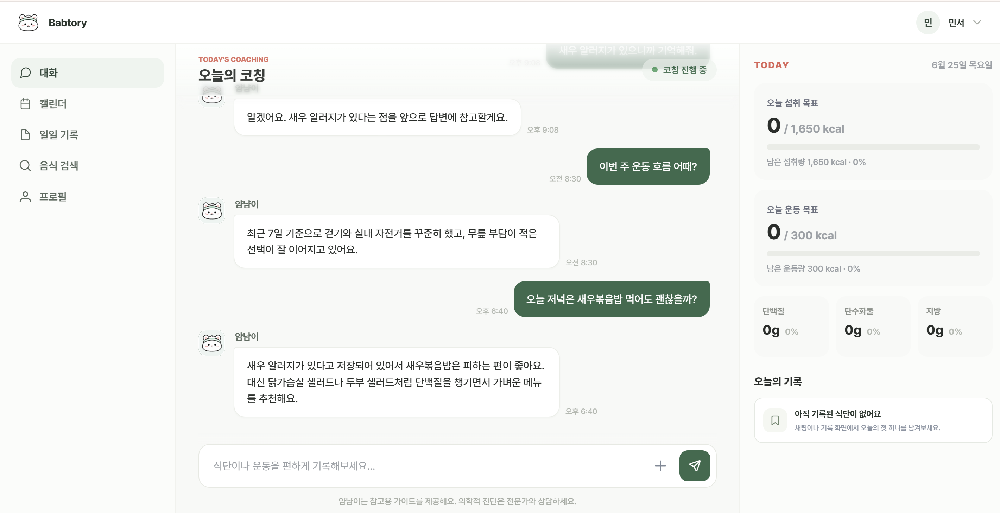
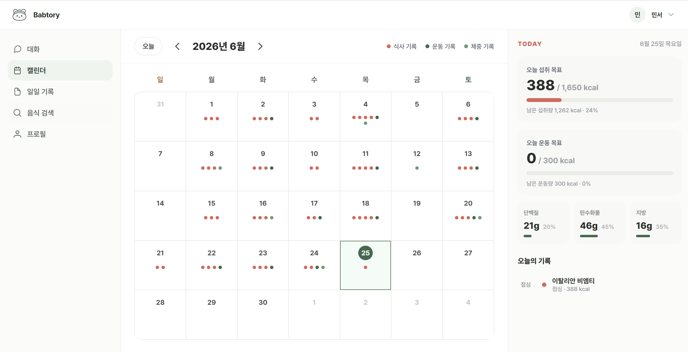
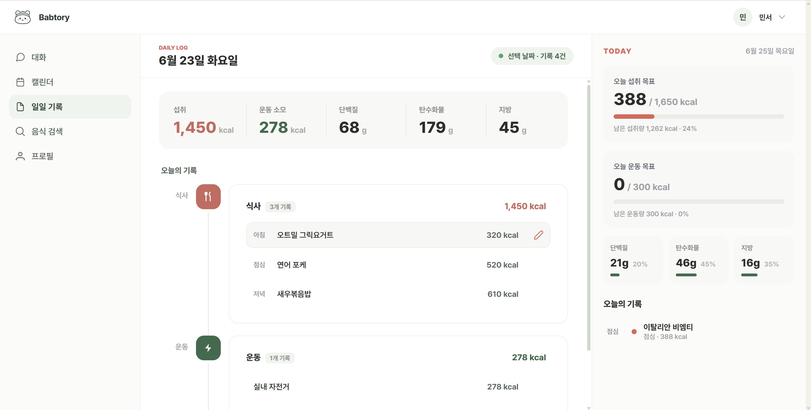
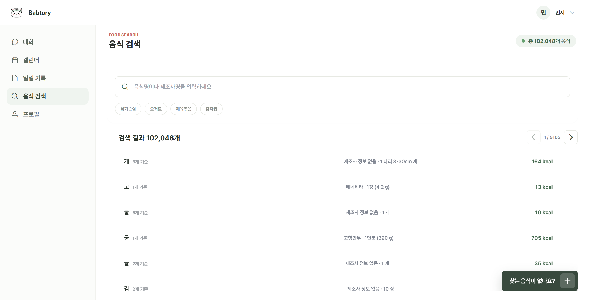
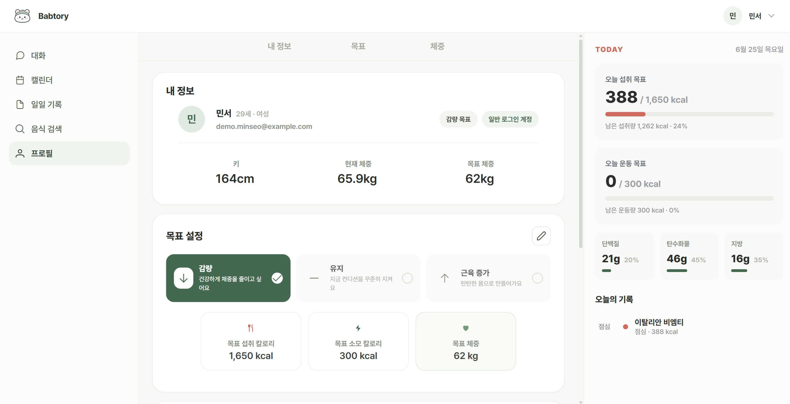
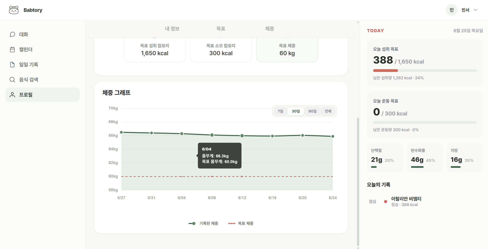

# Babtory

Babtory는 사용자의 식단, 운동, 체중, 건강 프로필을 기록하고 AI 채팅을 통해 개인 맞춤형 건강 코칭과 기록 제안을 제공하는 서비스입니다.

사용자는 대화하듯 건강 상태를 입력하고, AI가 추출한 식단/운동/체중 제안을 확인한 뒤 실제 기록으로 저장할 수 있습니다. 관리자는 사용자 음식 등록 요청과 외부 음식 후보를 검토해 음식 데이터를 보강합니다.

## 목차

- [Babtory](#babtory)
  - [목차](#목차)
  - [프로젝트 소개](#프로젝트-소개)
  - [주요 기능](#주요-기능)
  - [기술 스택](#기술-스택)
    - [Frontend](#frontend)
    - [Backend](#backend)
    - [Database \& Runtime](#database--runtime)
    - [Monitoring](#monitoring)
    - [External APIs](#external-apis)
  - [시스템 아키텍처](#시스템-아키텍처)
  - [화면 예시](#화면-예시)
    - [랜딩페이지](#랜딩페이지)
    - [회원가입](#회원가입)
    - [로그인](#로그인)
    - [대화](#대화)
    - [캘린더](#캘린더)
    - [일일기록](#일일기록)
    - [음식검색](#음식검색)
    - [프로필](#프로필)
  - [실행 방법](#실행-방법)
    - [1. 환경 변수 준비](#1-환경-변수-준비)
    - [2. Docker Compose 실행](#2-docker-compose-실행)
    - [3. 접속 주소](#3-접속-주소)
    - [4. 종료](#4-종료)
  - [환경 변수](#환경-변수)
  - [프로젝트 구조](#프로젝트-구조)
  - [주요 문서](#주요-문서)
  - [기대효과](#기대효과)
  - [발전방향](#발전방향)

## 프로젝트 소개

Babtory는 건강 기록을 꾸준히 남기기 어렵다는 문제를 대화형 입력과 AI 제안 확정 흐름으로 풀어내는 개인 건강 코칭 서비스입니다.

사용자는 식단, 운동, 체중을 직접 기록할 수도 있고, AI 채팅에서 자연어 또는 이미지를 통해 기록 후보를 생성할 수도 있습니다. 월간 캘린더와 일별 기록 화면에서는 식단, 운동, 체중 기록을 함께 확인하고 관리할 수 있습니다.

## 주요 기능

| 구분 | 기능 |
| --- | --- |
| 회원/인증 | 이메일 회원가입, 로그인, OAuth 로그인, 로그아웃, 토큰 기반 인증 |
| 프로필 | 건강 프로필 조회/수정, 현재 사용자 정보 조회 |
| AI 채팅 | 텍스트 AI 채팅, 이미지 AI 채팅, 스트리밍 응답, 채팅 이력 조회 |
| AI 기록 제안 | 식단/운동/체중 정보 추출, AI 제안 확인 후 실제 기록 저장 |
| 일일 목표 | 목표 유형별 권장 목표 추천, 일일 목표 확정/수정, 목표 진행률 조회 |
| 식단 | 식단 작성/수정/삭제, 일일 식단 조회, 월간 식단 조회 |
| 운동 | 운동 종목 검색, 운동 기록 작성/수정/삭제, 일일/월간 운동 기록 조회 |
| 체중 | 체중 기록 저장/수정/삭제, 체중 기록 조회, 현재 체중 동기화 |
| 음식 | 음식 검색, 식단 입력용 음식 후보 검색, 음식 검색 실패 기록, 음식 등록 요청 |
| 관리자 | 음식 등록 요청 조회/승인/반려, 외부 음식 후보 조회/승인/반려, 관리자 대시보드 |
| 운영 | 헬스 체크, Prometheus 메트릭, Grafana 대시보드 |

## 기술 스택

### Frontend


### Backend


### Database & Runtime


### Monitoring


### External APIs


## 시스템 아키텍처



## 화면 예시

### 랜딩페이지



### 회원가입



### 로그인



### 대화



### 캘린더



### 일일기록



### 음식검색



### 프로필





## 실행 방법

### 1. 환경 변수 준비

루트 디렉터리에 `.env` 파일을 생성하고 필요한 값을 설정합니다. 실제 secret 값은 README나 Git 저장소에 기록하지 않습니다.

```env
JWT_SECRET=
GMS_API_KEY=
GOOGLE_CLIENT_ID=
GOOGLE_CLIENT_SECRET=
NAVER_CLIENT_ID=
NAVER_CLIENT_SECRET=
FATSECRET_CLIENT_ID=
FATSECRET_CLIENT_SECRET=
OAUTH_SUCCESS_REDIRECT_URL=
OAUTH_FAILURE_REDIRECT_URL=
VITE_API_BASE_URL=
```

### 2. Docker Compose 실행

```bash
docker compose up -d --build
```

### 3. 접속 주소

| 서비스 | 주소 |
| --- | --- |
| Frontend | `http://localhost:5173` |
| Backend | `http://localhost:8080` |
| Swagger UI | `http://localhost:8080/swagger-ui.html` |
| Prometheus | `http://localhost:9090` |
| Grafana | `http://localhost:3000` |

### 4. 종료

```bash
docker compose down
```

DB 볼륨까지 삭제하고 다시 초기화해야 할 때는 다음 명령을 사용합니다.

```bash
docker compose down -v
docker compose up -d --build
```

## 환경 변수

| 변수명 | 설명 |
| --- | --- |
| `JWT_SECRET` | JWT 서명에 사용하는 비밀키 |
| `GMS_API_KEY` | AI API 연동 키 |
| `GOOGLE_CLIENT_ID` | Google OAuth Client ID |
| `GOOGLE_CLIENT_SECRET` | Google OAuth Client Secret |
| `NAVER_CLIENT_ID` | Naver OAuth Client ID |
| `NAVER_CLIENT_SECRET` | Naver OAuth Client Secret |
| `FATSECRET_CLIENT_ID` | FatSecret API Client ID |
| `FATSECRET_CLIENT_SECRET` | FatSecret API Client Secret |
| `OAUTH_SUCCESS_REDIRECT_URL` | OAuth 성공 후 프론트엔드 리다이렉트 URL |
| `OAUTH_FAILURE_REDIRECT_URL` | OAuth 실패 후 프론트엔드 리다이렉트 URL |
| `VITE_API_BASE_URL` | 프론트엔드 빌드 시 사용할 API Base URL |

## 프로젝트 구조

```text
Babtory/
├── frontend/              # Vue/Vite 프론트엔드
├── backend/               # Spring Boot 백엔드
├── data/                  # 음식 데이터, 데이터 임포터, 실험 데이터
├── monitoring/            # Prometheus, Grafana 설정
├── docs/
│   └── planning/          # 요구사항, 다이어그램, 화면 설계 문서
├── scripts/               # 프로젝트 검증 스크립트
├── docker-compose.yml
└── README.md
```

## 주요 문서

| 문서 | 설명 |
| --- | --- |
| [요구사항 정의서](docs/planning/requirements.md) | 기능/비기능 요구사항 정리 |
| [Use-case Diagram](docs/planning/use-case-diagram.md) | Actor와 기능 단위 Use-case 정리 |
| [화면 설계서](docs/planning/screen-design.md) | 화면 목록, 상세 설계, 와이어프레임, 요구사항 매핑 |
| [시스템 아키텍처](docs/planning/assets/readme/system-architecture.svg) | 전체 시스템 구성 이미지 |
| [ERD](docs/planning/assets/readme/erd.png) | 전체 테이블 구조 이미지|

## 기대효과

- 대화 기반 건강 기록으로 사용자의 입력 부담을 줄일 수 있습니다.
- AI 제안 확정 흐름을 통해 기록 편의성과 정확도를 함께 높일 수 있습니다.
- AI의 사용자 정보 기반 답변 생성 기능을 통해 사용자 개개인에게 알맞은 식단과 운동을 추천받을 수 있습니다.
- 식단, 운동, 체중, 목표를 통합 관리하여 자기 관리 지속성을 높일 수 있습니다.
- 음식 검색 실패 기록과 관리자 승인 흐름으로 음식 데이터 품질을 점진적으로 개선할 수 있습니다.
- 헬스 체크, Prometheus, Grafana 기반 모니터링으로 운영 안정성을 확보할 수 있습니다.

## 발전방향

- 식단/운동 추천 알고리즘 개선
- 모바일 화면 사용성 개선
- 음식 데이터 자동 수집 및 검수 프로세스 강화
- 알림/리마인더 기능 추가
- 장기 건강 리포트와 통계 기능 확장
