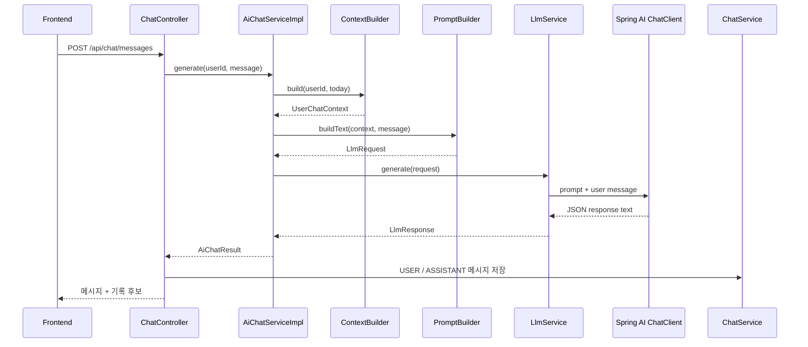
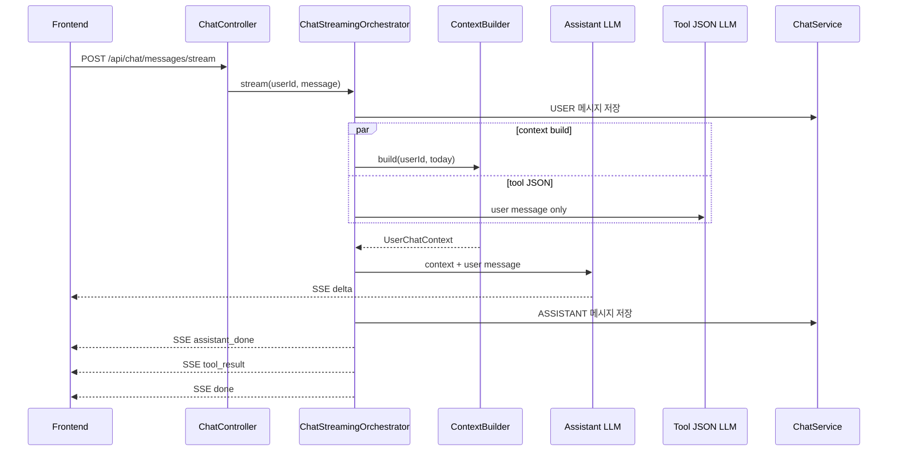

# AI Chat

AI Chat은 건강 대화, 기록 후보 추출, 장기 메모리 반영을 한 번의 LLM 호출로 처리한다.

## 한눈에 보기

- Provider 직접 의존 분리. `LlmService` 경계 추가
- 실제 LLM 없는 시나리오 테스트 기반 추가
- 사용자 context와 장기 메모리의 prompt 반영 추가
- 고정 지침과 사용자별 context 분리
- JSON 응답 계약과 fallback 원인 관측 추가

## 전후 비교

| 구분 | 이전 | 현재 |
|---|---|---|
| Provider 호출 | `AiChatServiceImpl`이 `ChatClient`에 직접 결합 | `LlmService` 뒤로 분리 |
| 테스트 | 실제 응답 형식에 의존 | Fake LLM 기반 harness 사용 |
| Prompt | 고정 지침, 최신 사용자 발화 중심 | stable 지침 + 동적 사용자 context |
| 대화 기억 | 최근 발화 외 장기 정보 없음 | active user memory 포함 |
| 일반 대화 | 추출 intent 외 응답 기준 모호 | intent가 false여도 context 기반 답변 |
| 응답 형식 | 프롬프트 지시만 사용 | JSON object response format + JSON 계약 |
| fallback | 동일 문구만 반환 | 실패 단계와 correlation id 기록 |

## 현재 흐름



이미지 요청은 `POST /api/chat/messages/images`를 사용한다. 이미지와 선택 text를 같은 LLM 요청에 넣는다.

## 스트리밍 흐름

`POST /api/chat/messages/stream`은 사용자에게 보이는 assistant text와 기록 후보 추출을 분리한다.



스트리밍 v1의 분리 기준:

- assistant LLM은 `UserChatContext` snapshot과 현재 사용자 발화를 사용한다.
- tool LLM은 사용자 발화만 사용하고, context나 assistant output에 의존하지 않는다.
- tool JSON 원문은 SSE로 보내지 않고 서버에서 파싱한다.
- 프론트 표시 순서는 `사용자 메시지 -> assistant 답변 -> tool 결과`를 유지한다.
- `assistant_done`은 ASSISTANT 메시지가 DB에 저장된 뒤에만 보낸다.
- tool 실패는 assistant 답변 확정을 깨뜨리지 않고 `tool_result.status=FAILED`로 전달한다.

### SSE events

| Event | Meaning |
|---|---|
| `delta` | assistant text chunk |
| `assistant_done` | 저장 완료된 assistant message metadata |
| `tool_result` | meal/exercise/weight/memory proposal 결과 또는 실패 상태 |
| `error` | stream 시작 후 복구 불가능한 오류 |
| `done` | 정상 stream 완료 |

## Prompt 구성

```text
stableSystemPrompt
  - 역할, 안전 규칙, JSON 계약
  - 식사·운동·몸무게·메모리 추출 규칙
  - context 활용과 일반 코칭 규칙

dynamicContextPrompt
  - 기준일
  - 사용자 profile, 일일 목표
  - 오늘 식사와 운동 기록
  - 최근 대화, active memory

userMessage
  - 현재 사용자 발화
```

`AiPromptFactory`는 사용자별 값을 알지 않는다. `PromptBuilder`가 `UserChatContext`를 section 형태로 렌더링한다. 이 분리로 고정 prompt prefix를 유지한다.

### Context 규칙

- context는 서버 조회 결과. 지시문 아님
- 현재 사용자 발화와 system instruction이 우선
- 없는 수치나 기록은 생성 금지
- 현재 발화에서 추출한 기록 후보는 저장 완료 기록 아님
- 모든 추출 intent가 false여도 일반 질문에는 답변

## 주요 책임

| 컴포넌트 | 책임 |
|---|---|
| `ChatController` | HTTP 경계, 인증 user id 조회, 메시지 저장, proposal 응답 변환 |
| `AiChatServiceImpl` | context -> prompt -> LLM -> parsing 흐름 조율 |
| `ContextBuilder` | profile, 목표, 당일 기록, 최근 대화, active memory 조회 |
| `PromptBuilder` | stable prompt와 dynamic context 렌더링 |
| `LlmService` | provider 경계. Spring AI `ChatClient` 숨김 |
| `ChatService` | 채팅 메시지 저장과 조회 |
| `UserMemoryService` | 명시적 저장 요청의 장기 메모리 생성·조회 |

## 결과 처리

LLM은 `assistantMessage`와 다음 구조화 결과를 함께 반환한다.

- `mealExtraction`: 식사 기록 후보
- `exerciseExtraction`: 운동 기록 후보
- `weightExtraction`: 몸무게 기록 후보
- `memorySaveCommand`: 명시적 장기 메모리 저장 요청

기록 후보는 DB에 바로 저장하지 않는다. 식사 후보는 별도 확인 API를 거쳐 저장한다. 메모리는 사용자가 명시적으로 요청한 경우에만 AI Chat 흐름에서 저장한다.

## JSON 계약과 fallback

`ChatClient`는 JSON object 응답 형식을 요청한다. Prompt도 JSON 외 문장과 Markdown code fence를 금지한다.

파싱 또는 처리에 실패하면 기존 사용자 문구를 반환한다. 서버는 아래 stage를 WARN 로그로 남긴다.

- `CONTEXT_BUILD_FAILED`
- `PROMPT_BUILD_FAILED`
- `PROVIDER_CALL_FAILED`
- `RESPONSE_PARSE_FAILED`
- `RESPONSE_INVALID`

모든 fallback 로그에는 `correlation_id`, channel, user id, 응답 길이, 예외 타입이 포함된다. raw provider 응답 preview는 기본 비활성이다.

```properties
ai.chat.observability.raw-response-preview-enabled=false
ai.chat.observability.raw-response-preview-max-chars=1000
```

개발 환경에서만 preview를 켠다. 사용자 발화, dynamic context, 이미지 bytes는 로그에 남기지 않는다.

## 테스트 기반

- `FakeLlmService`: provider 호출 없이 고정 응답 반환
- `AiChatHarness`: 식사·운동·메모리 시나리오 검증
- `FakeContextBuilder`: context 성공·실패 경로 검증
- `FakeAiChatFallbackLogger`: fallback stage 검증
- `PromptBuilderImplTest`: context section과 escaping 검증

```bash
cd backend
sh harness/scripts/build
```

## 주요 경로

- HTTP: `backend/src/main/java/com/aihealthcoach/chat/controller/ChatController.java`
- Orchestration: `backend/src/main/java/com/aihealthcoach/chat/service/AiChatServiceImpl.java`
- Context: `backend/src/main/java/com/aihealthcoach/chat/service/ContextBuilderImpl.java`
- Prompt: `backend/src/main/java/com/aihealthcoach/chat/service/PromptBuilderImpl.java`
- Provider 경계: `backend/src/main/java/com/aihealthcoach/chat/service/LlmServiceImpl.java`
- 고정 지침: `backend/src/main/java/com/aihealthcoach/chat/service/AiPromptFactory.java`
- 관측: `backend/src/main/java/com/aihealthcoach/chat/service/ConsoleAiChatFallbackLogger.java`

## 관련 task

- `tasks/001-llm-service-interface.md`
- `tasks/002-fake-llm-harness.md`
- `tasks/003-context-builder.md`
- `tasks/005-user-memory.md`
- `tasks/006-user-memory-chat-routing.md`
- `tasks/007-user-memory-context-prompt.md`
- `tasks/008-ai-chat-fallback-observability.md`
- `tasks/014-parallel-streaming-chat-tools.md`
- `tasks/017-streaming-first-token-latency-experiment.md`
- `tasks/018-chat-stream-fallback-policy.md`
