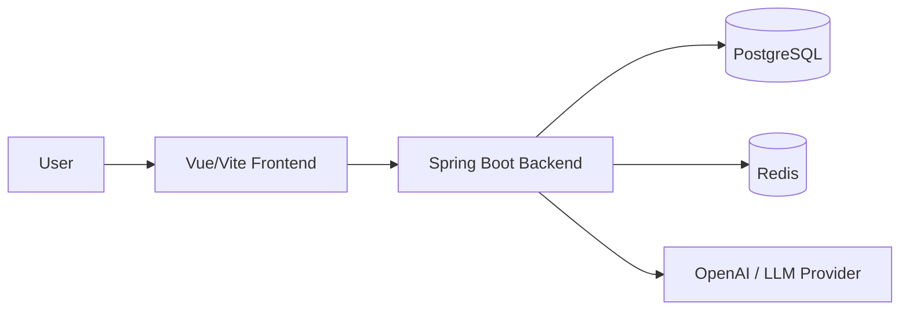
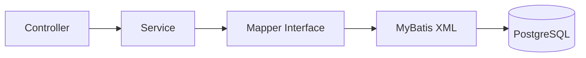
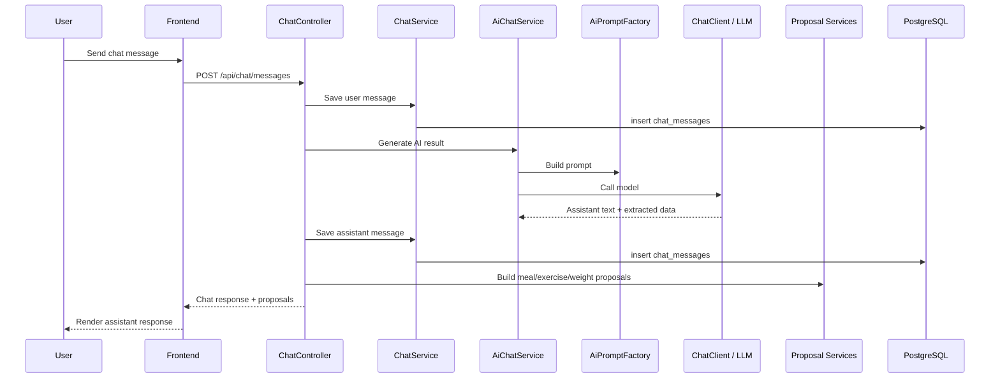
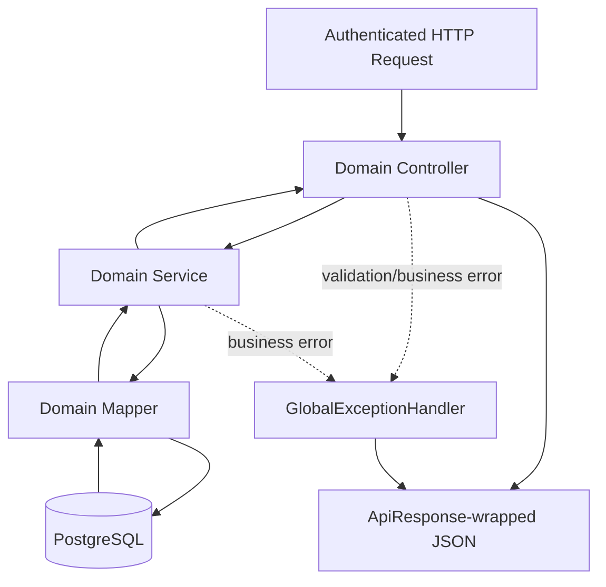

# Architecture

This is the high-level map of how requests move through AI Health Coach. Keep detailed feature decisions in feature docs.

## Application Shape

- Frontend: Vue/Vite
- Backend: Spring Boot
- DB: PostgreSQL
- Cache/session support: Redis
- AI: Chat flow currently uses `AiChatService -> ChatClient`; future LLM boundaries should stay behind service abstractions.

## Backend Layer Rule

Controller handles the HTTP boundary, Service owns business flow, Mapper owns database access.

## AI Chat High-Level Flow

Current chat flow records the user message, calls AI, saves the assistant message, and returns chat plus extracted proposals.

## Domain API Shape

Most feature APIs follow the same broad path.

