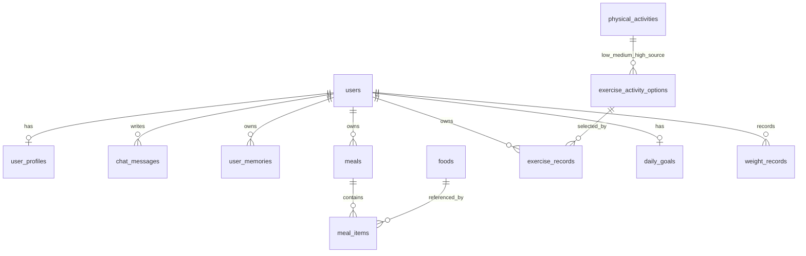

# Domain Map

This document connects product domains to database tables, backend packages, and frontend areas. Use it to decide where to look before changing a feature.

## Domain Ownership

| Domain | Main tables | Backend package | Frontend area | Notes |
|---|---|---|---|---|
| User/Auth | `users`, `user_profiles` | `backend/src/main/java/com/aihealthcoach/user/`, `backend/src/main/java/com/aihealthcoach/common/auth/` | `frontend/src/views/auth/`, `frontend/src/views/profile/`, `frontend/src/stores/authStore.js`, `frontend/src/stores/profileStore.js` | `userId` comes from authenticated context. Profiles are one-to-one with users. |
| Chat | `chat_messages` | `backend/src/main/java/com/aihealthcoach/chat/` | `frontend/src/views/chat/`, `frontend/src/components/chat/`, `frontend/src/stores/chatStore.js` | Stores natural-language user and assistant turns. Roles are `USER` or `ASSISTANT`. |
| Meal | `meals`, `meal_items`, `foods` | `backend/src/main/java/com/aihealthcoach/meal/` | `frontend/src/views/records/`, `frontend/src/views/calendar/`, `frontend/src/views/foods/`, `frontend/src/stores/mealStore.js`, `frontend/src/stores/foodStore.js` | Meals are unique by user, meal type, and calendar date. Food rows are shared master data. |
| Food | `foods` | `backend/src/main/java/com/aihealthcoach/meal/` | `frontend/src/views/foods/`, `frontend/src/api/foodApi.js`, `data/foods/` | Food belongs to the meal package today. Search groups serving rows by `source_key`. |
| Exercise | `exercise_records`, `exercise_activity_options`, `physical_activities` | `backend/src/main/java/com/aihealthcoach/exercise/` | `frontend/src/views/records/`, `frontend/src/views/calendar/`, `frontend/src/stores/exerciseStore.js`, `data/exercise/` | Users select a DB-backed activity option and intensity. `physical_activities` stores Compendium source rows. |
| Weight | `weight_records`, `user_profiles.current_weight_kg` | `backend/src/main/java/com/aihealthcoach/weight/`, `backend/src/main/java/com/aihealthcoach/user/` | `frontend/src/views/profile/`, `frontend/src/components/profile/`, `frontend/src/stores/weightRecordStore.js` | One weight record per user per date. Latest weight can influence exercise calorie calculation. |
| Daily Goal | `daily_goals` | `backend/src/main/java/com/aihealthcoach/dailygoal/` | `frontend/src/components/chat/DailyGoalSetupCard.vue`, `frontend/src/stores/dailyGoalStore.js` | One active goal row per user. Goal type values mirror profile goal types. |
| API Response/Error | none | `backend/src/main/java/com/aihealthcoach/common/response/`, `backend/src/main/java/com/aihealthcoach/common/error/` | `frontend/src/api/apiClient.js` | Successful DTO responses are wrapped by `ApiResponseAdvice`; errors go through `GlobalExceptionHandler` or security handlers. |
| User Memory | `user_memories` | `backend/src/main/java/com/aihealthcoach/memory/` | planned: chat/profile | Stores user-provided memory text. Active rows are later consumed by AI Chat context work. |

## Table Relationships

## Table Notes

| Table | Owner domain | Important constraints / use |
|---|---|---|
| `users` | User/Auth | Unique email. Root user identity table. |
| `user_profiles` | User/Profile | Unique `user_id`; stores height, current weight, target weight, goal type, gender, and age. |
| `chat_messages` | Chat | `role` is constrained to `USER` or `ASSISTANT`; stores message text and timestamp. |
| `user_memories` | User Memory | Stores user-provided text with soft deactivation through `is_active`; active rows are ordered by most recent update. |
| `foods` | Food/Meal | Shared food master data; unique by `source_key` and generated `serving_key`; nutrients must be non-negative when present. |
| `meals` | Meal | Unique by `user_id`, `meal_type`, and `meal_date`; meal type is `BREAKFAST`, `LUNCH`, `DINNER`, or `SNACK`. |
| `meal_items` | Meal | Join table between meals and foods; quantity must be positive. |
| `physical_activities` | Exercise source data | Raw Compendium-style activity rows with code, version, heading, MET value, and description. |
| `exercise_activity_options` | Exercise selection | User-facing activity options with low/medium/high source activities and MET values. |
| `exercise_records` | Exercise | User exercise log with option, intensity, date, duration, calories, and memo. |
| `daily_goals` | Daily Goal | Unique `user_id`; stores calorie intake and exercise calorie goals. |
| `weight_records` | Weight | Unique by `user_id` and `record_date`; weight must be positive and <= 500kg. |

## Where To Change

| Change type | Start here |
|---|---|
| Add or change a backend endpoint | Domain `controller/`, then `service/`, then mapper/XML only if persistence changes. |
| Change a DB query | Domain `mapper/*Mapper.java` and matching `backend/src/main/resources/mappers/*Mapper.xml`. |
| Change request/response shape | Domain `dto/*Dto.java`, related frontend API client, and tests. |
| Change validation/error behavior | Domain DTO validation annotations plus `common/error/GlobalExceptionHandler.java`. |
| Change auth ownership or `userId` handling | `common/auth/`, domain controller, and `user/` service tests. |
| Change frontend data flow | `frontend/src/api/`, matching store, then view/component. |
| Add a new domain table | `data/db/schema.sql`, seed/import data if needed, entity, mapper interface/XML, service, tests, and docs. |
