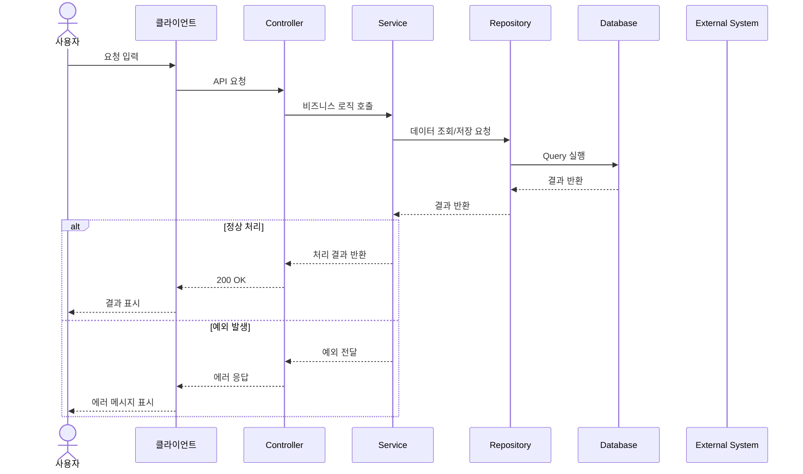

# 기능 설명 문서 템플릿

```yaml
feature_id: ""
feature_name: ""
domain: ""
status: draft
owner: ""
last_updated: YYYY-MM-DD
related_api:
  - ""
related_table:
  - ""
related_class:
  - ""
```

---

## 1. 기능 개요

### 기능 목적

<!-- 이 기능이 왜 필요한지 한두 문장으로 작성 -->

### 주요 사용자

<!-- 이 기능을 사용하는 주체 작성 -->

* 사용자
* 관리자
* 배치 시스템
* 외부 시스템

### 기능 요약

<!-- AI agent가 빠르게 이해할 수 있도록 핵심 동작을 3줄 이내로 작성 -->

---

## 2. 요구사항

### 기본 요구사항

*
*
*

### 제약사항

*
*
*

### 처리하지 않는 범위

<!-- 이 기능에서 책임지지 않는 내용을 명확히 작성 -->

*
*

---

## 3. 기능 흐름



### 흐름 설명

1.
2.
3.
4.
5.

---

## 4. API 명세

### Endpoint

```http
METHOD /api/path
```

### Request

```json
{
}
```

### Request Field

| 필드명 | 타입 | 필수 | 설명 |
| --- | -- | -- | -- |
|     |    |    |    |

### Response

```json
{
}
```

### Response Field

| 필드명 | 타입 | 설명 |
| --- | -- | -- |
|     |    |    |

---

## 5. 주요 로직

### 핵심 처리 규칙

*
*
*

### 정렬 / 우선순위 규칙

1.
2.
3.

### 중복 처리 규칙

*

### 상태 변경 규칙

| 현재 상태 | 조건 | 변경 상태 |
| ----- | -- | ----- |
|       |    |       |

---

## 6. 예외 처리

| 상황 | 원인 | 처리 방식 | 응답 코드 |
| -- | -- | ----- | ----- |
|    |    |       | 400   |
|    |    |       | 404   |
|    |    |       | 500   |

---

## 7. 관련 데이터

### 관련 테이블

| 테이블명 | 역할 |
| ---- | -- |
|      |    |

### 주요 컬럼

| 테이블 | 컬럼 | 설명 |
| --- | -- | -- |
|     |    |    |

---

## 8. 관련 코드

| 클래스 / 파일   | 역할           |
| ---------- | ------------ |
| Controller | API 요청 처리    |
| Service    | 비즈니스 로직 처리   |
| Repository | 데이터 접근       |
| DTO        | 요청/응답 데이터 전달 |
| Entity     | DB 테이블 매핑    |

---

## 9. 테스트 케이스

| 케이스      | 입력 | 기대 결과 |
| -------- | -- | ----- |
| 정상 처리    |    |       |
| 필수값 누락   |    |       |
| 잘못된 값 입력 |    |       |
| 데이터 없음   |    |       |
| 서버 오류    |    |       |

---

## 10. TODO

* [ ]
* [ ]
* [ ]
