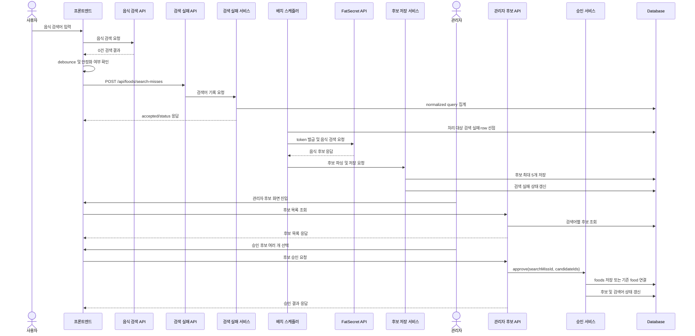

# 음식 정보 배치 기능

```yaml
feature_id: "001-food-import-batch"
feature_name: "음식 검색 실패 수집 및 FatSecret 후보 승인 배치"
domain: "meal"
status: implemented
owner: "backend/frontend"
last_updated: 2026-06-23
related_api:
  - "POST /api/foods/search-misses"
  - "GET /api/admin/food-import-candidates"
  - "POST /api/admin/food-import-candidates/search-misses/{searchMissId}/approve"
  - "POST /api/admin/food-import-candidates/search-misses/{searchMissId}/reject"
  - "GET /api/fatsecret/test/search"
related_table:
  - "food_search_misses"
  - "food_import_candidates"
  - "food_import_runs"
  - "foods"
related_class:
  - "FoodSearchMissController"
  - "FoodSearchMissServiceImpl"
  - "FoodImportBatchScheduler"
  - "FoodImportBatchRunner"
  - "FoodImportCandidateServiceImpl"
  - "FoodImportApprovalServiceImpl"
  - "AdminFoodImportCandidateController"
  - "FatSecretTokenClient"
  - "FatSecretFoodClient"
```

---

## 1. 기능 개요

### 기능 목적

사용자가 음식 검색에서 결과를 찾지 못한 검색어를 안정적으로 수집하고, FatSecret API에서 후보 음식을 가져온 뒤 관리자가 검수하여 내부 음식 데이터로 반영한다.

외부 음식 데이터를 바로 서비스 검색 결과에 노출하지 않고, 후보 저장과 관리자 승인 단계를 거쳐 데이터 품질을 통제한다.

### 주요 사용자

* 사용자
* 관리자
* 배치 시스템
* FatSecret API

### 기능 요약

사용자 검색 화면은 결과가 없고 검색어가 안정화된 경우에만 검색 실패 기록 API를 호출한다.

스케줄러 기반 배치가 검색 실패 기록을 가져와 FatSecret 음식 후보를 최대 5개까지 저장한다.

관리자는 검색어별 후보를 확인하고 여러 후보를 선택 승인하거나 전체 거절할 수 있다.

---

## 2. 요구사항

### 기본 요구사항

* 프론트엔드는 검색어 변경 중 발생하는 일시적인 0건 결과를 바로 기록하지 않고, debounce 이후 같은 검색어가 유지될 때 검색 실패 기록을 요청한다.
* 백엔드는 blank 검색어는 validation error로 처리하고, 너무 짧거나 의미 없는 검색어는 `IGNORED`로 처리한다.
* 같은 normalized query는 하나의 `food_search_misses` row로 집계하고 `miss_count`를 증가시킨다.
* 배치 스케줄러는 처리 대상 검색어를 선점한 뒤 FatSecret token 발급과 음식 검색 API를 호출한다.
* FatSecret 응답에서 검색어당 최대 5개의 후보만 `food_import_candidates`에 저장한다.
* FatSecret `food_description`에서 calories, fat, carbohydrate, protein 값을 파싱한다.
* `content_hash`는 `normalized_name + normalized_brand + calories + fat + carbohydrate + protein` 기준으로 생성한다.
* 기존 `foods.content_hash`와 같은 후보는 `DUPLICATE` 상태로 저장하고 관리자 화면에 표시한다.
* 관리자는 검색어별 후보 중 하나 이상을 선택해 승인할 수 있다.
* 승인된 후보는 `foods`에 신규 저장하거나 같은 content hash를 가진 기존 음식과 연결한다.
* 같은 검색어의 미선택 후보는 승인 처리 후 `REJECTED` 상태가 된다.
* 관리자는 검색어 단위로 모든 후보를 거절할 수 있다.

### 제약사항

* FatSecret client secret, access token, Authorization header는 API 응답과 로그에 노출하지 않는다.
* 음식 검색 요청 중 FatSecret API를 실시간 호출하지 않는다.
* FatSecret 후보 수집만으로는 `foods` 테이블에 직접 반영하지 않는다.
* 검색어당 관리자 검수 후보는 최대 5개로 제한한다.
* 현재 구현은 Spring Batch가 아니라 `@Scheduled` 기반 배치 실행 구조를 사용한다.
* FatSecret credential은 `.env` 또는 배포 환경 변수로만 관리한다.

### 처리하지 않는 범위

* FatSecret 외 다른 provider 연동
* 음식 이미지, 알레르기, 식단 선호 태그 수집
* 사용자 검색 화면에서 외부 API 결과를 직접 노출하는 기능
* 관리자 승인 취소 또는 롤백 UI
* 대량 승인, 고급 필터, 후보 상세 비교 모달
* FatSecret quota 초과 알림 시스템

---

## 3. 기능 흐름



### 흐름 설명

1. 사용자는 음식 검색 화면에서 음식명을 입력한다.
2. 프론트엔드는 기존 음식 검색 API 결과가 0건이고 검색어가 일정 시간 유지된 경우에만 검색 실패 기록 API를 호출한다.
3. 백엔드는 검색어를 정규화하고 같은 검색어를 하나의 row로 집계한다.
4. 배치 스케줄러는 `PENDING` 또는 재시도 가능한 `FAILED` 검색어를 가져와 FatSecret API로 후보를 조회한다.
5. 후보 저장 서비스는 FatSecret 응답을 파싱하고 content hash 중복 여부를 확인한 뒤 검색어당 최대 5개 후보를 저장한다.
6. 관리자는 관리자 화면에서 검색어별 후보를 확인한다.
7. 관리자가 하나 이상의 후보를 승인하면 선택 후보는 내부 음식 데이터로 반영되고, 미선택 후보는 거절 처리된다.
8. 관리자가 전체 거절하면 해당 검색어와 모든 후보가 `REJECTED` 상태가 된다.

---

## 4. API 명세

### 4.1 검색 실패 기록

#### Endpoint

```http
POST /api/foods/search-misses
```

#### Request

```json
{
  "query": "apple"
}
```

#### Request Field

| 필드명 | 타입 | 필수 | 설명 |
| --- | --- | --- | --- |
| query | string | Y | 사용자가 검색했지만 결과가 없었던 원본 검색어 |

#### Response

```json
{
  "success": true,
  "data": {
    "accepted": true,
    "status": "PENDING",
    "searchMissId": 1,
    "query": "apple",
    "normalizedQuery": "apple",
    "missCount": 1
  }
}
```

#### Response Field

| 필드명 | 타입 | 설명 |
| --- | --- | --- |
| accepted | boolean | 배치 처리 대상으로 수집되었는지 여부 |
| status | string | 검색 실패 기록 상태 |
| searchMissId | number | 검색 실패 기록 ID |
| query | string | 원본 검색어 |
| normalizedQuery | string | 정규화된 검색어 |
| missCount | number | 같은 검색어 누적 실패 횟수 |

### 4.2 관리자 후보 목록 조회

#### Endpoint

```http
GET /api/admin/food-import-candidates?status=PENDING_REVIEW&page=1&size=20
```

#### Request Field

| 필드명 | 타입 | 필수 | 설명 |
| --- | --- | --- | --- |
| status | string | N | 조회할 검색 실패 상태 |
| page | number | N | 1부터 시작하는 페이지 번호 |
| size | number | N | 페이지 크기 |

#### Response

```json
{
  "success": true,
  "data": {
    "items": [
      {
        "searchMissId": 1,
        "query": "apple",
        "normalizedQuery": "apple",
        "status": "PENDING_REVIEW",
        "missCount": 3,
        "candidates": [
          {
            "candidateId": 10,
            "foodName": "Apple",
            "brandName": null,
            "calories": 52,
            "fat": 0.2,
            "carbohydrate": 14,
            "protein": 0.3,
            "status": "PENDING"
          }
        ]
      }
    ],
    "page": 1,
    "size": 20,
    "totalItems": 1,
    "totalPages": 1
  }
}
```

#### Response Field

| 필드명 | 타입 | 설명 |
| --- | --- | --- |
| items | array | 검색어별 후보 목록 |
| candidates | array | 해당 검색어로 수집된 FatSecret 후보 |
| page | number | 현재 페이지 |
| size | number | 페이지 크기 |
| totalItems | number | 전체 검색어 수 |
| totalPages | number | 전체 페이지 수 |

### 4.3 관리자 후보 승인

#### Endpoint

```http
POST /api/admin/food-import-candidates/search-misses/{searchMissId}/approve
```

#### Request

```json
{
  "candidateIds": [10, 11]
}
```

#### Request Field

| 필드명 | 타입 | 필수 | 설명 |
| --- | --- | --- | --- |
| searchMissId | number | Y | 승인 대상 검색 실패 기록 ID |
| candidateIds | number[] | Y | 승인할 후보 ID 목록 |

#### Response

```json
{
  "success": true,
  "data": {
    "searchMissId": 1,
    "status": "APPROVED",
    "approvedCandidateIds": [10, 11]
  }
}
```

#### Response Field

| 필드명 | 타입 | 설명 |
| --- | --- | --- |
| searchMissId | number | 승인 처리된 검색 실패 기록 ID |
| status | string | 변경된 검색 실패 상태 |
| approvedCandidateIds | number[] | 승인된 후보 ID 목록 |

### 4.4 관리자 후보 전체 거절

#### Endpoint

```http
POST /api/admin/food-import-candidates/search-misses/{searchMissId}/reject
```

#### Request

```json
{
  "rejectionReason": "검색어와 맞지 않는 후보입니다."
}
```

#### Request Field

| 필드명 | 타입 | 필수 | 설명 |
| --- | --- | --- | --- |
| searchMissId | number | Y | 거절 대상 검색 실패 기록 ID |
| rejectionReason | string | N | 관리자 거절 사유 |

#### Response

```json
{
  "success": true,
  "data": {
    "searchMissId": 1,
    "status": "REJECTED"
  }
}
```

#### Response Field

| 필드명 | 타입 | 설명 |
| --- | --- | --- |
| searchMissId | number | 거절 처리된 검색 실패 기록 ID |
| status | string | 변경된 검색 실패 상태 |

---

## 5. 주요 로직

### 핵심 처리 규칙

* 프론트엔드는 같은 검색어가 debounce 이후에도 0건일 때만 검색 실패 기록을 요청한다.
* 백엔드는 검색어 정규화 후 처리 가치가 없는 검색어를 `IGNORED`로 응답한다.
* 배치 스케줄러는 cron 설정에 따라 실행되고 한 번에 제한된 수의 검색 실패 기록만 처리한다.
* 처리 대상 row는 중복 배치 실행을 막기 위해 선점 후 `PROCESSING` 상태로 바꾼다.
* FatSecret 응답 중 영양 정보 파싱이 가능한 후보만 저장 대상으로 사용한다.
* 후보 저장 시 같은 검색어 안에서 동일 content hash 후보는 하나만 남긴다.
* 관리자 승인 로직은 트랜잭션 안에서 `foods`, `food_import_candidates`, `food_search_misses` 상태를 함께 갱신한다.

### 정렬 / 우선순위 규칙

1. 배치 처리 대상은 실패 횟수가 많은 검색어를 우선한다.
2. 같은 우선순위에서는 오래된 검색어를 먼저 처리한다.
3. 관리자 후보 목록은 상태, 페이지 조건에 따라 검색어 그룹 단위로 조회한다.
4. 검색어별 후보는 FatSecret 응답 순서를 기준으로 최대 5개까지 저장한다.

### 중복 처리 규칙

* 같은 normalized query는 신규 row를 만들지 않고 기존 row의 `miss_count`와 요청 시각을 갱신한다.
* `content_hash`는 이름, 브랜드, 주요 영양소 값만으로 생성한다.
* `source_key`와 `serving_description`은 content hash 기준에서 제외한다.
* 기존 `foods.content_hash`와 같은 후보는 `DUPLICATE` 상태로 저장한다.
* `DUPLICATE` 후보를 승인하면 새 `foods` row를 만들지 않고 기존 음식과 연결한다.

### 상태 변경 규칙

| 대상 | 현재 상태 | 조건 | 변경 상태 |
| --- | --- | --- | --- |
| 검색 실패 | 없음 | 유효한 no-result 검색어 기록 | `PENDING` |
| 검색 실패 | `PENDING` | 배치가 처리 대상으로 선점 | `PROCESSING` |
| 검색 실패 | `PROCESSING` | 후보가 하나 이상 저장됨 | `PENDING_REVIEW` |
| 검색 실패 | `PROCESSING` | 유효 후보가 없음 | `NO_RESULT` |
| 검색 실패 | `PROCESSING` | FatSecret 호출 또는 저장 실패 | `FAILED` |
| 검색 실패 | `PENDING_REVIEW` | 관리자가 하나 이상 승인 | `APPROVED` |
| 검색 실패 | `PENDING_REVIEW` | 관리자가 전체 거절 | `REJECTED` |
| 후보 | 없음 | 신규 후보 저장 | `PENDING` |
| 후보 | 없음 | 기존 음식과 content hash 중복 | `DUPLICATE` |
| 후보 | `PENDING` 또는 `DUPLICATE` | 관리자가 선택 승인 | `APPROVED` |
| 후보 | `PENDING` 또는 `DUPLICATE` | 같은 검색어에서 미선택 또는 전체 거절 | `REJECTED` |

---

## 6. 예외 처리

| 상황 | 원인 | 처리 방식 | 응답 코드 |
| --- | --- | --- | --- |
| 검색어가 비어 있음 | `query` null 또는 blank | validation error 반환 | 400 |
| 검색어가 너무 짧거나 의미 없음 | 방어 필터 조건에 걸림 | `accepted=false`, `status=IGNORED` 응답 | 200 |
| 관리자 API 미인증 | access token 없음 또는 만료 | 공통 인증 오류 반환 | 401 |
| 관리자 권한 없음 | 일반 사용자 token으로 접근 | 공통 권한 오류 반환 | 403 |
| 후보 또는 검색 실패 row 없음 | 잘못된 ID | not found 오류 반환 | 404 |
| 이미 검수 완료된 검색어 승인 | `APPROVED` 또는 `REJECTED` 상태 재처리 | business error 반환 | 400 |
| FatSecret token 발급 실패 | credential 오류, scope 오류, 외부 API 오류 | 검색 실패 row를 `FAILED`로 기록하고 재시도 대상에 포함 | batch 내부 처리 |
| FatSecret 검색 실패 | 외부 API 오류 또는 응답 파싱 실패 | 검색 실패 row를 `FAILED`로 기록하고 사유 저장 | batch 내부 처리 |
| FatSecret 후보 없음 | 검색 결과 없음 또는 영양 정보 파싱 불가 | 검색 실패 row를 `NO_RESULT`로 변경 | batch 내부 처리 |
| DB 저장 실패 | mapper 또는 constraint 오류 | batch run 실패로 기록하고 트랜잭션 rollback | batch 내부 처리 |

---

## 7. 관련 데이터

### 관련 테이블

| 테이블명 | 역할 |
| --- | --- |
| `food_search_misses` | 사용자가 찾지 못한 음식 검색어와 배치 처리 상태 저장 |
| `food_import_candidates` | FatSecret에서 가져온 검색어별 음식 후보 저장 |
| `food_import_runs` | 배치 실행 단위, 성공/실패 개수, 실패 사유 기록 |
| `foods` | 관리자 승인 후 서비스에 노출되는 최종 음식 데이터 저장 |

### 주요 컬럼

| 테이블 | 컬럼 | 설명 |
| --- | --- | --- |
| `food_search_misses` | `query` | 사용자가 입력한 원본 검색어 |
| `food_search_misses` | `normalized_query` | 중복 집계 기준 검색어 |
| `food_search_misses` | `status` | 배치 및 관리자 검수 상태 |
| `food_search_misses` | `miss_count` | 같은 검색어 누적 실패 횟수 |
| `food_search_misses` | `retry_count` | FatSecret 수집 실패 재시도 횟수 |
| `food_import_candidates` | `source_key` | FatSecret 원본 음식 ID 또는 추적 키 |
| `food_import_candidates` | `food_name` | 후보 음식명 |
| `food_import_candidates` | `brand_name` | 후보 브랜드명 |
| `food_import_candidates` | `serving_description` | FatSecret 제공 serving 설명 |
| `food_import_candidates` | `calories` | 파싱된 열량 |
| `food_import_candidates` | `fat` | 파싱된 지방 |
| `food_import_candidates` | `carbohydrate` | 파싱된 탄수화물 |
| `food_import_candidates` | `protein` | 파싱된 단백질 |
| `food_import_candidates` | `content_hash` | 음식 중복 판단 기준 hash |
| `food_import_candidates` | `status` | 후보 검수 상태 |
| `food_import_runs` | `status` | 배치 실행 결과 |
| `food_import_runs` | `success_count` | 성공 처리한 검색어 수 |
| `food_import_runs` | `failure_count` | 실패 처리한 검색어 수 |
| `foods` | `content_hash` | 승인 음식 중복 판단 기준 hash |

---

## 8. 관련 코드

| 클래스 / 파일 | 역할 |
| --- | --- |
| `FoodSearchMissController` | 검색 실패 기록 API 요청 처리 |
| `FoodSearchMissServiceImpl` | 검색어 정규화, 방어 필터, 중복 집계 처리 |
| `FoodImportBatchScheduler` | cron 기반 음식 후보 수집 배치 트리거 |
| `FoodImportBatchRunner` | 배치 실행 단위 생성, 대상 검색어 처리, 실행 결과 기록 |
| `FoodBatchProperties` | 배치 활성화 여부, cron, chunk size, retry 설정 |
| `FatSecretTokenClient` | FatSecret OAuth token 발급 |
| `FatSecretFoodClient` | FatSecret 음식 검색 API 호출 |
| `FatSecretFoodDescriptionParser` | FatSecret `food_description` 영양 정보 파싱 |
| `FoodContentHashGenerator` | 음식 중복 판단용 content hash 생성 |
| `FoodImportCandidateServiceImpl` | FatSecret 후보 변환, 중복 판단, 후보 저장 |
| `FoodImportApprovalServiceImpl` | 후보 승인, `foods` 저장 또는 기존 음식 연결 |
| `AdminFoodImportCandidateController` | 관리자 후보 조회, 승인, 전체 거절 API 처리 |
| `AdminFoodImportCandidateServiceImpl` | 관리자 후보 목록 조회 및 승인 서비스 연결 |
| `FoodImportMapper` | 음식 import 관련 MyBatis mapper interface |
| `FoodImportMapper.xml` | 음식 import 관련 SQL |
| `foodApi.js` | 프론트엔드 검색 실패 기록 API 호출 |
| `adminApi.js` | 프론트엔드 관리자 후보 API 호출 |
| `foodStore.js` | 음식 검색 화면의 no-result 기록 상태 관리 |
| `adminStore.js` | 관리자 후보 조회 및 승인 상태 관리 |
| `FoodSearchView.vue` | 안정화된 no-result 검색어 기록 트리거 |
| `AdminDashboardView.vue` | 관리자 후보 목록, 다중 승인, 전체 거절 UI |

---

## 9. 테스트 케이스

| 케이스 | 입력 | 기대 결과 |
| --- | --- | --- |
| 정상 검색 실패 기록 | `query=apple` | `food_search_misses`에 `PENDING` row 생성 또는 기존 row 집계 |
| blank 검색어 | `query=""` | 400 validation error |
| 의미 없는 검색어 | `query="a"` | `accepted=false`, `status=IGNORED` |
| 같은 검색어 반복 | `query=Apple`, `query=apple` | 같은 normalized query row의 `miss_count` 증가 |
| FatSecret 후보 수집 성공 | `PENDING` 검색어 존재 | 후보 최대 5개 저장, 검색어 `PENDING_REVIEW` |
| FatSecret 후보 없음 | FatSecret 결과 없음 | 검색어 `NO_RESULT` |
| FatSecret 호출 실패 | token 또는 search API 실패 | 검색어 `FAILED`, retry count 및 실패 사유 기록 |
| 영양 정보 파싱 | `food_description` 포함 응답 | calories, fat, carbohydrate, protein 값 저장 |
| 기존 음식 중복 | 같은 `foods.content_hash` 존재 | 후보 `DUPLICATE` 저장 |
| 후보 다중 승인 | candidateIds 2개 이상 | 선택 후보 `APPROVED`, 미선택 후보 `REJECTED`, 검색어 `APPROVED` |
| duplicate 후보 승인 | `DUPLICATE` 후보 선택 | 새 음식 생성 없이 기존 food 연결 |
| 후보 전체 거절 | reject API 호출 | 검색어와 후보 모두 `REJECTED` |
| 관리자 권한 없음 | 일반 사용자 token | 403 권한 오류 |
| secret 노출 방지 | FatSecret 오류 발생 | 응답과 로그에 client secret/token 미노출 |

---

## 10. TODO

* [ ] 오래 `PROCESSING`에 머무른 검색 실패 기록을 복구하는 정책 정의
* [ ] FatSecret quota 초과 시 관리자 알림 또는 운영 로그 기준 정의
* [ ] 승인된 기존 음식과 검색어를 연결해 향후 검색 품질을 높이는 alias 정책 검토
* [ ] 관리자 승인 취소 또는 잘못 승인한 음식 비활성화 정책 검토
* [ ] 배치 처리량이 커질 경우 Spring Batch 전환 필요성 검토
