# Babtory 화면 설계서

## 1. 개요

| 항목 | 내용 |
| --- | --- |
| 문서 목적 | Babtory 프론트엔드 화면 구조, 화면별 입력/이벤트/API 연동, 화면 전환 규칙을 제출용 산출물 형태로 정리한다. |
| 작성 기준 | `frontend/src/router/index.js`, `frontend/src/views`, `frontend/src/components`, `frontend/src/stores`, `frontend/src/api`, `docs/planning/requirements.md` |
| 작성 범위 | 랜딩, 인증, 채팅, 캘린더, 일별 기록, 음식 검색, 프로필, 관리자, Not Found 화면 |
| 작성 방식 | 실제 구현 화면을 기준으로 표, 상태 정의, SVG 와이어프레임을 함께 제공한다. |
| 제외 범위 | 신규 UI 디자인, API 변경, DB 스키마 변경, 모바일 상세 시안 |

> 요구사항 번호 메모: 기능 요구사항 번호는 현재 `F01`부터 `F54`까지 연속 번호로 정리되어 있으며, 본 문서는 해당 번호 체계를 기준으로 매핑한다.

## 2. 공통 화면 구조

### 2.1 App Shell

로그인 이후 주요 업무 화면은 `AppShell.vue`를 통해 상단바, 사이드바, 작업 영역, 선택적 Today Panel을 함께 배치한다.

| 영역 | 구성 | 설명 |
| --- | --- | --- |
| Top Bar | 브랜드, 프로필 메뉴, 로그아웃 | 데스크톱 상단 고정 영역이며 프로필 메뉴에서 로그아웃을 수행한다. |
| Sidebar | 대화, 캘린더, 일일 기록, 음식 검색, 프로필, 관리자 | 인증 사용자의 주요 화면 이동을 담당한다. 관리자 권한일 때만 관리자 메뉴를 노출한다. |
| Workspace | 라우터별 View | 각 화면의 주 콘텐츠가 렌더링되는 영역이다. |
| Today Panel | 오늘 목표, 섭취/운동 진행률, 오늘 식단 | 채팅, 캘린더, 일별 기록, 프로필 화면에서 오늘 요약을 제공한다. |

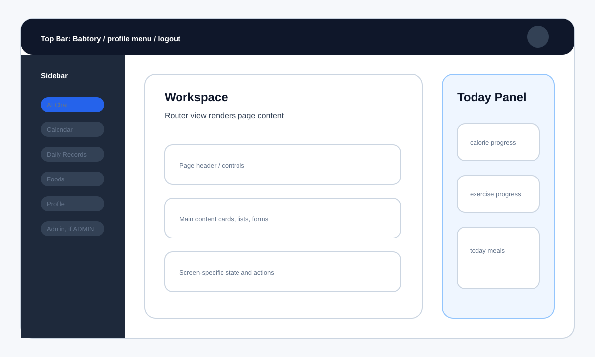

### 2.2 공통 라우팅/권한

| 구분 | 규칙 |
| --- | --- |
| 공개 라우트 | `/`, `/login`, `/signup`, `/oauth/success`, `/:pathMatch(.*)*` |
| 인증 필요 라우트 | `/chat`, `/calendar`, `/records`, `/foods`, `/profile`, `/admin` |
| 관리자 필요 라우트 | `/admin`은 `requiresAuth`, `requiresAdmin` 메타를 모두 가진다. |
| 비인증 접근 | 인증 필요 화면 접근 시 `/login`으로 이동한다. |
| 인증 사용자 인증 화면 접근 | 로그인한 사용자가 `/login`, 일반 `/signup`에 접근하면 `/chat`으로 이동한다. |
| OAuth 온보딩 | `/signup?oauth=true`는 OAuth 로그인 세션이 있을 때만 진입한다. |
| 권한 부족 | 일반 사용자가 `/admin`에 접근하면 `/chat`으로 이동한다. |

### 2.3 공통 상태 처리

| 상태 | 표시/처리 방식 |
| --- | --- |
| 로딩 | 화면 또는 카드 단위로 로딩 문구, 비활성 버튼, 스켈레톤성 영역을 표시한다. |
| 성공 | 저장/승인/반려 완료 후 메시지 표시 또는 목록 재조회로 결과를 반영한다. |
| 오류 | Store의 `error`, `saveError`, `deleteError` 값을 화면에 표시하고 기존 입력 상태는 가능한 유지한다. |
| 빈 데이터 | 기록 없음, 검색 결과 없음, 등록 요청 없음처럼 사용자가 다음 행동을 알 수 있는 문구를 표시한다. |
| 인증 만료 | API 요청 실패 또는 인증 상태 소실 시 로그인 화면으로 되돌아갈 수 있어야 한다. |

## 3. 화면 목록

| 화면 ID | 화면명 | 경로 | 접근 권한 | Shell | Today Panel | 관련 요구사항 |
| --- | --- | --- | --- | --- | --- | --- |
| S01 | 랜딩 | `/` | 전체 | 미사용 | 미사용 | F01, F03, F04 |
| S02 | 로그인 | `/login` | 전체 | 미사용 | 미사용 | F03, F04, F06 |
| S03 | 회원가입/온보딩 | `/signup` | 전체, OAuth 온보딩은 인증 필요 | 미사용 | 미사용 | F01, F02, F04, F08, F09 |
| S04 | OAuth 완료 | `/oauth/success` | 전체 | 미사용 | 미사용 | F04, F07, F08 |
| S05 | AI 채팅 | `/chat` | 회원 | 사용 | 사용 | F10-F21, F22-F24 |
| S06 | 월간 캘린더 | `/calendar` | 회원 | 사용 | 사용 | F32, F33, F38, F39, F41, F44 |
| S07 | 일별 기록 | `/records` | 회원 | 사용 | 사용 | F30-F32, F34-F42, F45 |
| S08 | 음식 검색 | `/foods` | 회원 | 사용 | 미사용 | F25-F29, F30 |
| S09 | 프로필 | `/profile` | 회원 | 사용 | 사용 | F07, F08, F09, F22-F24, F40-F43 |
| S10 | 관리자 대시보드 | `/admin` | 관리자 | 사용 | 미사용 | F46-F52 |
| S11 | Not Found | `/:pathMatch(.*)*` | 전체 | 미사용 | 미사용 | N16 |

## 4. 화면별 상세 설계

### S01. 랜딩

| 항목 | 내용 |
| --- | --- |
| 화면 ID | S01 |
| 화면명 | 랜딩 |
| 경로 | `/` |
| 접근 권한 | 전체 사용자 |
| 화면 목적 | 서비스 진입점에서 Babtory의 AI 건강 코칭 기능을 소개하고 로그인 또는 회원가입으로 이동시킨다. |
| 관련 요구사항 | F01, F03, F04 |

| 구분 | 설계 |
| --- | --- |
| 주요 UI 영역 | 브랜드 영역, 서비스 소개 영역, 주요 CTA, 기능 요약 섹션 |
| 입력 항목 | 없음 |
| 버튼/이벤트 | 로그인 버튼 클릭 시 `/login` 이동, 회원가입 버튼 클릭 시 `/signup` 이동 |
| API 또는 Store 연동 | 직접 API 호출 없음 |
| 상태 처리 | 정적 화면이다. 링크 이동 실패 시 라우터 기본 오류 흐름을 따른다. |
| 이동/전환 규칙 | 공개 화면이며 인증 상태와 무관하게 접근 가능하다. |

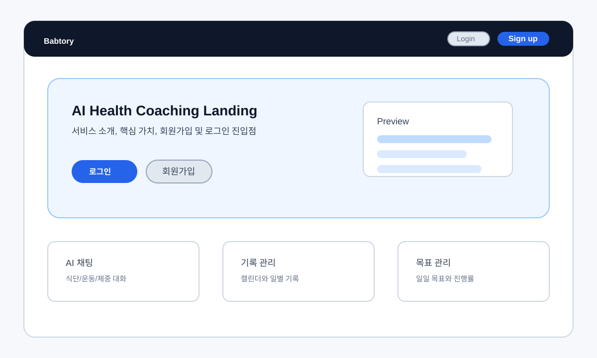

### S02. 로그인

| 항목 | 내용 |
| --- | --- |
| 화면 ID | S02 |
| 화면명 | 로그인 |
| 경로 | `/login` |
| 접근 권한 | 전체 사용자, 이미 로그인한 사용자는 `/chat`으로 이동 |
| 화면 목적 | 이메일/비밀번호 또는 OAuth 제공자를 통해 사용자 인증을 수행한다. |
| 관련 요구사항 | F03, F04, F06, N01, N04, N16 |

| 구분 | 설계 |
| --- | --- |
| 주요 UI 영역 | 브랜드, 로그인 카드, 이메일/비밀번호 입력 폼, OAuth 로그인 버튼, 회원가입 링크 |
| 입력 항목 | 이메일, 비밀번호 |
| 버튼/이벤트 | 로그인 제출, Google/Naver 소셜 로그인 시작, 회원가입 이동, 랜딩 이동 |
| API 또는 Store 연동 | `authStore.login()`, `authApi.loginUser()`, `authApi.getOAuthLoginUrl()` |
| 상태 처리 | 로그인 요청 중 버튼 비활성화, `authStore.loginError` 표시, OAuth 실패 쿼리 처리 |
| 이동/전환 규칙 | 일반 로그인 성공 시 `/chat`, OAuth 로그인 버튼 클릭 시 제공자 인증 페이지로 이동 |

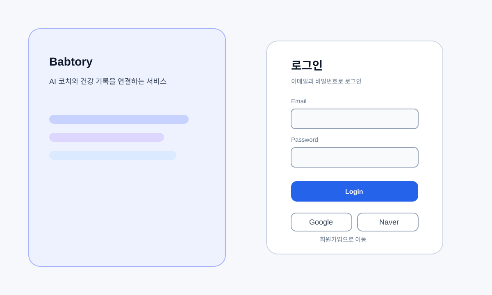

### S03. 회원가입/온보딩

| 항목 | 내용 |
| --- | --- |
| 화면 ID | S03 |
| 화면명 | 회원가입/온보딩 |
| 경로 | `/signup`, `/signup?oauth=true` |
| 접근 권한 | 일반 회원가입은 전체 사용자, OAuth 온보딩은 인증 사용자 |
| 화면 목적 | 계정 생성과 건강 프로필 초기 설정을 단계적으로 수집한다. |
| 관련 요구사항 | F01, F02, F04, F08, F09, N08, N16 |

| 구분 | 설계 |
| --- | --- |
| 주요 UI 영역 | 단계 표시, 계정 정보 입력, 신체 정보 입력, 목표 유형 선택, 제출 영역 |
| 입력 항목 | 닉네임, 이메일, 비밀번호, 키, 현재 체중, 목표 체중, 성별, 나이, 목표 유형 |
| 버튼/이벤트 | 다음 단계, 이전 단계, 회원가입 제출, OAuth 온보딩 저장, 로그인 이동 |
| API 또는 Store 연동 | `authStore.signup()`, `profileStore.updateProfile()`, `profileStore.updateNickname()`, `authStore.updateUser()` |
| 상태 처리 | 단계별 필드 검증, 이메일 형식 검증, 숫자 범위 검증, 저장 중 버튼 비활성화, 오류 메시지 표시 |
| 이동/전환 규칙 | 일반 가입 성공 후 로그인 또는 채팅 화면으로 이동한다. OAuth 온보딩 완료 후 `/chat`으로 이동한다. |

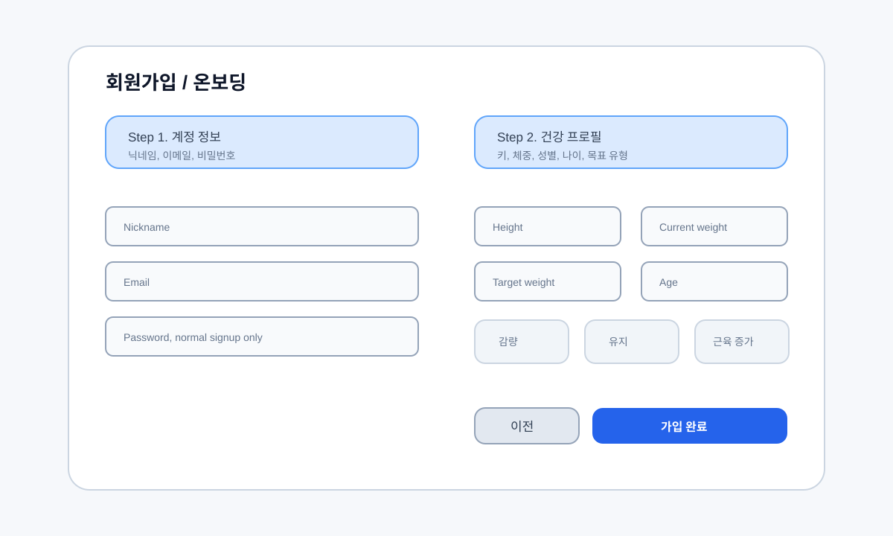

### S04. OAuth 완료

| 항목 | 내용 |
| --- | --- |
| 화면 ID | S04 |
| 화면명 | OAuth 완료 |
| 경로 | `/oauth/success` |
| 접근 권한 | 전체 사용자 |
| 화면 목적 | OAuth 제공자 인증 후 토큰과 사용자 정보를 저장하고, 프로필 완성 여부에 따라 다음 화면을 결정한다. |
| 관련 요구사항 | F04, F07, F08, N01, N16 |

| 구분 | 설계 |
| --- | --- |
| 주요 UI 영역 | 처리 중 안내, 성공 안내, 실패 안내 |
| 입력 항목 | 없음 |
| 버튼/이벤트 | 화면 진입 시 OAuth 로그인 완료 처리 자동 실행 |
| API 또는 Store 연동 | `authStore.completeOAuthLogin()`, `profileStore.loadProfile()` |
| 상태 처리 | 처리 중 로딩 메시지, 실패 시 로그인 실패 안내와 `/login` 이동 |
| 이동/전환 규칙 | 프로필 완성 시 `/chat`, 프로필 미완성 시 `/signup?oauth=true`, 실패 시 `/login` |

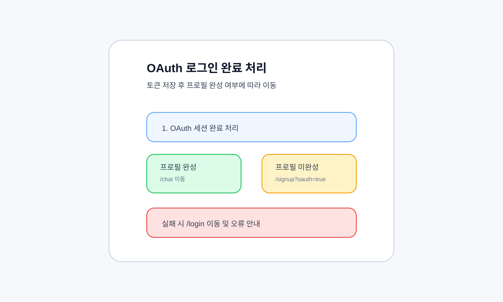

### S05. AI 채팅

| 항목 | 내용 |
| --- | --- |
| 화면 ID | S05 |
| 화면명 | AI 채팅 |
| 경로 | `/chat` |
| 접근 권한 | 회원 |
| 화면 목적 | AI 코치와 텍스트/이미지로 대화하고, 식단/운동/체중/목표 제안을 실제 기록으로 확정한다. |
| 관련 요구사항 | F10-F21, F22-F24, F30, F35, F40, N15, N18 |

| 구분 | 설계 |
| --- | --- |
| 주요 UI 영역 | 대화 헤더, 메시지 목록, AI 제안 카드 영역, 첨부 이미지 미리보기, 메시지 입력창, Today Panel |
| 입력 항목 | 채팅 텍스트, 이미지 파일, 제안 카드 내 날짜/수량/운동 강도/운동 시간/체중/목표 값 |
| 버튼/이벤트 | 메시지 전송, 이미지 선택, 이미지 붙여넣기/드래그, 첨부 이미지 삭제, 제안 확정, 제안 닫기, 일일 목표 추천/저장 |
| API 또는 Store 연동 | `chatStore.loadMessages()`, `chatStore.sendMessage()`, `chatStore.sendImageMessage()`, `chatStore.confirmMealProposal()`, `mealStore.loadDailyMeal()`, `exerciseStore.saveRecord()`, `weightRecordStore.saveRecord()`, `dailyGoalStore.loadRecommendations()`, `dailyGoalStore.saveGoal()`, `dailyGoalStore.loadProgress()`, `profileStore.loadProfile()` |
| 상태 처리 | 메시지 로딩, 빈 대화, SSE 스트리밍 pending 텍스트, 전송 오류, 이미지 형식/용량 오류, 제안 확정 중/완료/실패, 목표 미설정 안내 |
| 이동/전환 규칙 | 인증 사용자만 접근 가능하다. 로그아웃 시 `/login`으로 이동한다. |

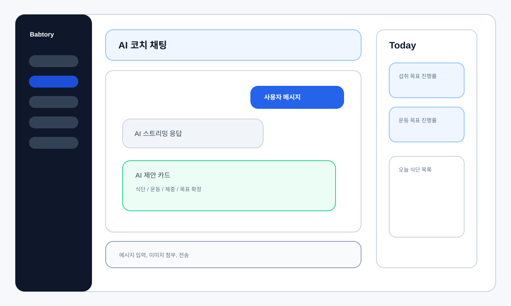

### S06. 월간 캘린더

| 항목 | 내용 |
| --- | --- |
| 화면 ID | S06 |
| 화면명 | 월간 캘린더 |
| 경로 | `/calendar` |
| 접근 권한 | 회원 |
| 화면 목적 | 월 단위로 식단, 운동, 체중 기록이 있는 날짜와 요약 정보를 한눈에 제공한다. |
| 관련 요구사항 | F32, F33, F38, F39, F41, F44, N16 |

| 구분 | 설계 |
| --- | --- |
| 주요 UI 영역 | 월 제목, 이전/다음/오늘 버튼, 요일 헤더, 월간 날짜 그리드, 날짜별 기록 배지, Today Panel |
| 입력 항목 | 없음 |
| 버튼/이벤트 | 이전 달, 다음 달, 오늘 이동, 날짜 클릭 |
| API 또는 Store 연동 | `mealStore.loadMonthlyMeals()`, `exerciseStore.loadMonthlyExerciseDates()`, `weightRecordStore.loadCalendarRecords()`, `profileStore.loadProfile()` |
| 상태 처리 | 월간 데이터 로딩, 데이터 없음, API 오류, 월 이동 애니메이션 상태 |
| 이동/전환 규칙 | 날짜 클릭 시 `/records?date=YYYY-MM-DD`로 이동한다. |

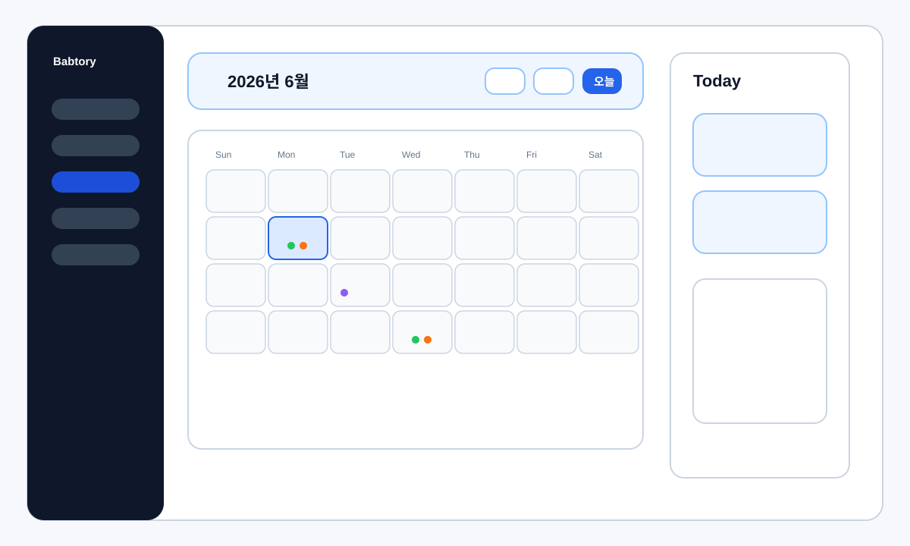

### S07. 일별 기록

| 항목 | 내용 |
| --- | --- |
| 화면 ID | S07 |
| 화면명 | 일별 기록 |
| 경로 | `/records`, `/records?date=YYYY-MM-DD` |
| 접근 권한 | 회원 |
| 화면 목적 | 선택한 날짜의 식단, 운동, 체중 기록을 통합 조회하고 작성, 수정, 삭제한다. |
| 관련 요구사항 | F26, F30-F32, F34-F42, F45, N08, N16 |

| 구분 | 설계 |
| --- | --- |
| 주요 UI 영역 | 날짜 선택, 일일 요약, 식단 목록, 운동 목록, 체중 기록, 추가 메뉴, 편집 폼 영역, Today Panel |
| 입력 항목 | 날짜, 식사 유형, 음식 검색어, 음식 수량, 운동 검색어, 운동 강도, 운동 시간, 운동 메모, 체중 값 |
| 버튼/이벤트 | 날짜 변경, 식단 추가/수정/삭제, 운동 추가/수정/삭제, 체중 추가/수정/삭제, 음식/운동 후보 선택, 저장, 취소 |
| API 또는 Store 연동 | `mealStore.loadDailyMeal()`, `mealStore.searchMealFoods()`, `mealStore.saveMealItems()`, `mealStore.deleteMealById()`, `exerciseStore.loadDailyExerciseRecords()`, `exerciseStore.searchActivities()`, `exerciseStore.saveRecord()`, `exerciseStore.updateRecord()`, `exerciseStore.deleteRecord()`, `weightRecordStore.loadCalendarRecords()`, `weightRecordStore.saveRecord()`, `weightRecordStore.deleteRecord()`, `profileStore.loadProfile()` |
| 상태 처리 | 일별 기록 로딩, 선택 날짜 데이터 없음, 검색 결과 없음, 저장/삭제 중 버튼 비활성화, 검증 오류, 삭제 확인창 |
| 이동/전환 규칙 | 캘린더에서 전달된 `date` 쿼리를 기준으로 초기 날짜를 설정한다. 날짜 변경 시 해당 날짜 데이터를 재조회한다. |

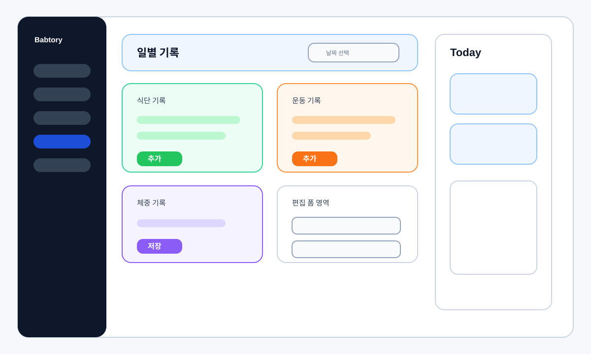

### S08. 음식 검색

| 항목 | 내용 |
| --- | --- |
| 화면 ID | S08 |
| 화면명 | 음식 검색 |
| 경로 | `/foods` |
| 접근 권한 | 회원 |
| 화면 목적 | 음식 DB를 검색하고 영양 정보를 확인한 뒤 오늘 식단에 추가하거나 없는 음식을 등록 요청한다. |
| 관련 요구사항 | F25-F29, F30, N13, N16 |

| 구분 | 설계 |
| --- | --- |
| 주요 UI 영역 | 검색 입력, 음식 그룹 목록, 페이지네이션, 영양 상세 패널, 오늘 식단 저장 영역, 음식 등록 요청 폼 |
| 입력 항목 | 음식 검색어, 페이지, 제공량 선택, 식사 유형, 수량, 등록 요청 음식명/브랜드/제공량/영양 성분 |
| 버튼/이벤트 | 검색, 이전/다음 페이지, 음식 선택, 제공량 선택, 오늘 식단에 추가, 검색 실패 기록, 음식 등록 요청 열기/닫기/제출 |
| API 또는 Store 연동 | `foodStore.loadFoodGroups()`, `foodStore.recordSearchMiss()`, `foodStore.submitMissingFood()`, `foodStore.loadMyFoodSubmissions()`, `mealStore.saveMealItems()` |
| 상태 처리 | 검색 로딩, 검색 결과 없음, 페이지 이동 로딩, 저장 성공/실패 메시지, 등록 요청 성공 화면, 등록 요청 검증 오류 |
| 이동/전환 규칙 | 화면 내 작업 중심이다. 식단 저장 후 현재 화면에 머무르며 결과 메시지를 표시한다. |

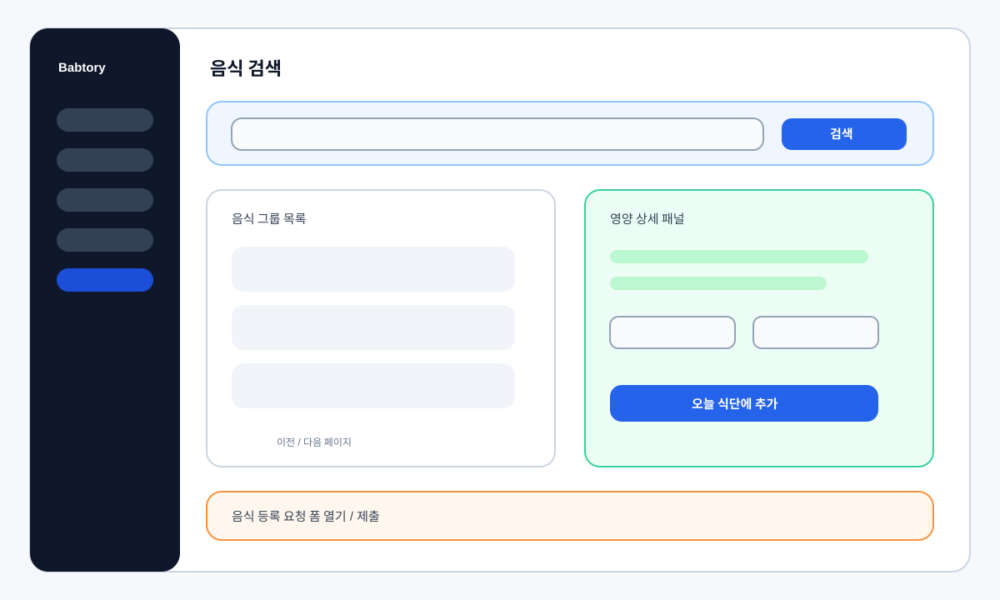

### S09. 프로필

| 항목 | 내용 |
| --- | --- |
| 화면 ID | S09 |
| 화면명 | 프로필 |
| 경로 | `/profile` |
| 접근 권한 | 회원 |
| 화면 목적 | 현재 사용자 정보, 건강 프로필, 일일 목표, 체중 기록 추세를 조회하고 수정한다. |
| 관련 요구사항 | F07, F08, F09, F22-F24, F40-F43, N16 |

| 구분 | 설계 |
| --- | --- |
| 주요 UI 영역 | 사용자 요약, 닉네임/건강 프로필 편집, 목표 설정 카드, 체중 추세 차트, 체중 기록 목록/입력, Today Panel |
| 입력 항목 | 닉네임, 키, 현재 체중, 목표 체중, 성별, 나이, 목표 유형, 섭취 칼로리 목표, 운동 칼로리 목표, 체중 기록 날짜/값 |
| 버튼/이벤트 | 프로필 저장, 닉네임 저장, 목표 추천 조회, 목표 저장, 체중 기록 저장/삭제, 기간 필터 변경 |
| API 또는 Store 연동 | `authStore`, `profileStore.loadProfile()`, `profileStore.updateProfile()`, `profileStore.updateNickname()`, `dailyGoalStore.loadRecommendations()`, `dailyGoalStore.saveGoal()`, `dailyGoalStore.loadProgress()`, `weightRecordStore.loadRecords()`, `weightRecordStore.saveRecord()`, `weightRecordStore.deleteRecord()` |
| 상태 처리 | 프로필 로딩, 저장 중 버튼 비활성화, 목표 추천 로딩, 체중 기록 없음, 차트 데이터 없음, 저장/삭제 오류 |
| 이동/전환 규칙 | 인증 사용자만 접근한다. 저장 후 현재 화면에서 최신 프로필과 Today Panel 데이터를 갱신한다. |

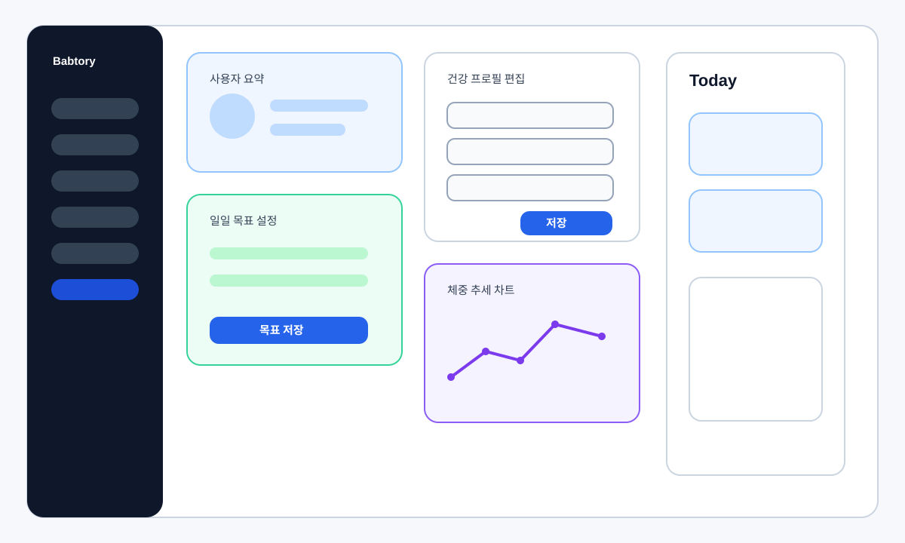

### S10. 관리자 대시보드

| 항목 | 내용 |
| --- | --- |
| 화면 ID | S10 |
| 화면명 | 관리자 대시보드 |
| 경로 | `/admin` |
| 접근 권한 | 관리자 |
| 화면 목적 | 운영 지표를 조회하고 사용자 음식 등록 요청 및 외부 음식 후보를 검토, 승인, 반려한다. |
| 관련 요구사항 | F46-F52, N02, N13, N16 |

| 구분 | 설계 |
| --- | --- |
| 주요 UI 영역 | 운영 지표 카드, 음식 등록 요청 목록, 요청 상세/검토 패널, 외부 음식 후보 그룹 목록, 후보 승인/반려 패널 |
| 입력 항목 | 요청 상태 필터, 페이지, 보정된 음식 정보, 승인 후보 선택, 반려 사유 |
| 버튼/이벤트 | 대시보드 새로고침, 요청 목록 조회, 요청 승인, 요청 반려, 외부 후보 목록 조회, 후보 선택 승인, 후보 그룹 반려 |
| API 또는 Store 연동 | `adminStore.loadDashboard()`, `adminStore.loadFoodRequests()`, `adminStore.approveFoodRequest()`, `adminStore.rejectFoodRequest()`, `adminStore.loadImportCandidates()`, `adminStore.approveImportCandidates()`, `adminStore.rejectImportSearchMiss()` |
| 상태 처리 | 대시보드 로딩, 목록 없음, 승인/반려 처리 중, 검증 오류, 처리 성공 후 목록 재조회 |
| 이동/전환 규칙 | `ADMIN` 권한이 없으면 `/chat`으로 이동한다. 관리자 화면 내부에서 탭/목록 선택으로 검토 대상을 전환한다. |

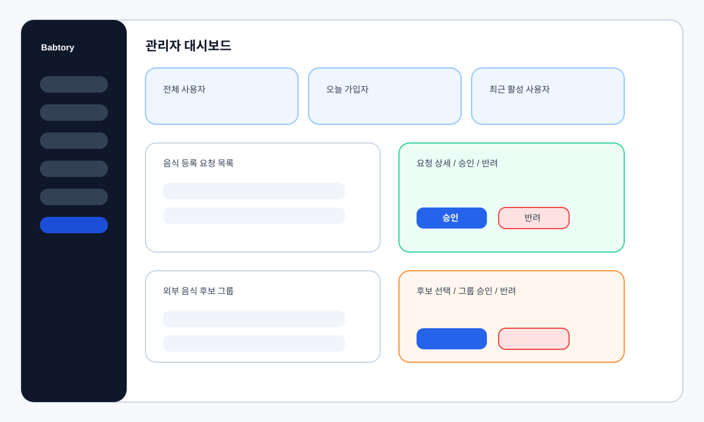

### S11. Not Found

| 항목 | 내용 |
| --- | --- |
| 화면 ID | S11 |
| 화면명 | Not Found |
| 경로 | `/:pathMatch(.*)*` |
| 접근 권한 | 전체 사용자 |
| 화면 목적 | 정의되지 않은 경로 접근 시 404 안내와 복귀 동선을 제공한다. |
| 관련 요구사항 | N16 |

| 구분 | 설계 |
| --- | --- |
| 주요 UI 영역 | 브랜드, 404 코드, 안내 문구, 홈 이동 버튼, 채팅 이동 버튼, 보조 링크 |
| 입력 항목 | 없음 |
| 버튼/이벤트 | 홈으로 이동, 채팅으로 이동 |
| API 또는 Store 연동 | 직접 API 호출 없음 |
| 상태 처리 | 정적 오류 화면이다. 채팅 이동은 인증 라우팅 규칙에 따라 비인증 사용자를 `/login`으로 보낼 수 있다. |
| 이동/전환 규칙 | 홈 버튼은 `/`, 채팅 버튼은 `/chat`으로 이동한다. |

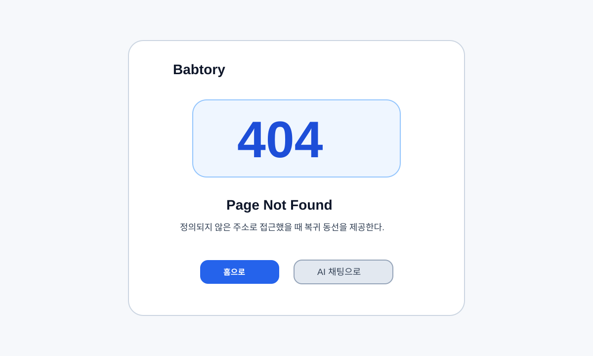

## 5. 공통 컴포넌트/모달 설계

| 구성요소 | 사용 화면 | 목적 | 주요 입력/이벤트 | Store/API 연동 | 상태 처리 |
| --- | --- | --- | --- | --- | --- |
| AI 식단 제안 카드 | `/chat` | AI가 추출한 식단 후보를 실제 식단으로 확정한다. | 음식 후보 선택, 음식명 보정, 수량 수정, 확정, 닫기 | `chatStore.confirmMealProposal()`, `mealStore.searchMealFoods()`, `mealStore.loadDailyMeal()` | 후보 검색 로딩, 확정 중, 필수 후보 미선택 오류 |
| AI 운동 제안 카드 | `/chat` | AI가 추출한 운동 후보를 운동 기록으로 저장한다. | 운동 후보 선택, 강도 선택, 날짜, 시간, 메모, 확정, 닫기 | `exerciseStore.saveRecord()`, `dailyGoalStore.loadProgress()` | 확정 중, 필수값 누락, 저장 오류 |
| AI 체중 제안 카드 | `/chat` | AI가 추출한 체중 값을 체중 기록으로 저장한다. | 기록 날짜, 체중 값, 확정, 닫기 | `weightRecordStore.saveRecord()`, `profileStore.loadProfile()` | 미래 날짜 제한, 범위 검증, 저장 오류 |
| 일일 목표 설정 카드 | `/chat`, `/profile` | 목표 유형별 권장 목표를 확인하고 일일 목표를 저장한다. | 목표 유형, 섭취 칼로리, 운동 칼로리, 추천 조회, 저장 | `dailyGoalStore.loadRecommendations()`, `dailyGoalStore.saveGoal()` | 추천 로딩, 목표 범위 안내, 저장 오류 |
| 식단 작성/수정 폼 | `/records` | 날짜와 식사 유형별 식단 음식을 저장하거나 수정한다. | 식사 유형, 음식 검색어, 음식 선택, 수량, 저장, 삭제 | `mealStore.searchMealFoods()`, `mealStore.saveMealItems()`, `mealStore.deleteMealById()` | 검색 로딩, 음식 미선택, 수량 검증, 삭제 확인 |
| 운동 작성/수정 폼 | `/records` | 일별 운동 기록을 작성하거나 수정한다. | 운동 검색어, 운동 후보, 강도, 시간, 메모, 저장, 삭제 | `exerciseStore.searchActivities()`, `exerciseStore.saveRecord()`, `exerciseStore.updateRecord()`, `exerciseStore.deleteRecord()` | 후보 없음, 시간 검증, 저장/삭제 오류 |
| 체중 작성/수정 폼 | `/records`, `/profile` | 날짜별 체중 기록을 저장하거나 삭제한다. | 기록 날짜, 체중 값, 저장, 삭제 | `weightRecordStore.saveRecord()`, `weightRecordStore.deleteRecord()` | 미래 날짜 제한, 비정상 범위 제한, 최소 기록 보존 오류 |
| 음식 등록 요청 폼 | `/foods` | DB에 없는 음식을 사용자가 직접 등록 요청한다. | 음식명, 브랜드, 제공량, 단위, 칼로리, 탄수화물, 단백질, 지방, 제출 | `foodStore.submitMissingFood()`, `foodStore.loadMyFoodSubmissions()` | 필수 영양값 검증, 제출 성공 화면, 제출 오류 |
| 관리자 승인/반려 패널 | `/admin` | 음식 등록 요청과 외부 음식 후보를 검토 처리한다. | 보정된 음식 정보, 후보 선택, 반려 사유, 승인, 반려 | `adminStore.approveFoodRequest()`, `adminStore.rejectFoodRequest()`, `adminStore.approveImportCandidates()`, `adminStore.rejectImportSearchMiss()` | 처리 중, 반려 사유 누락, 처리 후 목록 갱신 |

## 6. 화면 전환 흐름

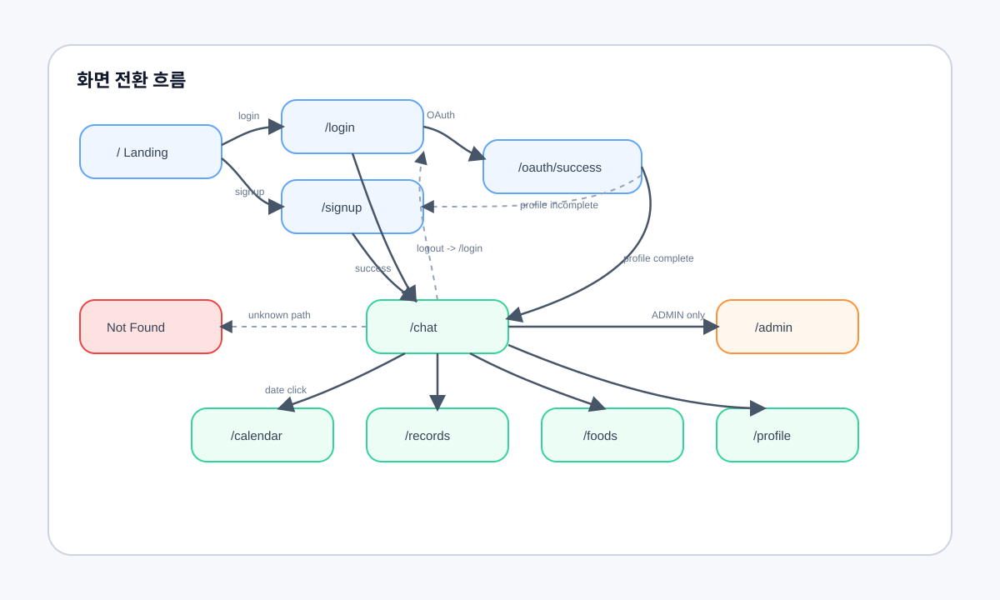

## 7. 요구사항 매핑표

| 화면 ID | 화면명 | 기능 요구사항 | 비기능 요구사항 | 매핑 근거 |
| --- | --- | --- | --- | --- |
| S01 | 랜딩 | F01, F03, F04 | N16 | 회원가입, 로그인, OAuth 진입점을 제공한다. |
| S02 | 로그인 | F03, F04, F06 | N01, N04, N16 | 이메일 로그인, OAuth 로그인, 토큰 기반 인증 흐름의 시작점이다. |
| S03 | 회원가입/온보딩 | F01, F02, F04, F08, F09 | N08, N16 | 계정 생성과 건강 프로필 초기 등록을 수행한다. |
| S04 | OAuth 완료 | F04, F07, F08 | N01, N16 | OAuth 성공 후 현재 사용자와 프로필 상태를 확인한다. |
| S05 | AI 채팅 | F10, F11, F12, F13, F14, F15, F16, F17, F18, F19, F20, F21, F22, F23, F24, F30, F35, F40 | N14, N15, N17, N18, N26 | 채팅, AI 제안 추출/확정, 목표 설정, 진행률 갱신을 수행한다. |
| S06 | 월간 캘린더 | F32, F33, F38, F39, F41, F44 | N16, N26 | 월간 식단/운동/체중 기록 요약을 표시한다. |
| S07 | 일별 기록 | F26, F30, F31, F32, F34, F35, F36, F37, F38, F40, F41, F42, F45 | N08, N16, N26 | 선택 날짜의 식단, 운동, 체중 기록을 통합 관리한다. |
| S08 | 음식 검색 | F25, F26, F27, F29, F30 | N13, N16, N26 | 음식 검색, 검색 실패 기록, 식단 추가, 음식 등록 요청을 제공한다. |
| S09 | 프로필 | F07, F08, F09, F22, F23, F24, F40, F41, F42, F43 | N08, N16, N26 | 사용자/건강 프로필, 목표, 체중 추세를 관리한다. |
| S10 | 관리자 대시보드 | F46, F47, F48, F49, F50, F51, F52 | N02, N13, N16 | 관리자 권한으로 운영 지표와 음식 승인 업무를 처리한다. |
| S11 | Not Found | - | N16 | 잘못된 경로에 대한 오류 상태와 복귀 동선을 제공한다. |

## 8. 확인 메모

| 항목 | 확인 내용 |
| --- | --- |
| 라우터 화면 포함 여부 | `frontend/src/router/index.js`의 11개 라우트를 모두 포함했다. |
| 요구사항 매핑 | 모든 화면에 기능 요구사항 또는 비기능 요구사항을 1개 이상 연결했다. |
| 구현 변경 여부 | 본 문서는 설계 산출물이며 프론트엔드 코드, 백엔드 코드, API, DB 스키마를 변경하지 않는다. |
| 후속 점검 | `NotFoundView.vue`의 일부 한국어 문구는 현재 파일에서 인코딩이 깨져 보여 별도 수정 여부를 검토할 수 있다. |
