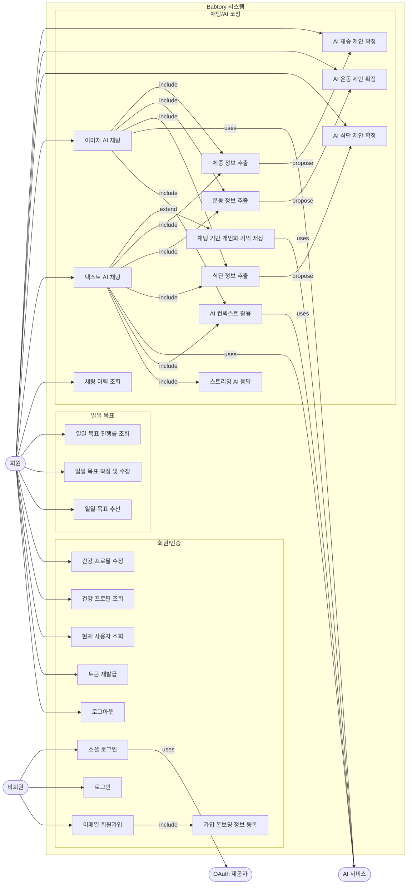
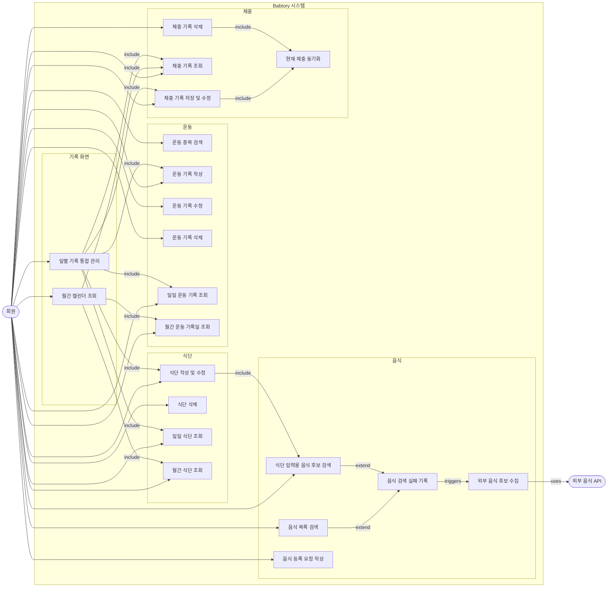
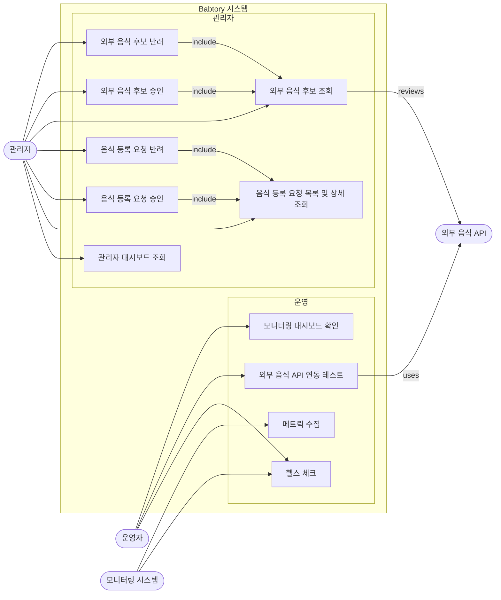

# Use-case Diagram

작성 기준: `docs/planning/requirements.md`의 기능 요구사항과 비기능 요구사항을 기준으로 한다. 산출물은 API 엔드포인트 단위가 아니라 사용자와 외부 시스템이 인식하는 기능 단위로 묶어 표현한다.

## 개요

Babtory는 사용자가 식단, 운동, 체중, 건강 프로필을 기록하고 AI 채팅을 통해 건강 코칭과 기록 제안을 받을 수 있는 개인 맞춤형 건강 코칭 서비스이다. 관리자는 사용자 음식 등록 요청과 외부 음식 후보를 검토하여 음식 데이터를 보강하고, 운영자는 서비스 상태와 외부 연동을 확인한다.

## Actor 정의

| Actor | 설명 |
| --- | --- |
| 비회원 | 아직 로그인하지 않은 사용자. 이메일 회원가입, 로그인, 소셜 로그인을 수행한다. |
| 회원 | 로그인한 일반 사용자. 프로필, 채팅, 목표, 식단, 음식, 운동, 체중, 기록 화면을 사용한다. |
| 관리자 | `ADMIN` 권한을 가진 사용자. 관리자 대시보드와 음식 데이터 검토 기능을 사용한다. |
| 운영자 | 서비스 운영 담당자. 헬스 체크, 외부 음식 API 연동 테스트, 모니터링 대시보드를 확인한다. |
| AI 서비스 | 텍스트/이미지 기반 AI 응답, 건강 기록 정보 추출, 개인화 기억 저장 판단을 제공하는 외부 AI 연동 대상이다. |
| OAuth 제공자 | Google, Naver 등 소셜 로그인 인증을 제공하는 외부 시스템이다. |
| 외부 음식 API | 음식 검색 실패 데이터를 바탕으로 후보 음식을 제공하는 외부 음식 데이터 제공자이다. |
| 모니터링 시스템 | 헬스 체크와 Prometheus 메트릭을 호출하여 서비스 상태를 수집하는 운영 시스템이다. |

## Diagram 작성 규칙

- Mermaid `flowchart LR`를 사용한다.
- 시스템 경계는 `subgraph Babtory`로 표현한다.
- `include`, `extend`, `uses`, `triggers` 관계는 화살표 라벨로 표현한다.
- 전체 요구사항이 많기 때문에 다이어그램은 세 영역으로 분리한다.

## 회원/AI 코칭 Use-case Diagram

## 기록/음식 Use-case Diagram

## 관리자/운영 Use-case Diagram

## Use-case 목록

| Actor | Use case | 설명 | 관련 요구사항 |
| --- | --- | --- | --- |
| 비회원 | 이메일 회원가입 | 이메일, 비밀번호, 닉네임으로 일반 사용자 계정을 생성한다. | F01 |
| 비회원 | 가입 온보딩 정보 등록 | 가입 과정에서 건강 프로필 초기 정보를 입력한다. | F02 |
| 비회원 | 로그인 | 이메일과 비밀번호로 인증하고 토큰을 발급받는다. | F03 |
| 비회원 | 소셜 로그인 | OAuth 제공자를 통해 로그인하거나 신규 소셜 계정을 생성한다. | F04 |
| OAuth 제공자 | 소셜 로그인 인증 | Google, Naver 인증 흐름을 제공한다. | F04 |
| 회원 | 로그아웃 | Access Token과 Refresh Token을 무효화하고 로그인 상태를 종료한다. | F05 |
| 회원 | 토큰 재발급 | Refresh Token으로 Access Token을 갱신한다. | F06 |
| 회원 | 현재 사용자 조회 | 사용자 ID, 이메일, 닉네임, 권한을 조회한다. | F07 |
| 회원 | 건강 프로필 조회 | 키, 현재 체중, 목표 체중, 목표 유형, 성별, 나이, 수정 시각을 조회한다. | F09 |
| 회원 | 건강 프로필 수정 | 건강 프로필 항목을 수정하여 목표 계산과 AI 코칭에 반영한다. | F10 |
| 회원 | 채팅 이력 조회 | 사용자 메시지와 AI 응답 이력을 조회한다. | F11 |
| 회원 | 텍스트 AI 채팅 | 텍스트 메시지를 보내고 AI 응답을 받는다. | F12 |
| 회원 | 스트리밍 AI 응답 | AI 응답 생성 중 부분 응답을 실시간으로 확인한다. | F13, N15 |
| 회원 | 이미지 AI 채팅 | 이미지와 선택 텍스트를 전송하여 AI 응답과 기록 제안을 받는다. | F14, N18 |
| AI 서비스 | AI 컨텍스트 활용 | 프로필, 목표, 기록, 최근 대화, 요약, 메모리를 AI 응답 컨텍스트로 활용한다. | F15, N14 |
| AI 서비스 | 식단 정보 추출 | 채팅 내용에서 식사 날짜, 식사 유형, 음식명, 수량을 추출한다. | F16 |
| 회원 | AI 식단 제안 확정 | AI가 제안한 음식 후보와 수량을 확인하고 식단으로 저장한다. | F17 |
| AI 서비스 | 운동 정보 추출 | 채팅 내용에서 운동명, 강도, 날짜, 시간, 메모를 추출한다. | F18 |
| 회원 | AI 운동 제안 확정 | AI가 제안한 운동 후보와 강도, 시간을 확인하고 운동 기록으로 저장한다. | F19 |
| AI 서비스 | 체중 정보 추출 | 채팅 내용에서 측정 날짜와 체중 값을 추출한다. | F20 |
| 회원 | AI 체중 제안 확정 | AI가 제안한 체중 값을 확인하고 체중 기록으로 저장한다. | F21 |
| AI 서비스 | 채팅 기반 개인화 기억 저장 | 사용자의 기억 저장 요청을 식별하고 저장 가능 여부를 판단한다. | F22 |
| 회원 | 일일 목표 추천 | 목표 유형별 권장 섭취 칼로리와 운동 칼로리를 조회한다. | F24 |
| 회원 | 일일 목표 확정 및 수정 | 목표 유형, 섭취 칼로리 목표, 운동 칼로리 목표를 저장한다. | F25 |
| 회원 | 일일 목표 진행률 조회 | 날짜별 섭취/운동 목표 달성률과 영양 비율을 조회한다. | F26 |
| 회원 | 음식 목록 검색 | 음식명 키워드로 음식 DB와 제공량별 영양 정보를 검색한다. | F27 |
| 회원 | 식단 입력용 음식 후보 검색 | 식단 작성 또는 AI 제안 확정에 사용할 음식 후보를 검색한다. | F28 |
| 회원 | 음식 검색 실패 기록 | 검색 결과가 없는 키워드를 후보 수집 대상으로 남긴다. | F29 |
| 외부 음식 API | 외부 음식 후보 수집 | 검색 실패 데이터를 기반으로 외부 음식 후보를 제공한다. | F30 |
| 회원 | 음식 등록 요청 작성 | DB에 없는 음식의 이름과 영양 정보를 등록 요청한다. | F31 |
| 회원 | 식단 작성 및 수정 | 날짜, 식사 유형, 음식, 수량으로 식단을 저장하거나 갱신한다. | F33 |
| 회원 | 식단 삭제 | 본인이 작성한 식단 기록을 삭제한다. | F34 |
| 회원 | 일일 식단 조회 | 특정 날짜의 식단과 영양 합계를 조회한다. | F35 |
| 회원 | 월간 식단 조회 | 월별 날짜 단위 식단 요약을 조회한다. | F36 |
| 회원 | 운동 종목 검색 | 운동명 키워드로 종목과 강도별 MET 정보를 검색한다. | F37 |
| 회원 | 운동 기록 작성 | 운동 종목, 강도, 날짜, 시간, 메모로 운동을 기록한다. | F38 |
| 회원 | 운동 기록 수정 | 본인이 작성한 운동 기록의 종목, 강도, 시간, 메모를 수정한다. | F39 |
| 회원 | 운동 기록 삭제 | 본인이 작성한 운동 기록을 삭제한다. | F40 |
| 회원 | 일일 운동 기록 조회 | 특정 날짜의 운동 기록과 소모 칼로리를 조회한다. | F41 |
| 회원 | 월간 운동 기록일 조회 | 특정 월에 운동 기록이 있는 날짜 목록을 조회한다. | F42 |
| 회원 | 체중 기록 저장 및 수정 | 날짜별 체중을 저장하거나 수정한다. | F43 |
| 회원 | 체중 기록 조회 | 전체 또는 기간별 체중 기록과 추세를 조회한다. | F44 |
| 회원 | 체중 기록 삭제 | 특정 날짜의 체중 기록을 삭제한다. | F45 |
| Babtory 시스템 | 현재 체중 동기화 | 체중 기록 변경 후 건강 프로필의 현재 체중을 최신 기록과 맞춘다. | F46 |
| 회원 | 월간 캘린더 조회 | 월간 캘린더에서 식단, 운동, 체중 기록 요약을 확인한다. | F47 |
| 회원 | 일별 기록 통합 관리 | 선택한 날짜의 식단, 운동, 체중을 함께 조회하고 관리한다. | F48 |
| 관리자 | 관리자 대시보드 조회 | 전체 사용자 수, 당일 가입자 수, 최근 활성 사용자 수를 확인한다. | F49 |
| 관리자 | 음식 등록 요청 목록 및 상세 조회 | 사용자 음식 등록 요청을 상태/페이지 조건으로 조회하고 상세를 확인한다. | F50 |
| 관리자 | 음식 등록 요청 승인 | 사용자 제출 음식을 검토/보정하여 공식 음식 데이터로 승인한다. | F51 |
| 관리자 | 음식 등록 요청 반려 | 부적절하거나 중복된 음식 등록 요청을 반려 사유와 함께 처리한다. | F52 |
| 관리자 | 외부 음식 후보 조회 | 검색 실패 기반으로 수집된 외부 음식 후보 그룹을 조회한다. | F53 |
| 관리자 | 외부 음식 후보 승인 | 외부 음식 후보를 공식 음식 데이터에 반영한다. | F54 |
| 관리자 | 외부 음식 후보 반려 | 외부 음식 후보 그룹을 반려 사유와 함께 처리한다. | F55 |
| 운영자 | 헬스 체크 | 서비스 생존 여부와 응답 시각을 확인한다. | F56, N19 |
| 운영자 | 외부 음식 API 연동 테스트 | FatSecret 음식 검색 연동 상태와 응답을 확인한다. | F57, N24 |
| 모니터링 시스템 | 메트릭 수집 | Prometheus 메트릭 엔드포인트를 호출하여 운영 지표를 수집한다. | N20 |
| 운영자 | 모니터링 대시보드 확인 | Grafana 대시보드에서 서버, JVM, 요청, 오류, AI 사용량, 활성 사용자 지표를 확인한다. | N21 |

## 요구사항 매핑 메모

- 다이어그램 본문은 가독성을 위해 요구사항 번호 대신 기능명을 우선 표기한다.
- 현재 `requirements.md`의 기능 요구사항 번호는 `F08`, `F23`, `F32`가 비어 있다. 본 문서의 매핑 표는 현재 존재하는 요구사항 ID만 직접 참조한다.
- `현재 체중 동기화`는 독립 사용자 조작이 아니라 `체중 기록 저장 및 수정`, `체중 기록 삭제`에 포함되는 내부 처리 use-case로 표현한다.
- 비기능 요구사항은 use-case의 중심 대상은 아니지만, 인증/권한, 스트리밍 피드백, 이미지 제한, 운영 모니터링처럼 actor 상호작용이나 주요 제약으로 드러나는 항목은 관련 요구사항에 함께 표기한다.
