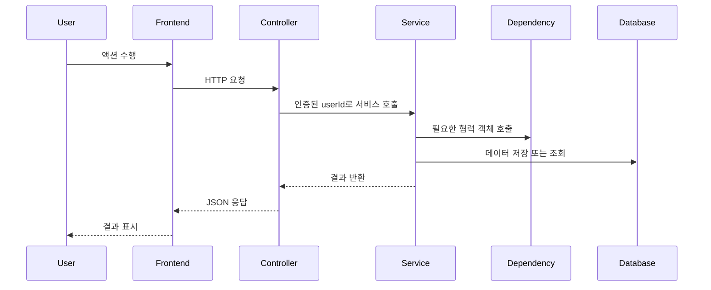

# NNN 작업 제목

## Status

proposed

## Goal

무엇을 만들거나, 바꾸거나, 고칠 것인가?

## Read First

- `AGENTS.md`
- `PROJECT_PROFILE.md`
- `docs/PROJECT_INDEX.md`
- 이 작업과 관련된 문서
- 주변 구현 코드와 테스트

## Current Behavior

현재는 어떻게 동작하는가?

## Target Behavior

이 작업이 끝난 뒤에는 어떻게 동작해야 하는가?

## Target Sequence



## Communication Contract

| From | To | Method/Call | Input | Output | Error |
|---|---|---|---|---|---|
| Frontend | Controller | HTTP method/path | request body/query | response DTO | 400/401/403/500 |
| Service | Dependency | method name | domain input | domain output | mapped exception |

## Scope

변경해도 되는 파일, 패키지, 동작 범위.

## Do Not Implement

이번 작업에서 구현하지 않을 것.

## Related Tables

- `table_name`

## Invariants

- 이 작업에서 유지해야 하는 기능 제약 1
- 이 작업에서 유지해야 하는 데이터/상태 전이 제약 2
- 이 작업에서 깨지면 안 되는 기존 사용자 흐름 3

## Acceptance Criteria

- [ ] 완료 기준 1
- [ ] 완료 기준 2

## Verification

```bash
./scripts/check
```

전체 검증을 실행할 수 없다면, 이유를 기록하고 가장 좁은 관련 명령을 실행한다.

```bash
cd backend && mvn test
cd frontend && npm ci && npm run build
```

## Tests

- 추가:
- 수정:
- 추가하지 않은 이유:

## Notes / Risks

알려진 위험 요소 또는 후속 작업.
