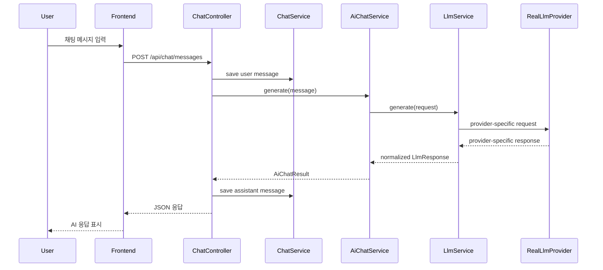
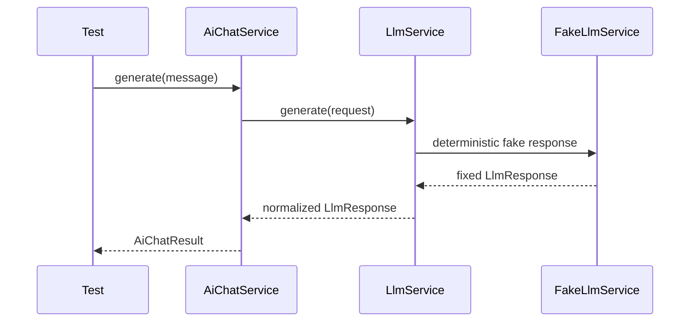

# 001 LLM Service Interface

## Status

proposed

## Goal

기존 AI Chat 흐름에서 실제 LLM provider 호출이 특정 구현체에 직접 묶여 있다면, 이를 `LlmService` 인터페이스 뒤로 분리한다.

이 작업의 목표는 운영 환경에서는 실제 LLM provider를 호출하고, 테스트 환경에서는 Fake 또는 Mock LLM을 주입할 수 있는 경계를 만드는 것이다.

이를 통해 이후 작업에서 실제 LLM 호출 없이 AI Chat 흐름을 테스트할 수 있게 한다.

## Read First

1. `AGENTS.md`
2. `PROJECT_PROFILE.md`
3. `docs/PROJECT_INDEX.md`
4. `docs/AI_CHAT/README.md`
5. `backend/docs/ai-chat-single-llm-call-plan.md`
6. Current provider boundary:
   - `backend/src/main/java/com/aihealthcoach/chat/service/AiChatService.java`
   - `backend/src/main/java/com/aihealthcoach/chat/service/AiChatServiceImpl.java`
   - `backend/src/main/java/com/aihealthcoach/common/config/ChatClientConfig.java`
7. Related tests:
   - `backend/src/test/java/com/aihealthcoach/chat/service/AiChatServiceImplTest.java`

Optional only if persistence or response flow becomes unclear:
- `docs/ARCHITECTURE.md`
- `docs/DOMAIN_MAP.md`

## Current Behavior

현재 AI Chat 흐름에서 LLM 호출 방식이 명확히 분리되어 있지 않을 수 있다.

예상되는 현재 문제는 다음과 같다.

- `AiChatServiceImpl` 또는 유사한 AI Chat 서비스가 실제 LLM client를 직접 호출한다.
- 테스트에서 실제 LLM provider 호출을 막기 어렵다.
- LLM 응답을 고정하기 어려워 AI Chat 테스트가 비결정적이다.
- 이후 FakeLlmService 기반 Harness 테스트를 만들기 어렵다.
- LLM provider 교체 시 AI Chat 서비스의 변경 범위가 커질 수 있다.

## Target Behavior

작업 완료 후에는 LLM 호출이 `LlmService` 인터페이스를 통해서만 이루어져야 한다.

운영 환경에서는 실제 provider 구현체가 사용된다.

테스트 환경에서는 Fake 또는 Mock 구현체를 주입할 수 있어야 한다.

`AiChatService`는 특정 provider SDK나 HTTP client 세부사항을 알지 않아야 한다.

현재 provider-facing 경계가 `AiChatServiceImpl -> ChatClient`라면, 이번 작업에서는 이를 `AiChatServiceImpl -> LlmService -> ChatClient` 구조로 분리한다.

## Target Sequence



## Test Sequence



## Communication Contract

| From             | To                   | Method/Call            | Input                                | Output                | Error                              |
| ---------------- | -------------------- | ---------------------- | ------------------------------------ | --------------------- | ---------------------------------- |
| `ChatController` | `ChatService`        | `insert(...)`          | authenticated `userId`, chat message | `ChatMessageResponse` | mapped domain exception            |
| `ChatController` | `AiChatService`      | `generate(...)`        | user message                         | `AiChatResult`        | mapped domain exception            |
| `AiChatService`  | `LlmService`         | `generate(...)`        | `LlmRequest`                         | `LlmResponse`         | `LlmException` or mapped exception |
| `LlmService`     | Real provider client | provider-specific call | prompt/messages/options              | provider response     | timeout, rate limit, parse error   |
| Test             | `AiChatService`      | service/test call      | fixed user message                   | deterministic result  | test failure                       |
| Test config      | `LlmService`         | bean injection         | fake implementation                  | no real provider call | fail if real provider is called    |

## Scope

변경해도 되는 범위:

- 기존 LLM 호출부
- `AiChatServiceImpl`에서 LLM을 직접 호출하던 부분
- `AiChatServiceImpl`이 `ChatClient` 대신 `LlmService`에 의존하도록 바꾸는 부분
- `LlmService` 인터페이스 추가
- 운영용 LLM 구현체 이름 정리
  - 예: `OpenAiLlmService`, `SpringAiLlmService`, `ClaudeLlmService` 등 실제 프로젝트에 맞는 이름

- LLM 요청/응답 DTO 추가
  - 예: `LlmRequest`
  - 예: `LlmResponse`

- LLM 관련 예외 타입 추가
- 테스트에서 fake/mock LLM을 주입할 수 있도록 최소 설정 추가
- 기존 테스트가 있다면 LLM 경계 변경에 맞게 수정

## Do Not Implement

이번 작업에서는 아래를 구현하지 않는다.

- FakeLlmService의 상세 시나리오 구현
- Harness 테스트 전체 구현
- ContextBuilder 구현
- PromptBuilder static/dynamic 분리
- user_memories 기능
- daily_chat_summaries 기능
- summary_jobs 기능
- llm_call_logs 기능
- LLM prompt 품질 개선
- 프론트엔드 UI 변경
- 실제 provider 교체
- 새로운 LLM provider dependency 추가

필요한 경우 TODO만 남긴다.

## Related Tables

없음.

이번 작업은 LLM 호출 경계 분리 작업이며 DB 스키마 변경은 하지 않는다.

## Invariants

- 테스트에서 실제 LLM provider를 호출하지 않아야 한다.
- Controller는 LLM provider 세부사항을 몰라야 한다.
- `AiChatService`는 특정 provider SDK나 HTTP client 세부사항을 몰라야 한다.
- `ChatService`는 기존처럼 채팅 메시지 저장/조회 책임을 유지한다.
- 실제 LLM 호출은 운영용 `LlmService` 구현체 내부에서만 수행한다.
- provider-specific response는 `LlmResponse` 같은 내부 표준 응답으로 변환한다.
- 기존 AI Chat의 사용자 관점 동작은 유지되어야 한다.
- userId는 기존 규칙대로 인증된 사용자 컨텍스트에서 가져온다.
- 새로운 dependency는 추가하지 않는다. 단, task에서 명시적으로 요구한 경우는 제외한다.
- provider API key, token, `.env` 값은 코드나 문서에 노출하지 않는다.

## Acceptance Criteria

- [ ] `LlmService` 인터페이스가 생성되어 있다.
- [ ] LLM 호출 입력을 표현하는 내부 요청 객체가 있다.
- [ ] LLM 호출 결과를 표현하는 내부 응답 객체가 있다.
- [ ] 기존 실제 LLM 호출 코드는 운영용 `LlmService` 구현체로 이동했거나 감싸져 있다.
- [ ] `AiChatService`는 실제 provider client를 직접 호출하지 않는다.
- [ ] `AiChatService`는 `LlmService` 인터페이스에만 의존한다.
- [ ] `ChatClient` 같은 provider-specific client는 운영용 `LlmService` 구현체 내부에서만 사용된다.
- [ ] 테스트에서 `LlmService`를 fake/mock으로 대체할 수 있는 구조가 마련되어 있다.
- [ ] 기존 Chat API의 외부 응답 형식은 불필요하게 변경되지 않았다.
- [ ] 실제 secret, token, `.env` 값이 노출되지 않았다.
- [ ] 관련 테스트가 추가 또는 수정되었다.

## Verification

프로젝트에 문서화된 검증 명령이 있으면 그 명령을 우선 사용한다.

```bash
./scripts/check
```

전체 검증이 어렵다면, 백엔드 관련 최소 검증을 실행한다.

```bash
cd backend && mvn test
```

정확한 명령은 `PROJECT_PROFILE.md`와 기존 프로젝트 파일을 기준으로 확인한다.

전체 검증을 실행할 수 없다면, 이유를 기록하고 가장 좁은 관련 테스트 명령을 실행한다.

## Tests

- 추가:
  - `LlmService`를 fake/mock으로 대체했을 때 `AiChatService`가 동작하는 테스트
  - 기존 `AiChatService` 테스트가 있다면 LLM provider 직접 호출 없이 통과하도록 수정

- 수정:
  - 실제 LLM provider에 의존하던 기존 테스트
  - `AiChatService` 생성자 또는 의존성 주입 변경으로 깨지는 테스트

- 추가하지 않은 이유:
  - 테스트를 추가하지 못한 경우, 기존 테스트 구조 부재 또는 설정 문제를 명확히 기록한다.
  - 단, 실제 LLM 호출에 의존하는 테스트를 그대로 두면 안 된다.

## Notes / Risks

- 기존 LLM 호출부가 여러 곳에 흩어져 있다면, 이번 task에서는 `AiChatService` 관련 호출부만 우선 분리한다.
- provider별 세부 옵션은 운영용 구현체 내부에 숨긴다.
- LlmRequest / LlmResponse를 너무 provider-specific하게 만들지 않는다.
- 이후 `003-fake-llm-harness.md`에서 FakeLlmService와 Harness 테스트를 본격적으로 추가한다.
- 이후 `004-context-builder.md`에서 LlmRequest에 들어갈 prompt/context 구조가 더 정리될 수 있다.
- 이후 `008-llm-call-logs.md`에서 LLM 호출 로깅 wrapper가 추가될 수 있으므로, 이번 task에서 로깅까지 과하게 구현하지 않는다.
