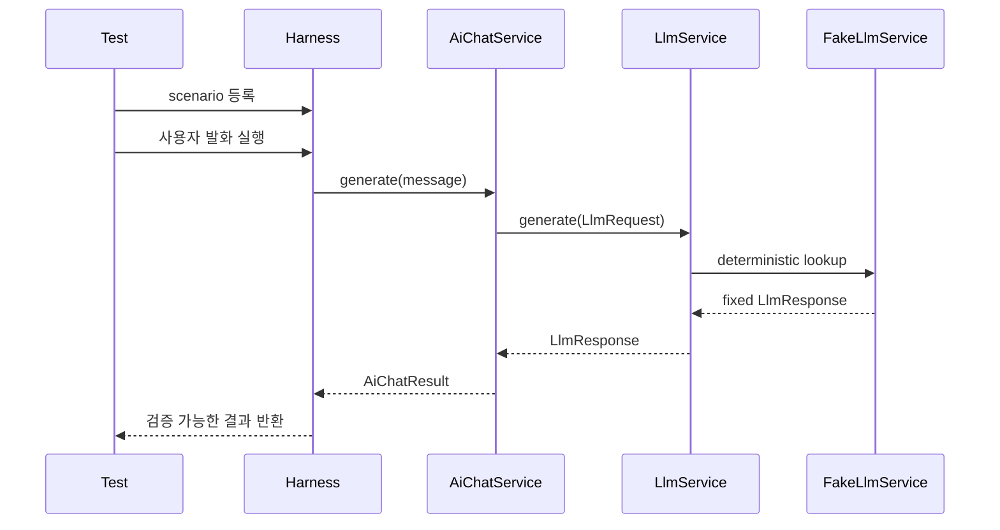
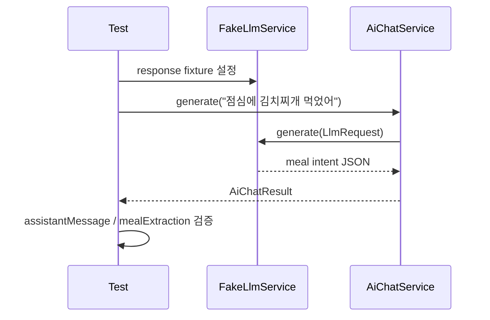

# 002 Fake LLM Harness

## Status

proposed

## Goal

실제 LLM provider를 호출하지 않고도 AI Chat의 주요 흐름을 검증할 수 있는 Fake LLM 기반 Harness 테스트 구조를 만든다.

이 작업의 목표는 `LlmService` 인터페이스 뒤에 테스트용 `FakeLlmService` 또는 mock 구현을 주입하고, 사용자 발화가 AI Chat 흐름을 거쳐 의도된 결과로 변환되는지 검증하는 기반을 마련하는 것이다.

이를 통해 이후 meal, exercise, weight, user memory, daily summary 기능을 실제 LLM 호출 없이 시나리오 단위로 검증할 수 있게 한다.

## Read First

1. `AGENTS.md`
2. `PROJECT_PROFILE.md`
3. `docs/PROJECT_INDEX.md`
4. `docs/AI_CHAT/README.md`
5. `tasks/001-llm-service-interface.md`
6. Current AI Chat flow:
   - `backend/src/main/java/com/aihealthcoach/chat/controller/ChatController.java`
   - `backend/src/main/java/com/aihealthcoach/chat/service/AiChatService.java`
   - `backend/src/main/java/com/aihealthcoach/chat/service/AiChatServiceImpl.java`
   - `backend/src/main/java/com/aihealthcoach/chat/service/LlmService.java`
   - `backend/src/main/java/com/aihealthcoach/chat/service/LlmServiceImpl.java`
   - `backend/src/main/java/com/aihealthcoach/chat/dto/LlmDto.java`
   - `backend/src/main/java/com/aihealthcoach/chat/dto/ChatDto.java`
7. Related tests:
   - `backend/src/test/java/com/aihealthcoach/chat/service/AiChatServiceImplTest.java`

Optional only if controller/persistence flow becomes unclear:
- `docs/ARCHITECTURE.md`
- `docs/DOMAIN_MAP.md`
- `backend/docs/ai-chat-single-llm-call-plan.md`

## Current Behavior

`LlmService` 경계가 생기면 `AiChatServiceImpl` 단위에서는 fake 또는 mock `LlmService`를 주입해 실제 provider 호출 없이 테스트할 수 있다.

하지만 AI Chat의 주요 흐름을 시나리오 단위로 검증하기 위한 공통 Harness 구조는 아직 없다.

현재 예상되는 부족한 점은 다음과 같다.

- 테스트마다 fake LLM 응답을 임시 내부 클래스로 반복해서 만들 가능성이 있다.
- 사용자 발화와 fake LLM 응답을 연결하는 시나리오 표현 방식이 없다.
- meal, exercise, weight 추출 결과를 한 흐름에서 검증하는 공통 테스트 기반이 없다.
- 실제 `LlmServiceImpl` 또는 provider client가 테스트에서 실수로 호출되는 것을 명확히 막는 장치가 부족하다.
- 이후 user memory, daily summary 같은 context 기반 기능을 붙일 때 테스트 구조를 다시 만들 가능성이 있다.

## Target Behavior

작업 완료 후에는 AI Chat 테스트에서 실제 LLM provider를 호출하지 않고도 주요 채팅 흐름을 검증할 수 있어야 한다.

테스트는 `LlmService` 인터페이스 뒤에 fake 또는 mock 구현을 주입한다.

Fake LLM은 고정된 `LlmResponse`를 반환하거나, 입력 발화 또는 scenario key에 따라 결정적인 응답을 반환할 수 있어야 한다.

Harness 테스트는 사용자 발화가 다음 흐름을 거쳐 의도한 결과로 변환되는지 검증한다.

1. 사용자 발화 입력
2. `AiChatService` 호출
3. `LlmService` fake 응답 반환
4. `AiChatResult` 파싱 및 정규화
5. assistant message, meal extraction, exercise extraction, weight extraction 검증

이번 작업은 Harness 기반만 만든다. 모든 도메인 시나리오를 대량으로 추가하지 않는다.

## Target Sequence



## Test Sequence



## Communication Contract

| From | To | Method/Call | Input | Output | Error |
|---|---|---|---|---|---|
| Test | Harness | scenario setup | scenario name, user message, fake response | configured harness | test setup failure |
| Harness | `AiChatService` | `generate(...)` / `generateWithImages(...)` | fixed user message or image input | `AiChatResult` | test failure |
| `AiChatService` | `LlmService` | `generate(...)` | `LlmRequest` | `LlmResponse` | fallback result or mapped exception |
| Fake LLM | `LlmService` boundary | fake lookup | `LlmRequest` | deterministic `LlmResponse` | fail fast if scenario missing |
| Test | Result assertions | assertions | `AiChatResult` | pass/fail | assertion failure |

## Scope

변경해도 되는 범위:

- 테스트용 Fake LLM 구현
  - 예: `FakeLlmService`
  - 위치는 테스트 소스 하위로 둔다.
- AI Chat Harness 테스트 구조
  - 예: `AiChatHarness`, `AiChatHarnessTest`, `FakeLlmScenario`
  - 실제 프로젝트 패키지 구조에 맞춰 최소한으로 둔다.
- 기존 `AiChatServiceImplTest`가 fake LLM 구조와 중복된다면 일부 정리 가능
- 최소 시나리오 fixture
  - meal intent 1개
  - exercise intent 1개 또는 weight intent 1개
  - no intent 또는 invalid JSON fallback 1개
- 테스트에서 실제 `LlmServiceImpl` 또는 `ChatClient`가 호출되지 않도록 하는 검증

## Do Not Implement

이번 작업에서는 아래를 구현하지 않는다.

- 실제 LLM provider 호출
- 새로운 LLM provider dependency 추가
- Prompt 품질 개선
- ContextBuilder 구현
- PromptBuilder static/dynamic 분리
- user_memories 기능
- daily_chat_summaries 기능
- summary_jobs 기능
- llm_call_logs 기능
- meal, exercise, weight 전체 시나리오 대량 추가
- 프론트엔드 UI 변경
- DB 스키마 변경
- 실제 사용자 기록 저장/조회 end-to-end 통합 테스트 확대

필요한 경우 TODO만 남긴다.

## Related Tables

없음.

이번 작업은 테스트 Harness 구조 추가이며 DB 스키마 변경은 하지 않는다.

## Invariants

- 테스트에서 실제 LLM provider를 호출하지 않아야 한다.
- 테스트에서 `ChatClient`를 직접 생성하거나 호출하지 않아야 한다.
- 운영용 `LlmServiceImpl`의 provider 호출 동작은 바꾸지 않는다.
- `AiChatService`의 외부 계약은 기존처럼 `AiChatResult`를 반환한다.
- 기존 Chat API의 외부 응답 형식은 변경하지 않는다.
- userId는 기존 규칙대로 인증된 사용자 컨텍스트에서 가져온다. 단, 이번 task가 service-level harness만 다룬다면 userId 흐름을 새로 만들지 않는다.
- Fake LLM 응답은 결정적이어야 한다.
- 실제 secret, token, `.env` 값은 코드나 문서에 노출하지 않는다.
- 새로운 dependency는 추가하지 않는다.

## Acceptance Criteria

- [ ] 테스트용 Fake LLM 구현 또는 mock 주입 구조가 마련되어 있다.
- [ ] Fake LLM은 실제 provider 또는 `ChatClient`를 호출하지 않는다.
- [ ] AI Chat Harness 테스트에서 `AiChatService`에 fake `LlmService`를 주입할 수 있다.
- [ ] 사용자 발화 1개 이상이 fake LLM 응답을 거쳐 `AiChatResult`로 변환되는 테스트가 있다.
- [ ] meal extraction 결과를 검증하는 최소 시나리오가 있다.
- [ ] exercise 또는 weight extraction 결과를 검증하는 최소 시나리오가 있다.
- [ ] invalid JSON 또는 no intent fallback 경로를 검증하는 최소 시나리오가 있다.
- [ ] 테스트가 실제 provider API key 없이 통과한다.
- [ ] 기존 `AiChatServiceImplTest`와 역할이 중복되면 중복을 줄이거나, 단위 테스트와 harness 테스트의 역할 차이가 명확하다.
- [ ] 관련 테스트가 문서화된 명령으로 통과한다.

## Verification

프로젝트에 문서화된 검증 명령이 있으면 그 명령을 우선 사용한다.

```bash
./scripts/check
```

WSL에서 root harness가 `cmd.exe` 또는 `UtilBindVsockAnyPort` 문제로 막히면 WSL 전용 검증을 실행한다.

```bash
./scripts/check-wsl
```

전체 검증이 어렵다면, 백엔드 관련 최소 검증을 실행한다.

```bash
cd backend && mvn test
```

정확한 명령은 `PROJECT_PROFILE.md`와 기존 프로젝트 파일을 기준으로 확인한다.

전체 검증을 실행할 수 없다면, 이유를 기록하고 가장 좁은 관련 테스트 명령을 실행한다.

## Tests

- 추가:
  - Fake LLM 기반 Harness 테스트
  - meal extraction 최소 시나리오 테스트
  - exercise 또는 weight extraction 최소 시나리오 테스트
  - invalid JSON 또는 no intent fallback 시나리오 테스트
  - 실제 provider가 호출되지 않는다는 것을 보장하는 테스트 구조

- 수정:
  - 기존 `AiChatServiceImplTest`와 중복되는 fake LLM helper가 있다면 공통 테스트 helper로 정리
  - 생성자 또는 DTO 위치 변경으로 깨지는 테스트

- 추가하지 않은 이유:
  - controller부터 DB 저장까지 포함하는 광범위한 end-to-end 테스트는 이번 task 범위를 넘으면 추가하지 않는다.
  - user memory, daily summary, llm call log 관련 시나리오는 해당 기능 task에서 추가한다.

## Notes / Risks

- Harness가 너무 복잡해지면 실제 기능보다 테스트 프레임워크가 먼저 커질 수 있다. 이번 task에서는 최소 구조와 대표 시나리오만 만든다.
- Fake LLM 응답 fixture가 실제 prompt 문구에 과하게 결합되면 prompt 변경 때 테스트가 불필요하게 깨질 수 있다.
- 반대로 fake 응답이 너무 느슨하면 실제 파싱/정규화 문제를 놓칠 수 있다.
- 이후 `ContextBuilder`, user memory, daily summary가 추가되면 Harness 입력에 context fixture가 더해질 수 있다.
- 이번 task는 `LlmService` 경계가 이미 존재한다는 전제를 둔다. 경계가 아직 merge되지 않았다면 `tasks/001-llm-service-interface.md`를 먼저 완료한다.
