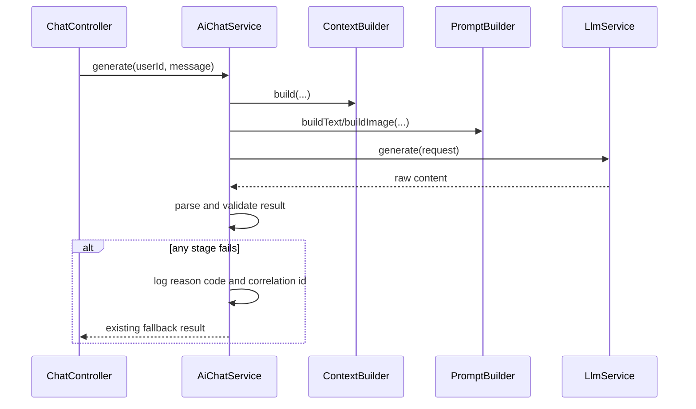

# 008 AI Chat Fallback Observability

## Status

done

## Goal

AI Chat이 공통 fallback 응답을 반환했을 때, context 조립·prompt 생성·provider 호출·LLM 응답 parsing·응답 유효성 중 어느 단계에서 실패했는지 서버에서 구분할 수 있게 한다.

개발 환경에서는 제한된 raw LLM 응답을 확인해 JSON 계약 불일치, markdown code fence, 빈 응답, provider 오류 text를 빠르게 진단할 수 있어야 한다. 운영 환경에서는 사용자 발화, profile, memory 같은 민감 정보가 로그에 과도하게 남지 않도록 한다.

## Read First

1. `AGENTS.md`
2. `PROJECT_PROFILE.md`
3. `docs/AI_CHAT/README.md`
4. `tasks/001-llm-service-interface.md`
5. `tasks/003-context-builder.md`
6. `tasks/007-user-memory-context-prompt.md`
7. `backend/src/main/java/com/aihealthcoach/chat/service/AiChatServiceImpl.java`
8. `backend/src/main/java/com/aihealthcoach/chat/service/LlmServiceImpl.java`
9. `backend/src/main/java/com/aihealthcoach/chat/dto/LlmDto.java`

## Current Behavior

- `AiChatServiceImpl.generate(...)`와 `generateWithImages(...)`는 context build, prompt build, provider 호출 중 발생한 예외를 하나의 catch로 처리하고 동일 fallback을 반환한다.
- `parseAiResult(...)`는 JSON parsing 실패를 로그 없이 fallback으로 바꾼다.
- JSON은 파싱되었지만 `assistantMessage`가 비어 있는 경우도 같은 fallback이 되며, 원인이 기록되지 않는다.
- `LlmResponse`는 content만 보관하므로 provider의 원본 응답 text를 parsing 실패 시점에 분류해 볼 수 있는 명시적 정책이 없다.
- 사용자는 모든 실패를 "응답을 정리하지 못했어요"로만 보므로, 실제 원인을 구별할 수 없다.

## Target Behavior

- fallback 발생 시 서버 로그에 아래 단계 중 하나를 명확한 reason code로 남긴다.
  - `CONTEXT_BUILD_FAILED`
  - `PROMPT_BUILD_FAILED`
  - `PROVIDER_CALL_FAILED`
  - `RESPONSE_PARSE_FAILED`
  - `RESPONSE_INVALID`
- 동일 AI 요청 흐름의 로그를 연결할 수 있도록 request correlation id를 생성한다.
- 개발 전용 설정이 활성화된 경우에만 raw provider response를 최대 정해진 길이까지 로그에 남긴다.
- 운영 기본 설정에서는 raw provider response, user message, dynamic context, image bytes를 로그에 남기지 않는다.
- 사용자에게 반환하는 fallback 문구와 Chat API 응답 형식은 유지한다.

## Logging Format

기존 Logback 설정에 별도 JSON encoder를 추가하지 않는다. 사람이 터미널에서 바로 읽고 `rg`로 필터링할 수 있도록, 한 줄의 고정 `key=value` 형식을 사용한다.

### Fallback Event

모든 fallback은 WARN 레벨의 아래 형식을 사용한다.

```text
event=ai_chat_fallback correlation_id=<uuid> stage=<reason_code> channel=<TEXT|IMAGE> user_id=<id> response_chars=<count|0> exception_type=<class|none>
```

예시:

```text
event=ai_chat_fallback correlation_id=7f3c... stage=RESPONSE_PARSE_FAILED channel=TEXT user_id=42 response_chars=816 exception_type=JsonProcessingException
```

- `event`: 항상 `ai_chat_fallback`으로 고정한다.
- `correlation_id`: 하나의 AI Chat 처리 흐름에서 생성한 UUID다. 같은 fallback의 raw response preview event와 연결한다.
- `stage`: `CONTEXT_BUILD_FAILED`, `PROMPT_BUILD_FAILED`, `PROVIDER_CALL_FAILED`, `RESPONSE_PARSE_FAILED`, `RESPONSE_INVALID` 중 하나다.
- `channel`: text 또는 image 요청을 구분한다.
- `user_id`: 문제 재현에 필요한 내부 사용자 식별자다. email, nickname 등 개인 식별 정보는 남기지 않는다.
- `response_chars`: provider response content의 문자 수이며, response가 없으면 `0`이다.
- `exception_type`: 예외가 없는 invalid response면 `none`이다.

### Raw Response Preview Event

raw response preview 설정이 명시적으로 활성화된 경우에만, parsing 또는 invalid response fallback 직후 WARN 레벨로 별도 한 줄을 남긴다.

```text
event=ai_chat_raw_response correlation_id=<uuid> response_chars=<count> response_preview="<sanitized and truncated content>"
```

- 기본 설정은 비활성이다.
- preview는 최대 `1000`자로 제한한다.
- `\r`, `\n`, `\t`는 escape해 한 줄 로그를 유지한다.
- user message, dynamic context prompt, image resource는 별도 필드로 절대 기록하지 않는다.
- provider raw response가 사용자 정보를 재진술할 수 있으므로 local/dev에서만 명시적으로 활성화한다.

### Configuration

```properties
ai.chat.observability.raw-response-preview-enabled=false
ai.chat.observability.raw-response-preview-max-chars=1000
```

설정값이 없을 때도 위 기본값을 사용한다. 운영 profile에서 raw preview를 자동 활성화하는 설정은 두지 않는다.

## Target Sequence



## Communication Contract

| From | To | Method/Call | Input | Output | Error |
|---|---|---|---|---|---|
| `AiChatServiceImpl` | fallback logger | `logFailure(...)` | correlation id, reason code, safe metadata, exception | structured server log | raw response omitted by default |
| `AiChatServiceImpl` | `LlmService` | `generate(...)` | rendered `LlmRequest` | `LlmResponse` | provider exception |
| Developer | application config | debug logging flag | local/dev property | raw response logging enabled | must remain disabled by default |

## Scope

- AI Chat fallback reason code와 내부 logging helper 또는 collaborator를 추가한다.
- context build, prompt build, provider call, response parse, response validation을 분리해 기록한다.
- 각 AI 요청에 correlation id를 만들고 관련 fallback 로그에 포함한다.
- raw LLM response 로그는 opt-in 설정으로만 활성화한다.
  - 기본값: `false`
  - 최대 길이: 명시적인 상한을 둔다.
  - image bytes와 rendered dynamic context는 어떤 환경에서도 로그에 넣지 않는다.
- invalid JSON, markdown fence text, 빈 content, blank `assistantMessage`의 reason을 구분한다.
- failure logger와 parsing 정책의 단위 테스트를 추가한다.

## Do Not Implement

- raw LLM 응답을 frontend, Swagger, 일반 API response에 노출
- DB 기반 LLM call history 또는 장기 보관 정책
- provider token usage, latency, model 비용 집계
- OpenTelemetry/Actuator dashboard 구성
- 사용자 profile, active memory, 최근 대화의 전체 raw log 저장
- fallback 문구의 사용자별 세분화

## Related Tables

- none

## Invariants

- 실제 provider 호출 실패와 JSON parsing 실패는 서로 다른 reason code로 남는다.
- fallback 뒤에도 기존처럼 USER와 ASSISTANT chat message는 저장된다.
- raw response logging은 기본 비활성이고, 운영 환경에서 우연히 활성화되지 않아야 한다.
- raw response가 활성화되어도 최대 길이 제한을 지킨다.
- image resource, API key, authorization header, rendered dynamic context는 로그에 남기지 않는다.
- 테스트는 실제 LLM provider를 호출하지 않는다.

## Acceptance Criteria

- [x] fallback 원인이 context/prompt/provider/parse/invalid 단계로 구분된다.
- [x] 각 failure log에 correlation id와 reason code가 있다.
- [x] raw response debug logging은 명시적 설정이 있을 때만 동작한다.
- [x] debug logging은 길이 제한을 적용한다.
- [x] 기본 설정에서 raw response와 dynamic context가 로그에 남지 않는다.
- [x] 사용자 fallback 메시지와 Chat API 응답 형식이 유지된다.
- [x] 실제 provider 없이 failure path 테스트가 통과한다.

## Verification

```bash
cd backend && mvn test
```

WSL 환경에서 root harness가 막히면:

```bash
sh backend/harness/scripts/build
```

## Tests

- 추가:
  - context build failure reason logging test
  - prompt build failure reason logging test
  - provider failure reason logging test
  - invalid JSON과 blank assistant message 구분 test
  - raw response logging disabled/enabled/truncated test
- 수정:
  - `AiChatServiceImplTest`
  - `AiChatHarnessTest` 또는 fake LLM support
- 제외:
  - 실제 GMS/OpenAI provider response 관찰
  - 운영 로그 수집 시스템 integration test

## Result

- `AiChatFallbackLogger`와 `ConsoleAiChatFallbackLogger`를 추가해 fallback 원인을 고정 `key=value` WARN 로그로 남긴다.
- 기본 설정에서는 raw provider response를 남기지 않으며, local/dev에서만 `ai.chat.observability.raw-response-preview-enabled=true`로 preview를 활성화할 수 있다.
- `sh backend/harness/scripts/build`를 실행해 테스트 129개가 통과했다.
- 일반 대화의 경우 json 형태로의 응답을 제공하지 않는다는 오류 원인을 찾았으므로, 결과에 대해서만 정리 한 뒤 AOP에 어긋나는 국소 logging에 대해 삭제한다.


## Notes / Risks

- raw LLM response에도 사용자 발화나 장기 memory가 재진술될 수 있다. 따라서 debug 설정의 적용 profile과 접근 권한을 구현 전에 명확히 정해야 한다.
- 이 task는 장기적인 LLM call logging의 최소 진단 기반이다. token usage, latency, model, 비용, DB 보관은 별도 task로 분리한다.
