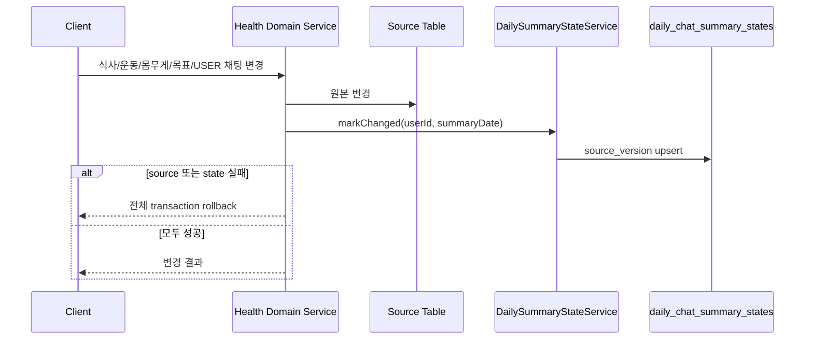

# 009 Daily Chat Summary Foundation

## Status

proposed

## Goal

사용자의 하루 대화와 건강 활동을 나중에 별도 AI가 요약할 수 있도록, 일별 summary 저장소와 summary 입력 freshness 상태를 만든다.

이 summary는 장기 사용자 memory가 아니다. 사용자의 선호·제약은 `user_memories`에 남기고, 특정 날짜의 대화·식사·운동·몸무게·목표 변화는 daily chat summary의 입력으로 관리한다.

이번 작업은 summary AI 호출, scheduler, worker를 구현하지 않는다. 후속 batch가 처리할 대상과 재생성 여부를 DB에서 빠르게 판단할 수 있는 기반까지만 만든다.

## Read First

1. `AGENTS.md`
2. `PROJECT_PROFILE.md`
3. `docs/AI_CHAT/README.md`
4. `tasks/003-context-builder.md`
5. `tasks/007-user-memory-context-prompt.md`
6. `backend/src/main/java/com/aihealthcoach/chat/service/ChatServiceImpl.java`
7. `backend/src/main/java/com/aihealthcoach/meal/service/MealServiceImpl.java`
8. `backend/src/main/java/com/aihealthcoach/exercise/service/ExerciseServiceImpl.java`
9. `backend/src/main/java/com/aihealthcoach/weight/service/WeightRecordServiceImpl.java`
10. `backend/src/main/java/com/aihealthcoach/user/service/UserServiceImpl.java`
11. `data/db/schema.sql`

## Current Behavior

- AI Chat은 profile, 일일 목표, 오늘 기록, 최근 대화, active memory를 현재 요청 context로만 사용한다.
- `user_memories`는 명시적으로 저장을 요청한 장기 정보만 보관한다.
- 식사·운동·몸무게·목표·채팅 변경 뒤에 summary가 필요한 사용자나 날짜를 기록하지 않는다.
- 향후 모든 사용자에게 summary AI를 호출하면 활동이 없는 사용자까지 대상으로 잡히고, 이미 요약한 날짜의 재생성 여부도 판단할 수 없다.

## Target Behavior

- `daily_chat_summaries`는 사용자·날짜별로 생성된 자연어 summary와 반영한 입력 revision을 보관한다.
- `daily_chat_summary_states`는 사용자·날짜별 summary 입력의 최신 revision을 보관한다.
- 건강 활동이 바뀌면 해당 날짜 state의 `source_version`이 증가한다.
- 후속 batch는 summary가 없거나 `state.source_version > summary.source_version`인 행만 처리한다.
- 최근 7일보다 과거인 날짜를 수정해도 summary 재생성 대상은 만들지 않는다.
- 신규 가입만 발생한 사용자는 summary 대상이 아니다.

## Target Sequence



후속 batch 흐름은 이 task에서 구현하지 않는다.

```text
stale target
  = summary 없음
  OR state.source_version > summary.source_version

batch
  -> stale target만 조회
  -> 해당 userId + summaryDate의 원본만 조회
  -> 별도 summary AI 호출
  -> daily_chat_summaries upsert
```

## Data Model

### `daily_chat_summaries`

| Column | Type | Rule |
|---|---|---|
| `id` | `BIGSERIAL` | primary key |
| `user_id` | `BIGINT` | `users.id` FK, cascade delete |
| `summary_date` | `DATE` | summary 대상 날짜 |
| `content` | `TEXT` | 후속 AI가 생성한 자연어 summary |
| `source_version` | `BIGINT` | summary가 반영한 state revision |
| `created_at` | `TIMESTAMP` | 생성 시각 |
| `updated_at` | `TIMESTAMP` | 마지막 생성·갱신 시각 |

- `(user_id, summary_date)` unique
- `summary_date` 기반 조회 index 추가
- `content`는 이 task에서 생성하거나 조회 API로 노출하지 않는다.

### `daily_chat_summary_states`

| Column | Type | Rule |
|---|---|---|
| `user_id` | `BIGINT` | `users.id` FK, cascade delete |
| `summary_date` | `DATE` | 변경이 영향을 주는 날짜 |
| `source_version` | `BIGINT` | 최초 `1`, 변경마다 `+1` |
| `source_updated_at` | `TIMESTAMP` | 마지막 변경 시각 |
| `created_at` | `TIMESTAMP` | 생성 시각 |
| `updated_at` | `TIMESTAMP` | 마지막 state 갱신 시각 |

- `(user_id, summary_date)` composite primary key
- `summary_date` 기반 조회 index 추가
- `source_version`은 timestamp 비교 대신 freshness 판단에 사용한다.

## State Update Policy

`DailyChatSummaryStateService.markChanged(Long userId, LocalDate summaryDate)`를 추가한다.

- application `Clock` 기준 오늘보다 7일 이상 과거인 날짜는 갱신하지 않는다.
- 오늘과 미래 날짜는 state를 남긴다. 후속 batch는 날짜가 종료된 뒤에만 처리한다.
- 동일 사용자·날짜는 새 행을 만들지 않고 `source_version`을 증가시킨다.
- `source_updated_at`, `updated_at`은 state 갱신 시각으로 갱신한다.

### 변경 대상

| Source | Summary date | 포함 이유 |
|---|---|---|
| USER chat message 저장 | 메시지 생성일 | 하루 대화의 입력 |
| 식사 생성·수정·삭제 | `mealDate` | 하루 섭취 변화 |
| 운동 생성·수정·삭제 | `exerciseDate` | 하루 운동 변화 |
| 몸무게 생성·수정·삭제 | `recordDate` | 하루 체중 기록 변화 |
| 일일 목표 upsert | 변경 당일 | 하루 목표 해석 변화 |
| user profile 변경 | 변경 당일 | 현재·목표 체중 등 건강 context 변화 |

### 제외 대상

- ASSISTANT chat message
- 신규 가입만 발생한 사용자
- user memory 생성·비활성화
- 7일보다 과거인 날짜의 원본 변경

삭제 API는 삭제 전에 원본 record date를 조회해 state 갱신 날짜를 확보한다.

## Transaction Policy

- 원본 도메인 변경과 `markChanged(...)`는 같은 transaction에서 처리한다.
- 원본 저장 또는 state upsert 중 하나라도 실패하면 전체 transaction을 rollback한다.
- summary state는 파생 데이터지만, 후속 batch가 원본을 전수 재조회하지 않도록 freshness state의 일관성을 우선한다.
- `AFTER_COMMIT` event, 별도 transaction, best-effort state 저장, 자동 reconciliation scan은 이번 설계에서 사용하지 않는다.

## Communication Contract

| From | To | Method/Call | Input | Output | Error |
|---|---|---|---|---|---|
| health/chat write service | `DailyChatSummaryStateService` | `markChanged` | authenticated user id, summary date | state upsert | transaction rollback |
| future summary batch | summary mapper | stale target query | completed summary date | user id, date, source version | retry policy는 후속 task |
| future summary batch | summary mapper | summary upsert | content, source version | daily summary | retry policy는 후속 task |

## Scope

- summary domain의 entity, dto, mapper, mapper XML, service 추가
- `data/db/schema.sql`에 두 summary 테이블과 index 추가
- activity write service에 state 갱신 연결
- 삭제 흐름에서 날짜를 확보할 수 있도록 mapper/service 계약 보강
- freshness state 및 source revision 관련 unit test 추가

## Do Not Implement

- summary AI prompt, provider 호출, JSON parsing
- scheduler, worker, worker claim, retry, backoff
- `daily_chat_summaries` 실제 content 생성
- 최근 7일 summary의 AI Chat `ContextBuilder` 주입
- weekly summary, 30일 체중 추세, context ranker
- inferred memory candidate, memory 승격 정책
- summary 조회·수정 API와 frontend UI

## Related Tables

- 기존: `users`, `chat_messages`, `meals`, `exercise_records`, `weight_records`, `daily_goals`
- 신규: `daily_chat_summaries`, `daily_chat_summary_states`

## Invariants

- 사용자 원본 기록과 summary state는 같은 transaction에서 성공하거나 함께 rollback한다.
- summary state는 사용자·날짜마다 하나만 존재한다.
- 같은 날짜의 반복 변경은 state revision만 증가시킨다.
- `daily_chat_summaries`는 원본 기록을 대체하지 않는다.
- user memory와 daily summary는 서로 다른 시간 범위의 정보를 보관한다.
- summary 대상 조회는 전체 사용자 순회나 전체 원본 전수 조회를 요구하지 않는다.

## Acceptance Criteria

- [ ] 두 summary 테이블과 제약·index가 schema에 추가된다.
- [ ] 건강 활동 변경이 올바른 summary date의 state revision을 증가시킨다.
- [ ] USER 메시지만 대화 summary 입력으로 표시된다.
- [ ] 삭제 후에도 삭제된 record의 원래 날짜가 summary state에 반영된다.
- [ ] 최근 7일을 벗어난 과거 수정은 summary state를 만들거나 변경하지 않는다.
- [ ] 원본 변경 또는 summary state 저장 실패 시 전체 transaction이 rollback된다.
- [ ] summary AI, scheduler, AI Chat context 주입은 추가되지 않는다.

## Verification

```bash
cd backend && mvn test
```

WSL 환경에서 root harness가 막히면:

```bash
sh backend/harness/scripts/build
```

## Tests

- 추가:
  - `DailyChatSummaryStateService` upsert와 revision 증가 test
  - 최근 7일 경계 test
  - activity별 summary date test
  - 삭제 전 record date 조회 test
  - state 실패 시 source transaction rollback test
- 수정:
  - `ChatServiceImplTest`
  - `MealServiceImplTest`
  - `ExerciseServiceImplTest`
  - `WeightRecordServiceImplTest`
  - `DailyGoalServiceImplTest`
  - `UserServiceImplProfileTest`
- 제외:
  - 실제 LLM provider 호출 test
  - scheduler 또는 병렬 worker integration test

## Notes / Risks

- summary state까지 같은 transaction에 포함하므로 state DB 오류가 사용자 기록 저장 오류로 이어진다. 이는 state 누락으로 summary 대상이 영구적으로 빠지는 위험보다 강한 일관성을 선택한 결과다.
- 미래 날짜의 식사·운동·몸무게 state는 저장할 수 있다. 후속 batch는 summary date가 종료되기 전에는 처리하지 않아야 한다.
- summary content의 보존 기간, 사용자가 보는 UI, summary AI의 환각 방지 규칙은 후속 task에서 정한다.
