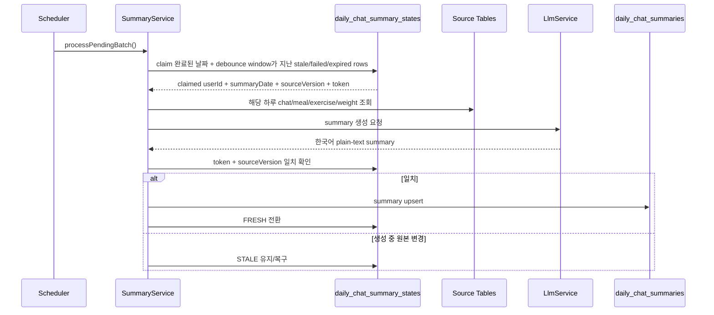

# 010 Daily Chat Summary Stale Claim Batch

## Status

done

## Goal

`daily_chat_summary_states`를 stale 날짜만 처리하는 작업 큐로 확장하고, claim된 `user_id + summary_date`의 하루 원본 기록만 조회해 `daily_chat_summaries`를 lazy/batch 방식으로 생성·저장한다.

매번 최근 7일 전체 원본 기록을 재조회하지 않고, 실제 변경이 발생한 날짜만 summary 재생성 대상으로 처리한다.

## Read First

- `AGENTS.md`
- `PROJECT_PROFILE.md`
- `docs/PROJECT_INDEX.md`
- `docs/AI_CHAT/README.md`
- `tasks/009-daily-chat-summary.md`
- `backend/src/main/java/com/aihealthcoach/summary/`
- `backend/src/main/java/com/aihealthcoach/chat/service/ChatServiceImpl.java`
- `backend/src/main/java/com/aihealthcoach/dailygoal/service/DailyGoalServiceImpl.java`
- `data/db/schema.sql`

## Current Behavior

- `daily_chat_summaries`와 `daily_chat_summary_states`는 존재하지만, summary content를 생성하는 worker가 없다.
- state는 `source_version`만 증가시키며 `STALE`, `CLAIMED`, `FRESH`, `FAILED` 같은 작업 상태를 갖지 않는다.
- batch worker가 stale row를 claim하거나 중복 worker 처리를 막는 흐름이 없다.
- summary 생성 시 한 날짜의 원본만 조회하는 service boundary가 없다.
- chat 저장 경로 중 일부는 summary state를 dirty 처리하지 않는다.
- profile 변경도 summary source로 잡히지만, 체중 변화는 weight record로 충분히 표현할 수 있다.

## Target Behavior

- state row는 `STALE`, `CLAIMED`, `FRESH`, `FAILED` 상태와 claim token, lease, retry 정보를 가진다.
- scheduler는 1분마다 최대 50건의 stale/재시도 가능 row를 claim해 처리한다.
- lazy API `refreshForUser(userId)`는 해당 사용자 stale row를 최대 2건만 처리한다.
- scheduler와 lazy API는 `source_updated_at`이 debounce window를 지난 row만 claim한다. 기본 debounce window는 5분이며 설정값으로 조정할 수 있게 한다.
- 같은 사용자가 과거의 같은 날짜 기록을 연달아 수정하면, 마지막 변경 시각부터 debounce window가 지난 뒤 한 번만 summary를 재생성한다.
- 오늘 날짜 변경은 summary state로만 추적하고 summary 생성 대상에서는 제외한다. 하루가 끝난 뒤 `summary_date < today`가 되었을 때 scheduler/lazy worker가 처리한다.
- 오늘 summary를 만들지 않기 때문에, 당일 AI Chat context는 기존처럼 원본 기록을 직접 조회하는 흐름을 유지한다.
- claim된 row의 `user_id + summary_date` 하루 원본만 조회해 Korean plain-text daily summary를 생성한다.
- 생성 성공 시 `daily_chat_summaries`를 upsert하고 state를 `FRESH`로 전환한다.
- 생성 실패 시 안전한 failure code만 저장하고 `FAILED`로 전환하며 retry schedule을 잡는다.
- 생성 중 원본 변경이 발생하면 기존 worker는 `FRESH` 처리하지 못하고 state를 다시 `STALE`로 남긴다.
- profile 변경은 summary source에서 제외한다.
- daily goal 변경은 변경 당시 snapshot 전체를 state에 저장하고 summary prompt에 포함한다.

## Target Sequence



## Communication Contract

| From | To | Method/Call | Input | Output | Error |
|---|---|---|---|---|---|
| scheduler | `DailyChatSummaryService` | `processPendingBatch()` | none | processed count | failure row별 `FAILED` |
| context consumer | `DailyChatSummaryService` | `refreshForUser(userId)` | authenticated user id | processed count, max 2 | failure row별 `FAILED` |
| write services | `DailyChatSummaryStateService` | `markChanged(userId, date, source)` | source: `CHAT`, `MEAL`, `EXERCISE`, `WEIGHT` | state stale upsert | transaction rollback |
| daily goal service | `DailyChatSummaryStateService` | `markDailyGoalChanged(userId, date, snapshot)` | 변경 당시 목표 snapshot | state stale upsert | transaction rollback |
| summary worker | `DailyChatSummaryGenerator` | `generate(sourceData)` | 하루 원본 기록과 snapshot | Korean plain-text summary | exception -> `FAILED` |

## Scope

- `summary` domain의 state entity, mapper, service, generator, scheduler/lazy orchestration
- scheduler/lazy claim 대상의 debounce window 적용
- scheduler/lazy claim 대상에서 오늘 날짜 제외
- `daily_chat_summary_states` schema 확장
- `daily_chat_summaries` upsert mapper 추가
- chat 날짜 범위 조회 mapper 추가
- weight 단일 날짜 조회 service boundary 추가
- source-aware `markChanged` 호출 정리
- daily goal snapshot 저장
- profile summary source 제거
- 관련 backend unit test 추가·수정

## Do Not Implement

- AI Chat prompt에 daily summary를 주입하지 않는다.
- summary 조회 API나 frontend UI를 만들지 않는다.
- weekly/monthly summary, trend summary, memory 승격 정책은 구현하지 않는다.
- profile 변경을 summary source로 유지하지 않는다.
- 실제 LLM provider를 호출하는 테스트를 만들지 않는다.

## Related Tables

- `daily_chat_summary_states`
- `daily_chat_summaries`
- `chat_messages`
- `meals`
- `meal_items`
- `exercise_records`
- `weight_records`
- `daily_goals`

## Invariants

- 같은 state row는 한 worker만 claim할 수 있어야 한다.
- `STALE` 또는 retry 가능한 row라도 마지막 source 변경이 debounce window 안이면 claim하지 않는다.
- debounce window는 `source_updated_at` 기준으로 계산하고, 새 변경이 들어올 때마다 window가 다시 시작된다.
- `summary_date >= today`인 row는 claim하지 않는다.
- 오늘 변경을 아예 버리지는 않는다. 오늘 state를 남겨두고, 자정 이후 완료된 날짜가 되면 기존 scheduler가 처리한다.
- 완료/실패 갱신은 claim token과 claimed `source_version`이 일치할 때만 가능하다.
- claim 중 새 원본 변경이 들어오면 `source_version`이 증가하고, 기존 worker는 stale row를 fresh 처리할 수 없다.
- 원본 조회는 claim된 하루 범위로 제한한다.
- 7일 regeneration window 밖 row는 처리하지 않는다.
- failure 저장 시 예외 원문이나 민감한 provider 응답을 저장하지 않는다.
- daily goal snapshot은 변경 당시 값을 사용해 과거 summary에 현재 목표가 섞이지 않게 한다.

## Acceptance Criteria

- [x] state가 status, claim, retry, changed source, daily goal snapshot 정보를 저장한다.
- [x] `STALE`, 재시도 가능 `FAILED`, 10분 lease 만료 `CLAIMED` row만 claim 대상이 된다.
- [x] claim은 `FOR UPDATE SKIP LOCKED`와 claim token으로 중복 worker 처리를 방지한다.
- [x] scheduler batch는 1분마다 최대 50건을 처리한다.
- [x] lazy `refreshForUser(userId)`는 사용자별 최대 2건을 처리한다.
- [x] scheduler와 lazy claim은 마지막 변경 후 debounce window가 지난 row만 대상으로 한다.
- [x] debounce 기본값은 5분이며 설정으로 조정할 수 있다.
- [x] 같은 사용자·같은 날짜에 여러 기록 변경이 연속 발생하면 마지막 변경 후 한 번만 summary를 생성한다.
- [x] scheduler와 lazy claim은 `summary_date < today`인 완료된 날짜만 대상으로 한다.
- [x] 오늘 변경은 state로 추적되지만 오늘 summary는 생성하지 않는다.
- [x] 하루 원본 조회는 해당 날짜의 chat, meal, exercise, weight, daily goal snapshot만 포함한다.
- [x] daily goal 변경은 snapshot 전체가 summary 입력에 포함된다.
- [x] profile 변경은 summary state를 stale 처리하지 않는다.
- [x] 생성 성공 시 summary upsert 후 state가 `FRESH`가 된다.
- [x] 생성 실패 시 `FAILED`가 되고 retry 간격은 1분, 5분, 30분, 이후 6시간이다.
- [x] 생성 중 source version이 바뀌면 기존 worker는 `FRESH` 처리하지 못하고 state가 `STALE`로 남는다.
- [x] USER, ASSISTANT, 이미지 채팅 저장 경로 모두 `CHAT` 변경을 기록한다.

## Verification

```bash
cd backend && mvn test
```

전체 root 검증이 실용적이면 다음을 실행한다.

```bash
./scripts/check
```

## Tests

- 추가:
  - state claim, lease 만료, success/failure transition test
  - summary service batch/lazy limit test
  - debounce window 안의 stale row가 claim되지 않는 test
  - debounce window가 지난 stale row만 claim되는 test
  - 오늘 날짜 state가 claim되지 않는 test
  - source version mismatch 시 stale 유지 test
  - daily goal snapshot summary 입력 test
  - generator가 fake/mock `LlmService`를 사용하는 test
- 수정:
  - `DailyChatSummaryStateServiceImplTest`
  - `ChatServiceImplTest`
  - `MealServiceImplTest`
  - `ExerciseServiceImplTest`
  - `WeightRecordServiceImplTest`
  - `DailyGoalServiceImplTest`
  - `UserServiceImplProfileTest`
- 추가하지 않은 이유:
  - 실제 LLM provider 호출 test는 프로젝트 규칙상 제외한다.

## Result

- `daily_chat_summary_states`에 worker 상태, claim, retry, source, daily goal snapshot 컬럼을 추가했다.
- `DailyChatSummaryService`가 scheduler batch와 lazy `refreshForUser(userId)` 처리를 제공한다.
- `DailyChatSummaryGenerator`가 기존 `LlmService` 경계로 한국어 plain-text daily summary를 생성한다.
- claim token과 source version 조건으로 중복 worker와 생성 중 원본 변경을 방지한다.
- chat, meal, exercise, weight, daily goal 변경 source를 명시하고 profile source는 제거했다.
- `.env`를 로드한 `cd backend && mvn test`에서 146개 테스트가 통과했다.
- 추가 요구사항으로 lazy summary debounce window와 오늘 날짜 claim 제외를 도입했다. `.env`를 로드한 `cd backend && mvn test`로 재검증한다.

## Notes / Risks

- LLM 호출 시간이 10분 lease를 넘으면 lease 만료 row가 다시 claim될 수 있다. 현 v1은 짧은 summary 호출을 전제로 하고, 필요하면 lease 연장 heartbeat를 후속으로 추가한다.
- debounce window가 너무 짧으면 과거 기록을 여러 번 수정하는 사용자에게 LLM 호출이 중복될 수 있고, 너무 길면 summary 반영이 늦어진다. 기본값은 5분으로 시작한다.
- 오늘 state를 추적하지 않는 방식은 자정 이후 summary 대상이 사라지므로 채택하지 않는다. 대신 오늘은 state만 남기고 worker에서 제외한다.
- 현재 task는 summary 생성·저장까지만 다룬다. AI Chat context에서 summary를 소비하는 작업은 후속 task에서 연결한다.
