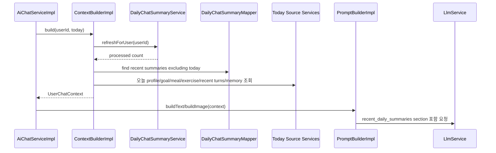

# 011 Daily Summary Chat Context

## Status

done

## Goal

생성된 `daily_chat_summaries`를 AI Chat의 사용자 context에 포함한다.

오늘 날짜는 계속 원본 기록을 직접 조회하고, 완료된 과거 날짜는 daily summary를 우선 사용해 최근 대화 context가 너무 길어지지 않게 한다.

## Read First

- `AGENTS.md`
- `PROJECT_PROFILE.md`
- `docs/PROJECT_INDEX.md`
- `docs/AI_CHAT/README.md`
- `tasks/003-context-builder.md`
- `tasks/007-user-memory-context-prompt.md`
- `tasks/009-daily-chat-summary.md`
- `tasks/010-daily-chat-summary-stale-claim-batch.md`
- `backend/src/main/java/com/aihealthcoach/chat/service/ContextBuilderImpl.java`
- `backend/src/main/java/com/aihealthcoach/chat/service/PromptBuilderImpl.java`
- `backend/src/main/java/com/aihealthcoach/summary/`

## Current Behavior

- AI Chat context는 profile, 현재 daily goal, 오늘 식사, 오늘 운동, 최근 10개 chat turn, active memory를 포함한다.
- `daily_chat_summaries`는 생성·저장되지만 AI Chat prompt에는 들어가지 않는다.
- `DailyChatSummaryService.refreshForUser(userId)`는 stale 과거 summary를 최대 2건 처리할 수 있지만, `ContextBuilder`에서 호출하지 않는다.
- 오늘 기록은 원본 조회로 context에 들어가지만, 어제부터 최근 며칠간의 요약 기록은 context에 들어가지 않는다.

## Target Behavior

- `ContextBuilderImpl.build(userId, contextDate)`는 context 조립 전에 `DailyChatSummaryService.refreshForUser(userId)`를 호출한다.
- refresh는 기존 task10 정책을 따른다: 오늘은 제외하고, debounce window가 지난 완료 날짜만 최대 2건 처리한다.
- context에는 완료된 최근 daily summary 목록을 포함한다.
- summary 조회 범위는 `contextDate.minusDays(6)`부터 `contextDate.minusDays(1)`까지, 즉 오늘을 제외한 최근 6일로 한다.
- 조회 결과는 오래된 날짜부터 최신 날짜 순으로 prompt에 렌더링한다.
- 오늘 날짜의 meal/exercise는 기존처럼 원본 기록으로 포함한다.
- daily summary가 없거나 아직 stale/failed 상태인 날짜는 prompt에 넣지 않는다.
- `refreshForUser`가 실패하면 AI Chat 전체를 실패시키지 않고, summary 없이 기존 context를 계속 만든다. 단, WARN log를 남긴다.

## Target Sequence



## Communication Contract

| From | To | Method/Call | Input | Output | Error |
|---|---|---|---|---|---|
| `ContextBuilderImpl` | `DailyChatSummaryService` | `refreshForUser` | user id | processed count | catch and log |
| `ContextBuilderImpl` | `DailyChatSummaryMapper` | `findSummariesBetween` | user id, from date, to date | summary list | context build failure |
| `ContextBuilderImpl` | `UserChatContext` | constructor | existing context + summaries | immutable context DTO | none |
| `PromptBuilderImpl` | dynamic context prompt | `recent_daily_summaries` section | summary date + content | XML-like data section | omitted when empty |

## Scope

- `DailyChatSummaryMapper`에 날짜 범위 조회 추가
- `DailyChatSummaryDto` 또는 chat context DTO에 daily summary response/section type 추가
- `UserChatContext`에 최근 완료 daily summary 목록 추가
- `ContextBuilderImpl`에서 `refreshForUser` 호출 및 최근 summary 조회 연결
- `PromptBuilderImpl`에서 `recent_daily_summaries` section 렌더링
- 관련 unit test 수정·추가

## Do Not Implement

- summary 생성 정책, claim, retry, debounce 로직을 변경하지 않는다.
- 오늘 summary를 생성하거나 prompt에 넣지 않는다.
- frontend API/UI를 추가하지 않는다.
- daily summary 조회용 public controller를 만들지 않는다.
- user memory 승격, weekly/monthly summary, ranking 알고리즘은 구현하지 않는다.
- 실제 LLM provider 호출 테스트를 만들지 않는다.

## Related Tables

- `daily_chat_summaries`
- `daily_chat_summary_states`
- `chat_messages`
- `meals`
- `exercise_records`
- `weight_records`
- `daily_goals`
- `user_memories`

## Invariants

- 오늘 context는 원본 기록을 직접 사용한다.
- prompt에 들어가는 daily summary는 `summary_date < contextDate`인 완료된 날짜만 포함한다.
- stale/failed/claimed state의 content를 억지로 사용하지 않는다. `daily_chat_summaries`에 저장된 fresh content만 조회 대상으로 삼는다.
- summary refresh 실패는 AI Chat 실패로 전파하지 않는다.
- daily summary는 user memory가 아니다. 사용자 선호·제약은 계속 `user_memories`가 담당한다.
- context section은 data로 취급되어야 하며, prompt instruction보다 우선하지 않는다.

## Acceptance Criteria

- [x] `DailyChatSummaryMapper`가 사용자·날짜 범위의 summary를 날짜 오름차순으로 조회한다.
- [x] `ContextBuilderImpl`이 context 생성 전 `DailyChatSummaryService.refreshForUser(userId)`를 호출한다.
- [x] refresh 실패 시 WARN log만 남기고 기존 context 생성을 계속한다.
- [x] `UserChatContext`가 최근 완료 daily summary 목록을 가진다.
- [x] context summary 조회 범위는 오늘 제외 최근 6일이다.
- [x] 오늘 날짜 summary는 prompt에 포함되지 않는다.
- [x] daily summary가 없으면 `recent_daily_summaries` section은 렌더링되지 않는다.
- [x] daily summary가 있으면 prompt에 날짜와 content가 함께 렌더링된다.
- [x] text chat과 image chat 모두 동일한 daily summary context를 사용한다.
- [x] 기존 profile, daily goal, 오늘 meal/exercise, recent turns, active memory section은 유지된다.

## Verification

```bash
cd backend && mvn test
```

전체 root 검증이 실용적이면 다음을 실행한다.

```bash
./scripts/check
```

## Tests

- 추가:
  - `ContextBuilderImplTest`: `refreshForUser` 호출, 최근 summary 조회, refresh 실패 fallback
  - `PromptBuilderImplTest`: `recent_daily_summaries` section 렌더링과 empty omit
  - `DailyChatSummaryMapper` 범위 조회 test가 가능하면 추가
- 수정:
  - `ChatContextDto.UserChatContext` 생성자 사용 test
  - fake context builder 또는 harness에서 `UserChatContext` 필드 추가 반영
- 추가하지 않은 이유:
  - 실제 LLM provider 호출 test는 프로젝트 규칙상 제외한다.

## Notes / Risks

- context에 daily summary와 recent chat turns가 모두 들어가면 같은 내용이 중복될 수 있다. v1에서는 최근 10 turn을 유지하되, 필요하면 후속 task에서 recent turn 범위나 summary 우선순위를 조정한다.
- `refreshForUser`는 lazy하게 최대 2건만 처리하므로, summary가 많이 밀린 사용자는 몇 번의 chat 요청 동안 일부 날짜 summary가 비어 있을 수 있다.
- summary content는 LLM이 만든 파생 데이터다. prompt에는 서버 데이터 context로 넣되, 현재 사용자 발화와 system instruction이 항상 우선한다.

## Result

- `DailyChatSummaryMapper.findFreshSummariesBetween`를 추가해 `FRESH` state와 source version이 일치하는 summary만 조회한다.
- `ContextBuilderImpl`이 `refreshForUser(userId)`를 먼저 호출하고, 오늘 제외 최근 6일 summary를 context에 포함한다.
- refresh 실패는 WARN log만 남기고 기존 context 생성을 계속한다.
- `PromptBuilderImpl`이 `<recent_daily_summaries>` section을 렌더링한다.
- 관련 `ContextBuilderImplTest`, `PromptBuilderImplTest`, `AiChatHarnessTest`를 업데이트했다.
