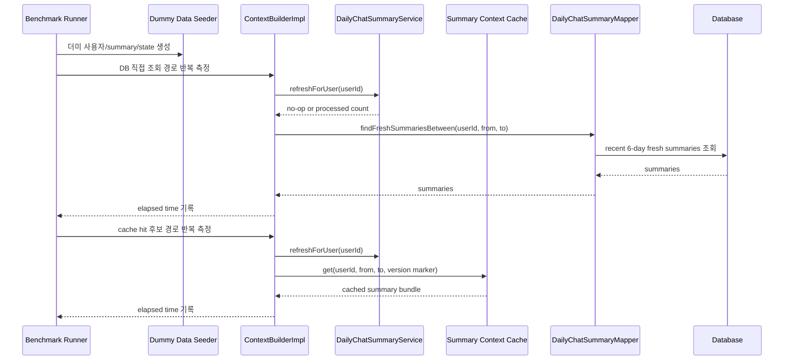

# 012 Daily Summary Context Cache Benchmark

## Status

done

## Goal

AI Chat context에 들어가는 최근 daily summary 묶음을 캐싱할지 결정하기 전에, 현재 DB 조회 방식과 캐시 방식의 시간 차이를 더미데이터 기반으로 비교한다.

이 작업의 1차 목표는 캐시를 바로 도입하는 것이 아니라, “캐시가 실제로 필요한가?”, “필요하다면 어떤 키와 invalidation 정책이 안전한가?”를 측정 가능한 형태로 확정하는 것이다.

## Read First

- `AGENTS.md`
- `PROJECT_PROFILE.md`
- `docs/PROJECT_INDEX.md`
- `docs/AI_CHAT/README.md`
- `tasks/010-daily-chat-summary-stale-claim-batch.md`
- `tasks/011-daily-summary-chat-context.md`
- `backend/src/main/java/com/aihealthcoach/chat/service/ContextBuilderImpl.java`
- `backend/src/main/java/com/aihealthcoach/summary/service/DailyChatSummaryServiceImpl.java`
- `backend/src/main/java/com/aihealthcoach/summary/mapper/DailyChatSummaryMapper.java`
- `backend/src/main/resources/mappers/DailyChatSummaryMapper.xml`
- `data/db/schema.sql`

## Current Behavior

- `ContextBuilderImpl.build(userId, contextDate)`는 context 생성 전 `DailyChatSummaryService.refreshForUser(userId)`를 호출한다.
- refresh는 처리할 stale row가 없으면 빠르게 no-op 반환한다.
- 완료된 최근 daily summary는 DB에서 직접 조회한다.
- 조회 범위는 오늘 제외 최근 6일이다.
- summary 조회 결과는 매번 prompt context 조립 시 DB에서 가져온다.
- 아직 summary 묶음에 대한 Redis/local cache는 없다.

## Target Behavior

- 캐시 도입 전후를 비교할 수 있는 실험 경로를 만든다.
- 더미데이터를 생성해 사용자의 최근 daily summary 6일 조회가 실제에 가까운 데이터량에서 얼마나 걸리는지 측정한다.
- 최소 두 경로를 비교한다.
  - DB 직접 조회: `refresh no-op → daily summary DB 조회 → context 조립`
  - 캐시 후보 경로: `refresh no-op → summary bundle cache hit → context 조립`
- 캐시 miss 또는 stale 감지 경로는 별도로 측정한다.
  - `refresh no-op → cache miss → DB 조회 → cache write → context 조립`
  - `summary_state source_version 변경 감지 → cache invalidation/rebuild`
- 실험 결과를 바탕으로 캐시 도입 여부, 캐시 키, TTL, invalidation 조건을 결정한다.
- 캐시를 도입한다면 정합성을 우선한다. stale summary를 빠르게 보여주는 것보다, stale을 감지하면 캐시를 버리고 DB fresh summary만 사용하는 쪽을 기본으로 한다.

## Target Sequence



## Communication Contract

| From | To | Method/Call | Input | Output | Error |
|---|---|---|---|---|---|
| Benchmark runner | Dummy data seeder | script/test helper | user count, days, summaries per user | seeded rows | fail fast |
| Benchmark runner | Context/summary benchmark target | measured method | user id, context date, mode | elapsed time metrics | recorded failure |
| ContextBuilderImpl | DailyChatSummaryService | `refreshForUser` | user id | processed count | catch/log policy 유지 |
| ContextBuilderImpl | Summary cache 후보 | `get/put/evict` | user id + date range + version marker | summary bundle | fallback to DB |
| Summary cache 후보 | DailyChatSummaryMapper | fallback lookup | user id, from date, to date | fresh summaries | context build failure |

## Scope

- daily summary context 캐싱 정책 설계
- 캐싱 전후 시간 비교 실험 설계와 측정 코드 추가
- 더미데이터 생성 스크립트 또는 테스트 fixture 추가
- benchmark 결과 기록 문서 추가
- 필요하면 cache abstraction/interface 후보 추가
- 캐시 도입이 확정되면 최소 구현 범위로 연결

## Do Not Implement

- 캐시 성능 수치 없이 Redis/local cache를 먼저 도입하지 않는다.
- stale/failed/claimed summary를 캐시에 넣지 않는다.
- 오늘 summary를 생성하거나 캐싱하지 않는다.
- daily summary generation 자체의 LLM 호출 시간을 캐시 성능 실험에 섞지 않는다.
- user memory, recent chat turn, today meal/exercise 전체 context 캐싱은 이번 범위에 포함하지 않는다.
- frontend API/UI를 변경하지 않는다.

## Related Tables

- `daily_chat_summaries`
- `daily_chat_summary_states`
- `chat_messages`
- `meals`
- `exercise_records`
- `weight_records`
- `daily_goals`

## Experiment Design

### Compare A: current DB direct path

측정 대상:

1. `DailyChatSummaryService.refreshForUser(userId)` no-op 시간
2. `DailyChatSummaryMapper.findFreshSummariesBetween(userId, from, to)` 시간
3. `ContextBuilderImpl.build(userId, contextDate)` 전체 시간 중 daily summary 관련 구간

조건:

- summary state가 모두 `FRESH`
- 오늘 제외 최근 6일 summary 존재
- stale 대상 없음
- LLM 호출 없음

### Compare B: cache hit candidate path

측정 대상:

1. `refreshForUser(userId)` no-op 시간
2. summary bundle cache lookup 시간
3. context build 내 summary section 조립 시간

조건:

- 동일 사용자·동일 날짜 범위 반복 호출
- cache hit 상태
- 캐시 value에는 fresh summary content와 version marker를 포함한다.

### Compare C: cache miss/rebuild path

측정 대상:

1. cache miss 감지 시간
2. DB fallback 조회 시간
3. cache write 시간
4. 이후 cache hit 전환 여부

조건:

- 최초 요청 또는 TTL 만료
- DB에는 fresh summary 존재
- miss 이후 동일 요청에서 cache hit가 재현되어야 한다.

### Compare D: changed history invalidation path

측정 대상:

1. `daily_chat_summary_states.source_version` 변경 감지 시간
2. cache evict 또는 rebuild 시간
3. stale/fresh 불일치 시 캐시를 사용하지 않는지

조건:

- 과거 날짜 기록 수정으로 state가 `STALE`이 됨
- 기존 cached bundle에 해당 날짜가 포함되어 있음
- stale 감지 후 prompt에는 오래된 cached content가 들어가지 않아야 함

## Dummy Data Plan

- `data/db/benchmark/` 아래에 daily summary context benchmark용 seed/measure 스크립트를 둔다.
- 최소 데이터셋:
  - 사용자 1,000명
  - 사용자별 최근 7일 raw source
  - 사용자별 오늘 제외 최근 완료 6일 summary/state
- 각 summary content는 실제 prompt 길이에 가까운 한국어 plain text로 생성한다.
- state는 기본적으로 `FRESH`, `source_version`과 summary의 `source_version`이 일치하도록 생성한다.
- `CHANGE_RATE`로 최근 완료 6일 user-day 중 `STALE` 비율을 조절한다.
  - 1% changed: 6,000 user-day 중 60 rows stale
  - 3% changed: 6,000 user-day 중 180 rows stale
  - 10% changed: 6,000 user-day 중 600 rows stale
- seed script는 반복 실행 가능해야 한다.
  - benchmark 전용 user id 범위를 쓰거나
  - 기존 benchmark 데이터를 정리하는 명시적 cleanup step을 둔다.

## Cache Policy Candidate

캐시를 도입할 경우의 1차 후보:

- key: `daily-summary-context:{userId}:{fromDate}:{toDate}`
- value:
  - summary list
  - 포함된 summary date 목록
  - 각 date의 `source_version`
  - built/loaded timestamp
- TTL 후보:
  - 5분
  - 30분
  - TTL 없음 + version marker 기반 invalidation
- invalidation 후보:
  - `markChanged` 시 해당 user의 daily summary context cache evict
  - 조회 시 DB에서 lightweight version marker를 확인하고 불일치하면 evict

정합성 기본 원칙:

- 캐시가 빠르더라도 version marker가 확인되지 않으면 사용하지 않는다.
- `daily_chat_summary_states.status != FRESH`인 날짜는 cache hit 결과에서도 제외한다.
- 캐시 장애는 AI Chat 실패로 전파하지 않고 DB 조회로 fallback한다.

## Invariants

- 오늘 날짜는 summary cache 대상이 아니다.
- 캐시 대상은 완료된 과거 날짜의 `FRESH` summary뿐이다.
- `daily_chat_summaries.source_version`과 `daily_chat_summary_states.source_version`이 일치하지 않으면 캐시/DB 조회 결과에 포함하지 않는다.
- stale 감지 이후 오래된 cached summary를 prompt에 넣지 않는다.
- 캐시 성능 실험은 LLM provider 호출을 포함하지 않는다.
- benchmark 데이터는 운영/개발 기본 데이터와 분리되어야 한다.

## Acceptance Criteria

- [x] task12가 summary caching의 목적, 범위, 비범위를 명확히 기록한다.
- [x] DB 직접 조회, cache hit 후보, cache miss/rebuild, invalidation 경로의 측정 항목이 정의된다.
- [x] 더미데이터 생성 방식과 데이터 규모가 정의된다.
- [x] benchmark seed/measure script 또는 backend benchmark test가 추가된다.
- [x] benchmark 결과를 기록할 문서가 추가된다.
- [x] 측정 결과에 따라 cache 도입 여부를 판단하는 기준이 정리된다.
- [x] 캐시를 구현한다면 version marker와 stale 상태를 확인하는 안전장치가 포함된다.
- [x] 캐시 후보 miss 시 loader fallback이 동작하고, production 경로에는 기존 DB 직접 조회 fallback이 남는다.
- [x] 기존 task11의 no-cache DB 조회 경로는 유지되거나 fallback으로 남는다.

## Verification

벤치마크/실험 스크립트:

```bash
data/db/benchmark/measure-daily-summary-context-cache.sh
```

백엔드 테스트:

```bash
cd backend && mvn test
```

전체 root 검증이 실용적이면 다음을 실행한다.

```bash
./scripts/check
```

## Tests

- 추가:
  - cache key/version marker 계산 test
  - stale/version mismatch summary가 cache result에서 제외되는지 test
  - cache miss 시 DB fallback test
  - cache 장애 시 DB fallback test
  - benchmark seed 데이터의 fresh/stale 분포 검증
- 수정:
  - `ContextBuilderImplTest`: cache 후보가 도입되면 refresh → cache/DB summary 조회 순서 반영
  - `PromptBuilderImplTest`: summary section 렌더링 기존 검증 유지
- 추가하지 않은 이유:
  - 실제 LLM provider 호출 test는 프로젝트 규칙상 제외한다.

## Notes / Risks

- 최근 6일 summary 조회가 이미 충분히 빠르면 캐시가 오히려 복잡도만 늘릴 수 있다. 이 경우 task12 결과는 “캐시 보류”가 될 수 있다.
- 캐시 invalidation이 느슨하면 summary 정합성이 깨질 수 있다. 이 기능은 속도보다 stale 방지가 우선이다.
- Redis cache를 쓰면 운영 복잡도는 낮지만 테스트/로컬 환경 의존성이 늘어난다. local in-memory cache는 간단하지만 멀티 인스턴스에서 stale 위험이 있다.
- 과거 기록 수정이 드물다는 가정은 benchmark만으로 증명되지 않는다. 실제 사용 로그가 쌓이면 markChanged 빈도도 별도로 관찰하는 것이 좋다.

## Result

- `DailyChatSummaryMapper`에 cache benchmark용 조회를 추가했다.
  - `findFreshSummaryCacheEntriesBetween`: summary content + `source_version`
  - `findFreshSummaryVersionsBetween`: fresh/version marker 조회
- production chat context 경로는 변경하지 않았다. task11의 DB 직접 조회 경로가 그대로 fallback이자 현재 기본 경로다.
- `InMemoryDailySummaryContextCache` 후보를 추가했다.
  - key는 user id + date range다.
  - cached bundle은 date별 `source_version` marker와 함께 저장된다.
  - 현재 fresh version marker와 다르면 loader를 다시 호출한다.
  - marker에 없거나 version이 맞지 않는 entry는 cache result에서 제외한다.
  - user 단위 evict를 지원한다.
- 2차 실험 후 production chat context 경로에 event-evict + TTL cache를 적용했다.
  - `ContextBuilderImpl`은 recent daily summary 조회 시 cache를 먼저 확인한다.
  - cache miss/TTL 만료 시 기존 `DailyChatSummaryMapper.findFreshSummariesBetween`를 loader fallback으로 사용한다.
  - `DailyChatSummaryStateService.markChanged`와 `markDailyGoalChanged`는 user 단위 cache evict를 수행한다.
  - 기본 TTL은 5분이다.
- benchmark dummy data와 측정 스크립트를 추가했다.
  - `data/db/benchmark/seed-daily-summary-context-cache-benchmark.sql`
  - `data/db/benchmark/measure-daily-summary-context-cache.sql`
  - `data/db/benchmark/measure-daily-summary-context-cache.sh`
- benchmark seed와 측정에 최근 완료 6일 raw source full lookup 비교를 추가했다.
  - chat, meal/item/food, exercise, weight, daily goal 원본 조회를 포함한다.
  - summary 없이 원본 전체를 반복 조회하는 경로가 summary 조회와 cache hit 대비 어떤 비용인지 비교한다.
- benchmark seed를 현재 context window에 맞춰 사용자별 7일 데이터로 축소했다.
  - summary/state는 오늘 제외 최근 완료 6일만 만든다.
  - raw source는 최근 7일을 만든다.
  - `CHANGE_RATE=1|3|10`으로 recent completed 6-day window 안의 stale 비율을 바꿔 측정한다.
- benchmark 결과 기록 문서를 추가했다.
  - `docs/experiments/2026-06-22-daily-summary-context-cache-benchmark.md`
