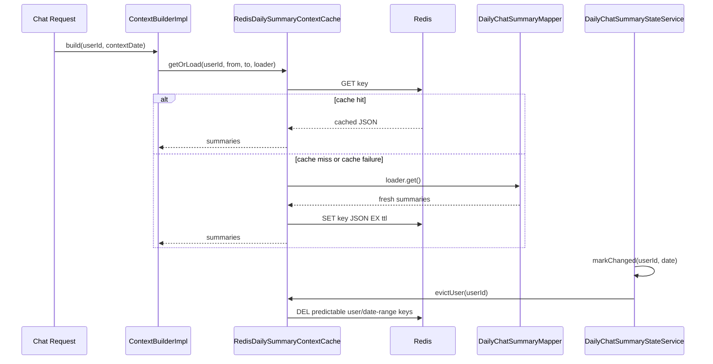

# 016 Redis Daily Summary Context Cache

## Status

implemented

## Goal

AI Chat context에 들어가는 최근 daily summary text cache를 JVM in-memory 중심에서 Redis 기반 cache로 확장한다.

이 작업의 목표는 streaming chat 구현 전에 context build 경로의 daily summary cache를 운영 친화적으로 정리하는 것이다. summary text를 JVM heap에 오래 들고 있는 부담을 줄이고, 향후 backend scale-out에서도 같은 cache 정책을 유지할 수 있게 한다.

## Read First

- `AGENTS.md`
- `PROJECT_PROFILE.md`
- `docs/PROJECT_INDEX.md`
- `docs/AI_CHAT/README.md`
- `tasks/011-daily-summary-chat-context.md`
- `tasks/012-daily-summary-context-cache-benchmark.md`
- `tasks/013-parallel-streaming-chat-tools.md`
- `docs/experiments/2026-06-22-daily-summary-context-cache-benchmark.md`
- `backend/src/main/java/com/aihealthcoach/chat/service/ContextBuilderImpl.java`
- `backend/src/main/java/com/aihealthcoach/summary/service/DailySummaryContextCache.java`
- `backend/src/main/java/com/aihealthcoach/summary/service/InMemoryDailySummaryContextCache.java`
- `backend/src/main/java/com/aihealthcoach/summary/service/DailyChatSummaryStateServiceImpl.java`
- `backend/src/main/resources/application.properties`
- `docker-compose.yml`

## Current Behavior

- `ContextBuilderImpl.build(userId, contextDate)`는 오늘 제외 최근 6일 daily summary를 context에 넣는다.
- `DailySummaryContextCache` abstraction은 이미 존재한다.
- 현재 production bean은 `InMemoryDailySummaryContextCache`다.
- cache key는 `userId + from + to` 범위다.
- 기본 TTL은 `ai.chat.summary.context-cache.ttl-ms:300000`으로 5분이다.
- 과거 기록이나 daily goal 변경 시 `DailyChatSummaryStateServiceImpl`이 `dailySummaryContextCache.evictUser(userId)`를 호출한다.
- 현재 in-memory cache는 max entry 제한이 없고, expired entry도 접근되기 전까지 map에 남을 수 있다.
- 단일 backend 인스턴스에서는 동작하지만, scale-out 또는 active user 증가 시 JVM heap에 summary text를 오래 올려두는 부담이 있다.

## Target Behavior

- Redis 기반 `DailySummaryContextCache` 구현을 추가한다.
- Redis cache는 lazy load만 수행한다.
  - 사용자의 chat context 요청 시 cache miss면 DB 조회 결과를 Redis에 저장한다.
  - 모든 사용자의 summary를 미리 preload하지 않는다.
- cache value는 최근 daily summary context response list를 JSON으로 저장한다.
- cache TTL은 기본적으로 다음 자정까지로 잡는다.
  - 오늘 제외 최근 6일 window는 날짜가 바뀌면 자연스럽게 바뀌므로 다음 날 첫 발화 때 lazy reload한다.
  - property로 기존 fixed TTL fallback도 가능하게 한다.
- evict는 데이터 변경 시 즉시 해당 user의 summary context cache를 삭제하는 동작이다.
  - TTL은 시간 기반 안전망이다.
  - evict는 수정 직후 stale cache 사용을 막는 안전장치다.
- Redis 장애나 serialization 실패는 AI Chat 실패로 전파하지 않고 DB loader fallback을 사용한다.
- `InMemoryDailySummaryContextCache`는 local/fallback profile 또는 Redis 비활성 환경을 위해 남긴다.

## Target Sequence



## Communication Contract

| From | To | Method/Call | Input | Output | Error |
|---|---|---|---|---|---|
| `ContextBuilderImpl` | `DailySummaryContextCache` | `getOrLoad` | user id, from, to, loader | daily summary responses | loader fallback |
| `RedisDailySummaryContextCache` | Redis | `GET` | cache key | serialized summary list | miss/failure -> loader |
| `RedisDailySummaryContextCache` | Redis | `SET` | cache key, JSON, TTL | ok | warn and continue |
| `DailyChatSummaryStateServiceImpl` | `DailySummaryContextCache` | `evictUser` | user id | user cache removed | warn and continue |
| `RedisDailySummaryContextCache` | Redis | `DEL` | predictable keys or tracked keys | removed count | warn and continue |

## Scope

- `RedisDailySummaryContextCache` 추가
- Redis key naming 정책 추가
- JSON serialization/deserialization 추가
- next-midnight TTL 계산 추가
- cache type 선택 property 추가
- Redis 장애 fallback 처리
- user cache evict 구현
- 단위 테스트 추가
- 관련 task/doc에 Redis cache 정책 링크 또는 짧은 결정 기록 추가

## Do Not Implement

- 모든 사용자 summary preload를 구현하지 않는다.
- Redis `KEYS` 명령 기반 wildcard 삭제를 사용하지 않는다.
- daily summary 생성 로직을 변경하지 않는다.
- `ContextBuilder` dynamic source selection을 구현하지 않는다.
- streaming endpoint 구현을 이 task에 포함하지 않는다.
- user memory, recent chat turn, today meal/exercise cache를 함께 Redis로 옮기지 않는다.
- Redis 장애를 chat 응답 실패로 전파하지 않는다.

## Related Tables

- `daily_chat_summaries`
- `daily_chat_summary_states`
- `chat_messages`
- `meals`
- `exercise_records`
- `weight_records`
- `daily_goals`

## Cache Policy

### Key

기본 후보:

```text
ai:chat:summary-context:{userId}:{fromDate}:{toDate}
```

현재 context window는 `contextDate.minusDays(6)`부터 `contextDate.minusDays(1)`까지라 key를 예측할 수 있다.

### Value

JSON serialized `List<DailyChatSummaryContextResponse>`.

후속으로 version marker를 value에 넣을 수 있지만, v1에서는 현재 production 경로처럼 event evict + TTL을 기본 정책으로 한다.

### TTL

기본 후보:

- next midnight까지 만료
- 단위 테스트가 어렵거나 운영 property가 필요하면 fixed TTL fallback 제공

Property 후보:

```properties
ai.chat.summary.context-cache.type=redis
ai.chat.summary.context-cache.ttl-policy=next-midnight
ai.chat.summary.context-cache.ttl-ms=300000
```

### Evict

`evict`는 cache에서 삭제하는 동작이다.

사용자가 과거 식사, 운동, 체중, daily goal 등을 수정해 summary freshness가 바뀔 수 있으면:

```text
markChanged / markDailyGoalChanged
-> DailySummaryContextCache.evictUser(userId)
-> Redis DEL ai:chat:summary-context:{userId}:{from}:{to}
```

TTL만 있으면 수정 직후 stale cache를 볼 수 있다. evict만 있으면 누락된 변경 경로나 오래 남은 cache를 방어하기 어렵다. Redis cache는 TTL + evict를 같이 사용한다.

## Existing Benchmark Reuse

`docs/experiments/2026-06-22-daily-summary-context-cache-benchmark.md`의 결과는 Redis 전환 후에도 정책 판단 근거로 재사용할 수 있다.

재사용 가능한 것:

- DB direct daily summary lookup 비용
- raw source full lookup 비용
- cache miss가 DB fallback으로 돌아간다는 판단
- event evict + TTL 정책이 per-request version marker보다 낫다는 결론
- summary/cache 방향이 raw source 반복 조회보다 낫다는 결론

그대로 재사용하면 안 되는 것:

- cache hit lower-bound 수치
- JVM in-memory hit latency
- serialization/deserialization 비용이 없는 hit latency

Redis cache hit은 JVM map read보다 느리고, 네트워크/serialization 비용이 추가된다. 따라서 Redis 구현 후에는 Redis hit/miss/evict 경로를 별도 측정해야 한다. 다만 Redis hit은 일반적으로 DB direct lookup보다 낮은 비용일 가능성이 높으므로, 기존 실험은 Redis 전환의 방향성을 뒷받침하는 baseline으로 사용한다.

Redis 구현 후 `data/db/benchmark/measure-daily-summary-context-redis-cache.sh`를 추가했다. 이 스크립트는 같은 seed 데이터에서 DB direct fresh summary lookup, Redis GET hit, Redis miss fallback DB lookup + SET, Redis evict DEL 비용을 비교한다.

최종 판단용 반복 측정은 shell/CLI benchmark가 아니라 `DailySummaryContextCacheBenchmarkTest`를 사용한다. 이 테스트는 Spring Boot test 안에서 실제 mapper/cache bean을 호출해 DB direct, Redis miss, Redis hit, Redis evict를 같은 JVM 경로에서 비교한다.

Redis 도입 기준은 `docs/experiments/2026-06-22-daily-summary-context-cache-benchmark.md`의 "Redis 도입 기준"을 따른다.

- 순수 request latency 기준으로는 observed hit ratio가 약 95% 이상일 때 Redis 유지 근거가 충분하다.
- DB connection pool pressure가 있으면 hit ratio가 80% 이상이어도 Redis 유지가 가능하다.
- 이유는 Redis hit 요청이 daily summary DB 조회와 connection pool 점유를 건너뛰기 때문이다.
- hit ratio가 낮고 miss/evict가 잦으면 Redis를 기본값으로 강제하지 않고 `memory` 기본값을 유지한다.

## Invariants

- 오늘 날짜는 summary cache 대상이 아니다.
- 캐시 대상은 완료된 과거 날짜의 fresh daily summary context뿐이다.
- cache miss 또는 Redis 장애 시 기존 DB 조회 loader로 fallback한다.
- Redis write 실패는 chat 응답 실패로 전파하지 않는다.
- evict 누락 위험을 줄이기 위해 기존 `DailyChatSummaryStateServiceImpl`의 `evictUser` 호출 흐름을 유지한다.
- Redis wildcard `KEYS`로 운영 keyspace를 스캔하지 않는다.
- 모든 cache는 lazy load이며 preload하지 않는다.
- `ContextBuilder.build(userId, contextDate)` 계약은 유지한다.

## Acceptance Criteria

- [x] Redis 기반 `DailySummaryContextCache` 구현이 추가된다.
- [x] cache miss 시 DB loader fallback 후 Redis에 저장된다.
- [x] cache hit 시 DB daily summary 조회 없이 Redis value를 반환한다.
- [x] Redis 장애, deserialize 실패, write 실패가 chat context build 실패로 전파되지 않는다.
- [x] `evictUser(userId)`가 해당 user의 Redis summary context cache를 삭제한다.
- [x] 기본 TTL 정책이 next-midnight 또는 property 기반으로 명확히 동작한다.
- [x] `InMemoryDailySummaryContextCache`는 local/fallback 구현으로 유지된다.
- [x] Redis `KEYS` wildcard 삭제를 사용하지 않는다.
- [x] backend test가 Redis hit/miss/evict/fallback/TTL 정책을 검증한다.
- [x] 기존 benchmark 결과 중 재사용 가능한 항목과 Redis 적용 후 재측정할 항목이 문서화된다.

## Verification

```bash
cd backend && mvn test
```

전체 root 검증이 실용적이면 다음을 실행한다.

```bash
./scripts/check
```

Redis 통합 확인이 필요하면 Docker Compose Redis를 띄운 뒤 별도 manual 확인을 기록한다.

```bash
docker compose up -d redis
cd backend && mvn test
```

Redis 비교 실험:

```bash
ITERATIONS=30 data/db/benchmark/measure-daily-summary-context-redis-cache.sh
```

Spring/JVM 반복 benchmark:

```bash
docker run --rm \
  --network aihealthcoach_default \
  -e RUN_REDIS_CACHE_BENCHMARK=true \
  -e REDIS_CACHE_BENCHMARK_SEED=false \
  -e REDIS_CACHE_BENCHMARK_ITERATIONS=100 \
  -e REDIS_CACHE_BENCHMARK_WARMUP_ITERATIONS=10 \
  -e DB_URL=jdbc:postgresql://postgres:5432/ai_health_coach \
  -e DB_USERNAME=postgres \
  -e DB_PASSWORD=postgres \
  -e REDIS_HOST=redis \
  -e REDIS_PORT=6379 \
  -e JWT_SECRET=0123456789012345678901234567890123456789012345678901234567890123 \
  -e GOOGLE_CLIENT_ID=test-google \
  -e GOOGLE_CLIENT_SECRET=test-google-secret \
  -e NAVER_CLIENT_ID=test-naver \
  -e NAVER_CLIENT_SECRET=test-naver-secret \
  aihealthcoach-backend-test-runner \
  mvn -Dtest=DailySummaryContextCacheBenchmarkTest test
```

## Tests

- 추가:
  - `RedisDailySummaryContextCacheTest`
  - `DailySummaryContextCacheBenchmarkTest`
  - cache hit returns Redis value
  - cache miss calls loader and writes Redis
  - Redis get failure falls back to loader
  - Redis write failure returns loader result
  - invalid JSON falls back to loader and rewrites cache
  - `evictUser` deletes predictable key or tracked user keys
  - next-midnight TTL calculation test
  - opt-in benchmark compares DB direct, Redis miss, Redis hit, Redis evict on real Spring beans
- 수정:
  - `DailyChatSummaryStateServiceImplTest`는 cache abstraction 호출 유지 확인
  - 필요하면 `ContextBuilderImplTest` fixture 업데이트
- 추가하지 않은 이유:
  - 실제 Redis 서버가 필요한 통합 테스트는 CI/로컬 환경 의존도가 크면 mock/fake 기반 단위 테스트로 대체한다.

## Notes / Risks

- Redis로 옮겨도 cache value가 text이므로 TTL과 evict 정책이 중요하다.
- scale-out에서는 Redis cache 자체는 공유되지만, evict가 모든 변경 경로에서 호출되어야 stale risk가 낮다.
- 현재 key가 date range를 포함하므로 자정 이후에는 새 key가 만들어지고 이전 key는 TTL로 사라진다.
- user별 여러 date-range key를 지원하게 되면 user key set tracking이 필요할 수 있다.
- Redis 장애 fallback이 너무 자주 발생하면 DB 조회 비용으로 돌아가므로 로그/metric으로 관찰해야 한다.
- Redis miss는 DB direct보다 비싸므로 hit ratio가 낮으면 이득이 줄어든다.
- latency 기준 break-even은 hit ratio 약 95%다. DB pool 점유 감소를 우선하면 hit ratio 80% 이상에서도 Redis 유지 근거가 있다.

## Implementation Notes

- `ai.chat.summary.context-cache.type=memory`가 기본값이다.
- Redis 구현은 `AI_CHAT_SUMMARY_CONTEXT_CACHE_TYPE=redis`로 활성화한다.
- Redis key는 `ai:chat:summary-context:{userId}:{fromDate}:{toDate}`이다.
- `evictUser(userId)`는 user별 tracked key set을 읽어 `DEL`을 수행한다. 운영 keyspace에 wildcard `KEYS`를 사용하지 않는다.
- Redis value는 summary list와 source version map을 포함한 JSON payload다.
- `clear()`는 Redis keyspace scan을 피하기 위해 no-op warning으로 둔다.
- `DailySummaryContextCacheBenchmarkTest`는 `RUN_REDIS_CACHE_BENCHMARK=true`일 때만 실행된다.
