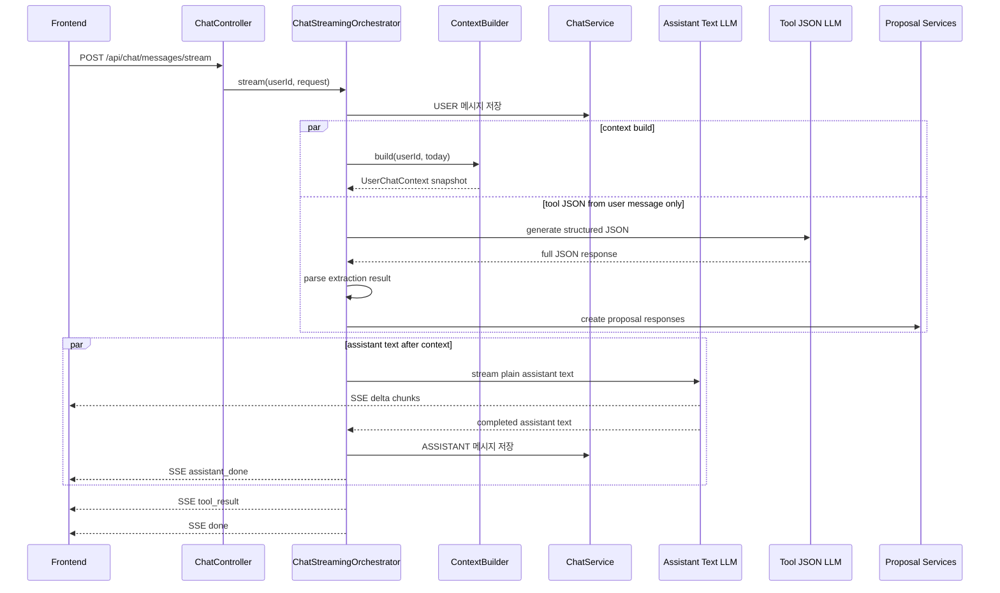

# 014 Parallel Streaming Chat Tools

## Status

backend v1 implemented

## Goal

AI Chat 응답을 두 흐름으로 나누어 구현한다.

첫 번째 흐름은 사용자에게 보여줄 `assistantMessage` plain text를 스트리밍으로 생성한다. 두 번째 흐름은 식사·운동·몸무게·메모리 후보를 만드는 structured tool JSON을 non-streaming으로 생성하고, 서버에서 파싱한 뒤 현재와 동일하게 proposal 결과를 만든다.

assistant text 흐름은 `UserChatContext` snapshot과 사용자 발화를 사용한다. tool JSON 흐름은 사용자 발화만 사용한다. 두 흐름은 서로 다른 prompt를 사용한다. assistant prompt는 plain text만 생성하고, tool prompt는 기존 extraction/proposal JSON 계약을 유지한다.

## Scope Decision

2026-06-22 실험 결과와 2026-06-23 scope 결정을 반영해 streaming v1은 dynamic context routing, intent routing, frontend 연결을 포함하지 않는다.

확정 범위:

1. String 답변 생성 흐름
   - 사용자에게 보여줄 plain assistant text를 생성한다.
   - JSON object 출력을 요구하지 않는다.
   - 생성되는 text chunk를 `delta` SSE event로 즉시 표출한다.
2. Tool JSON 흐름
   - intent classifier를 두지 않는다.
   - `UserChatContext` snapshot을 사용하지 않고 사용자 발화만 사용한다.
   - 기존 meal/exercise/weight/memory extraction JSON 답변을 non-streaming으로 만든다.
   - JSON은 클라이언트로 stream하지 않고 서버에서 전체 응답을 받은 뒤 파싱한다.
   - 파싱된 extraction 결과는 현재 동기 endpoint와 동일한 proposal 생성 흐름에 태운다.
   - 최종 proposal 결과만 `tool_result` SSE event로 한 번 보낸다.
3. Backend streaming endpoint
   - Spring MVC 기반이므로 v1은 `SseEmitter`를 사용한다.
   - frontend 연결은 후속 task로 분리한다.

명시적으로 제외:

- `ContextBuilder` dynamic source selection
- tool JSON 흐름의 user context 사용
- user-message-only intent classification
- rule based routing 운영 연결
- embedding 기반 routing의 운영 연결
- BGE-M3 sidecar runtime 의존성
- `ContextBuilder.build(userId, contextDate, userMessage)` 계약 변경
- frontend streaming client 연결
- tool timeout/pending/retry 정책

근거:

- `014`에서 embedding search 후보는 fixture 정확도가 높았지만 실제 provider 호출은 포함하지 않았다.
- `015`에서 BGE-M3 sidecar warmed p95가 328.305ms로 측정되어 첫 `delta` 전에 blocking하기에는 부담이 있다.
- dynamic context building은 prompt/DB 최적화 여지는 있지만 streaming v1의 주된 사용자 체감 개선 요소가 아니다.
- 현재 가장 큰 개선점은 단일 JSON LLM 호출을 `plain text streaming`과 `non-streaming structured tool JSON` 두 흐름으로 나누는 것이다.
- intent classification은 별도 설계 가치가 있지만, streaming v1에서는 범위를 키우므로 다루지 않는다.
- timeout이나 pending tool result는 후속 조회/재연결 정책을 요구하므로 v1에서는 추가하지 않는다.

## Read First

- `AGENTS.md`
- `PROJECT_PROFILE.md`
- `docs/PROJECT_INDEX.md`
- `docs/AI_CHAT/README.md`
- `tasks/001-llm-service-interface.md`
- `tasks/002-fake-llm-harness.md`
- `tasks/003-context-builder.md`
- `tasks/007-user-memory-context-prompt.md`
- `tasks/011-daily-summary-chat-context.md`
- `backend/src/main/java/com/aihealthcoach/chat/controller/ChatController.java`
- `backend/src/main/java/com/aihealthcoach/chat/service/AiChatServiceImpl.java`
- `backend/src/main/java/com/aihealthcoach/chat/service/LlmService.java`
- `backend/src/main/java/com/aihealthcoach/chat/service/LlmServiceImpl.java`
- `backend/src/main/java/com/aihealthcoach/chat/service/AiChatClientGateway.java`
- `backend/src/main/java/com/aihealthcoach/chat/service/PromptBuilderImpl.java`

## Current Behavior

- `POST /api/chat/messages`는 하나의 LLM 호출에서 `assistantMessage`, `mealExtraction`, `exerciseExtraction`, `weightExtraction`, `memorySaveCommand`를 포함한 JSON object를 받는다.
- 서버는 전체 JSON 응답을 받은 뒤에야 `assistantMessage`를 파싱하고 사용자·assistant 메시지를 저장한다.
- 식사·운동·몸무게 후보도 같은 JSON에서 파싱한 뒤 동기 응답에 포함한다.
- 프론트는 AI 응답 전체가 끝날 때까지 assistant 말풍선과 후보 컴포넌트를 표시할 수 없다.
- `ChatClient` 호출은 `LlmService`와 `AiChatClientGateway` 뒤에 숨겨져 있지만, 현재 `LlmService.generate` 계약은 non-streaming `LlmResponse`만 반환한다.
- context는 `ContextBuilder.build(userId, contextDate)`로 고정 snapshot을 만든다.

## Target Behavior

- 새 streaming endpoint를 추가한다.
  - 후보: `POST /api/chat/messages/stream`
  - response media type: `text/event-stream`
- 서버는 요청 시작 시점에 인증된 `userId`와 오늘 날짜로 `UserChatContext`를 한 번만 만든다.
- context snapshot이 준비되면 assistant text streaming을 시작한다.
  - assistant text 흐름: context + user message를 보고 사용자에게 보여줄 plain text만 생성한다.
- tool JSON 생성은 context snapshot을 기다리지 않고 요청 초기에 시작한다.
  - tool JSON 흐름: user message만 보고 structured extraction JSON을 non-streaming으로 생성한다.
  - 서버는 tool JSON 전체 응답을 받은 뒤 파싱하고, 현재와 동일하게 proposal result로 변환한다.
  - tool JSON text 자체는 SSE로 흘리지 않는다.
  - tool JSON 흐름은 assistant text 결과에 의존하지 않는다.
- assistant text 흐름은 `delta` event로 chunk를 계속 전송한다.
- assistant text가 끝나면 서버는 누적된 assistant text를 저장하고 `assistant_done` event를 전송한다.
- tool 결과가 이미 끝났으면 `assistant_done` 직후 `tool_result` event를 바로 전송한다.
- tool 결과가 아직 끝나지 않았으면 stream을 유지하고 tool 흐름 완료 후 `tool_result` event를 전송한다.
- v1은 tool timeout을 추가하지 않는다.
- tool 흐름이 실패하면 assistant 답변은 유지하고, `tool_result`는 failed 상태로 전송한다.
- 최종적으로 `done` event를 전송해 프론트가 스트리밍 세션을 닫을 수 있게 한다.
- streaming v1은 기존 `ContextBuilder.build(userId, contextDate)` 계약을 유지한다.
- streaming v1은 backend endpoint와 테스트까지만 구현하고, 프론트 연결은 후속 task로 분리한다.

## Target Sequence



## Communication Contract

| From | To | Method/Call | Input | Output | Error |
|---|---|---|---|---|---|
| Frontend | `ChatController` | `POST /api/chat/messages/stream` | `ChatMessageRequest` | SSE events | 400/401/403 before stream, stream `error` after stream starts |
| `ChatController` | streaming orchestrator | `stream(userId, request)` | authenticated user id, user message | `SseEmitter` event stream | mapped stream error |
| streaming orchestrator | `ContextBuilder` | `build` | user id, context date | `UserChatContext` snapshot | fail before LLM starts or fallback policy |
| streaming orchestrator | `ChatService` | `insert` | USER/ASSISTANT message | saved message response | stream `error` or partial-result policy |
| streaming orchestrator | assistant LLM service | `streamAssistantMessage` | assistant prompt request | assistant text chunks | assistant fallback/error event |
| streaming orchestrator | tool JSON service | `generateToolJson` | user message only | full JSON response text or parsed extraction result | failed tool result, WARN log |
| tool JSON service | proposal services | `createProposal` | parsed extraction result | proposal response DTOs | empty proposal or mapped failure |

### SSE Events

| Event | Data | When |
|---|---|---|
| `delta` | plain text chunk | assistant text chunk 생성 시 |
| `assistant_done` | saved assistant message metadata | assistant text 저장 완료 시 |
| `tool_result` | parsed meal/exercise/weight/memory proposal result + status | tool 흐름 완료 또는 fallback 확정 시 |
| `error` | safe error message/code | stream 시작 후 복구 불가능한 오류 |
| `done` | final status | 클라이언트가 stream을 닫아도 되는 시점 |

## Scope

- text chat 전용 streaming endpoint 추가
- assistant text 전용 prompt 또는 prompt builder 경로 추가
- tool extraction 전용 prompt 또는 prompt builder 경로 추가
- `LlmService` 또는 별도 LLM boundary에 streaming 계약 추가
- `AiChatClientGateway`에 Spring AI `ChatClient.stream().content()` 기반 호출 추가
- tool JSON 경로는 non-streaming `generate`/`call` 기반으로 유지
- SSE event DTO 추가
- streaming orchestration service 추가
- 기존 proposal 생성 서비스 재사용
- backend 테스트 또는 fake LLM harness 확장

## Do Not Implement

- 이미지 채팅 streaming은 이번 범위에 포함하지 않는다.
- tool/proposal 결과 자체를 token 단위로 스트리밍하지 않는다.
- tool JSON text를 SSE로 전송하지 않는다.
- intent/tool 흐름에서 DB 저장을 확정하지 않는다. 기록 저장은 기존 confirm API 흐름을 유지한다.
- user-message-only intent classifier를 추가하지 않는다.
- tool timeout, pending 상태, retry, polling API를 추가하지 않는다.
- frontend streaming client 연결은 이번 범위에 포함하지 않는다.
- 실제 LLM provider를 호출하는 테스트를 만들지 않는다.
- 기존 `POST /api/chat/messages` 동기 endpoint를 바로 제거하지 않는다.
- `daily_chat_summaries` 생성 정책이나 context refresh 정책을 변경하지 않는다.
- 장기 메모리 자동 저장 정책을 확대하지 않는다. 명시적 저장 요청 기준은 유지한다.
- dynamic context source selection을 추가하지 않는다.
- embedding provider 또는 embedding router를 운영 streaming path에 연결하지 않는다.
- `ContextBuilder.build(userId, contextDate)` 계약을 이번 scope에서 변경하지 않는다.

## Related Tables

- `chat_messages`
- `meal_proposals`
- `exercise_records`
- `weight_records`
- `user_memories`
- `daily_chat_summaries`
- `daily_chat_summary_states`

## Design Questions

### 병렬 실행 기준

- streaming v1은 별도 intent classification을 수행하지 않는다.
- `ContextBuilder.build(userId, contextDate)`로 full context snapshot을 한 번 만든다.
- assistant text LLM은 `UserChatContext` snapshot을 사용한다.
- tool JSON LLM은 `UserChatContext` snapshot을 사용하지 않고 사용자 발화만 사용하며, non-streaming으로 전체 JSON을 반환한다.
- tool JSON LLM이 assistant text 결과에 의존하면 병렬 이점이 사라지므로, 기본 설계에서는 의존하지 않는다.
- context build와 tool JSON 생성을 요청 초기에 병렬 실행한다.
- context snapshot 생성 이후 assistant text streaming을 시작한다.
- assistant text가 사용자에게 후보 생성 여부를 확정적으로 말하지 않도록 prompt를 제한한다.

### 결과 불일치

가능한 불일치:

- assistant text는 “기록을 도와드릴게요”라고 말했지만 tool result는 empty인 경우
- assistant text는 일반 코칭 답변인데 tool result가 proposal을 만든 경우
- tool LLM이 사용자 발화를 과도하게 해석한 경우

초기 정책 후보:

- assistant text는 저장/후보 생성 완료를 직접 선언하지 않는다.
- tool result가 있으면 프론트 컴포넌트가 별도로 후보를 보여준다.
- tool result가 없으면 assistant text만 남긴다.
- tool result는 confirm 전까지 저장 완료 상태가 아니다.
- assistant prompt와 tool prompt는 별도 작성한다.
- assistant prompt만 user context를 사용한다.
- tool prompt는 사용자 발화만 사용하고 assistant output에 의존하지 않는다.
- tool JSON은 서버 내부에서만 파싱하고, 프론트에는 proposal result만 보낸다.

### Partial Failure

- 일반 streaming 챗봇은 모델 출력 chunk를 먼저 표시하고, 완료 콜백에서 저장/usage logging/후처리를 수행하는 형태가 흔하다. 따라서 v1도 assistant text 완료 후 저장하고 `assistant_done`을 보낸다.
- assistant text 성공, tool 실패: assistant 메시지는 저장하고 `tool_result`는 failed 상태로 보낸다.
- assistant text 실패, tool 성공: 사용자에게 보여줄 답변이 없으므로 stream `error` 처리하고 tool result는 표시하지 않는 쪽을 기본 후보로 한다.
- USER 메시지 저장 실패: LLM 호출 전 실패시킨다.
- ASSISTANT 메시지 저장 실패: 이미 delta가 전송됐을 수 있으므로 `assistant_done`을 보내지 않고 `error` event와 함께 저장 실패 상태를 명확히 보낸다.
- 클라이언트 연결 종료: provider stream 취소와 tool future 취소 가능 여부를 확인한다.
- 더 정교한 fallback, partial assistant rollback, 재생성/재시도 UX는 후속 task로 분리한다.

### Timeout / Waiting

- v1은 tool timeout을 추가하지 않는다.
- assistant stream이 끝났는데 tool 흐름이 아직 끝나지 않았으면 stream을 열어두고 tool 완료를 기다린다.
- pending 상태를 지원하지 않는다.
- timeout, polling, stream resume, retry는 후속 task에서 다룬다.

### Memory Save Policy

- 기존 동기 AI Chat은 명시적 `memorySaveCommand`가 있으면 바로 `UserMemoryService.createMemory`를 호출한다.
- ChatGPT류 memory UX는 사용자가 명시적으로 저장 요청을 할 수 있고, 사용자가 기억을 관리/삭제할 수 있는 제어면을 제공한다.
- streaming v1은 기존 정책과 맞춰 명시적 memory save command를 즉시 저장한다.
- 다만 UX 정책은 아직 열어둔다.
  - 후보 A: 식사/운동/몸무게처럼 memory proposal을 보여주고 사용자가 confirm한다.
  - 후보 B: 명시적 저장 요청은 즉시 저장하고, `tool_result`에서 저장 완료 상태와 새 memory를 보여준다.
- v1 구현은 후보 B에 가깝게 유지하되, memory 관리 UI와 confirmation 전환 여부는 후속 task에서 결정한다.

### DTO Naming

- SSE payload 타입은 `Event` suffix를 사용한다.
- 이유는 HTTP response DTO가 아니라 stream 안에서 발생하는 domain event payload에 가깝기 때문이다.
- 후보:
  - `ChatStreamDeltaEvent`
  - `ChatStreamAssistantDoneEvent`
  - `ChatStreamToolResultEvent`
  - `ChatStreamErrorEvent`
  - `ChatStreamDoneEvent`

### Usage Logging

- 현재 `AiChatClientGateway`의 `@AiUsageTracked`는 `ChatResponse` metadata를 읽는 방식이다.
- assistant text streaming은 최종 token usage metadata를 동일하게 얻지 못할 수 있다.
- tool JSON은 non-streaming 호출이므로 기존 `ChatResponse` metadata 기반 usage logging을 유지하기 쉽다.
- assistant streaming usage logging이 누락된다면 명시적으로 risk로 기록하고 보완 task를 분리한다.

### API Response Wrapping

- SSE endpoint는 일반 JSON controller response와 다르므로 `ApiResponseAdvice` 적용 여부를 확인한다.
- successful SSE event payload는 기존 `ApiResponse` wrapper를 억지로 적용하지 않는 쪽이 자연스럽다.
- stream 시작 전 validation/auth error는 기존 JSON error shape를 유지한다.

## Invariants

- `userId`는 인증 context에서만 가져온다.
- assistant LLM은 `UserChatContext` snapshot을 사용한다.
- tool JSON LLM은 `UserChatContext` snapshot을 사용하지 않는다.
- tool JSON은 stream하지 않고 서버에서 전체 응답을 파싱한다.
- `ChatService`는 메시지 저장/조회 책임만 유지한다.
- `LlmService` 또는 새 provider boundary 밖으로 `ChatClient`가 새지 않는다.
- proposal은 사용자의 confirm 전까지 실제 기록으로 저장하지 않는다.
- 명시적 memory save command는 기존 동기 endpoint와 동일하게 저장한다.
- 테스트는 실제 LLM provider를 호출하지 않는다.
- assistant text prompt는 JSON object 출력을 요구하지 않는다.
- tool prompt는 structured output 계약을 유지한다.
- context의 daily summary는 instruction이 아니라 data로 취급한다.

## Acceptance Criteria

- [x] `POST /api/chat/messages/stream`에서 assistant text가 `delta` event로 스트리밍된다.
- [x] streaming endpoint는 Spring MVC `SseEmitter` 기반으로 구현된다.
- [x] assistant text 흐름은 context snapshot으로 스트리밍된다.
- [x] tool JSON 흐름은 user message only로 non-streaming 실행되고 context snapshot에 의존하지 않는다.
- [x] tool JSON text가 아니라 파싱된 proposal result만 `tool_result`로 전송된다.
- [x] assistant stream 완료 후 assistant 메시지가 저장되고 `assistant_done` event가 전송된다.
- [x] tool 결과가 완료되면 `tool_result` event로 meal/exercise/weight/memory 결과가 전송된다.
- [x] tool 흐름 실패가 assistant stream 성공을 깨지 않는다.
- [x] tool timeout, pending, retry, polling은 구현하지 않는다.
- [x] 기존 `POST /api/chat/messages` 동기 endpoint는 유지된다.
- [x] `ChatClient` 직접 의존은 provider boundary 내부에만 남는다.
- [x] fake LLM 또는 mock 기반 테스트로 streaming event 순서와 partial failure를 검증한다.
- [x] frontend 연결은 후속 task로 남긴다.

## Implementation Notes

- `ChatStreamingOrchestrator`가 USER 저장 이후 context build, assistant streaming, tool JSON 생성을 조율한다.
- assistant LLM은 `AssistantStreamingLlmService`를 통해 plain text chunk를 만들고, tool JSON은 기존 non-streaming `LlmService.generate` 경로를 재사용한다.
- tool JSON generation 실패는 `GENERATION_FAILED`, JSON parse 실패는 `PARSE_FAILED`, proposal 변환 실패는 `PROPOSAL_FAILED`로 구분한다.
- memory save 실패는 assistant stream을 실패시키지 않고 `tool_result.memorySave`에 safe reason code로 포함한다.

## Verification

```bash
./scripts/check
```

전체 검증을 실행할 수 없다면, 이유를 기록하고 가장 좁은 관련 명령을 실행한다.

```bash
cd backend && mvn test
```

## Tests

테스트는 controller보다 streaming orchestration 단위를 두껍게 가져간다. 비동기 실행, SSE event 순서, 저장 시점, partial failure는 controller mock만으로는 검증이 약하다.

- 추가:
  - backend streaming controller/orchestrator test
  - fake assistant stream LLM test
  - fake non-streaming tool LLM success/failure/invalid JSON test
  - SSE event order test: `delta` -> `assistant_done` -> `tool_result` -> `done`
- 수정:
  - `LlmServiceImplTest` 또는 새 provider boundary test
  - `AiChatHarnessTest`에 streaming 시나리오 추가 여부 검토
- 추가하지 않은 이유:
  - 실제 OpenAI/Spring AI provider 호출 테스트는 프로젝트 규칙상 제외한다.
  - frontend streaming parser/API client는 후속 task 범위다.
  - tool timeout test는 v1에서 timeout을 구현하지 않으므로 제외한다.

### Test Layers

| Layer | Purpose | Test shape |
|---|---|---|
| streaming orchestrator unit | event order, parallel execution, partial failure, DB save timing | fake assistant stream, fake non-streaming tool generator, fake context builder, fake chat service |
| prompt/boundary unit | assistant prompt는 available context 포함, tool prompt는 user message only | fake or captured `LlmRequest` assertions |
| provider gateway unit | `ChatClient.stream()` 사용 경계가 provider 내부에만 남는지 확인 | mock Spring AI gateway or thin adapter test |
| controller slice/unit | endpoint가 `SseEmitter`를 반환하고 authenticated user id를 넘기는지 확인 | controller direct test or `@WebMvcTest` |
| existing sync regression | 기존 `/api/chat/messages` 동기 endpoint 유지 | existing `ChatControllerTest`, `AiChatServiceImplTest` 유지 |

### Must Cover Scenarios

| Scenario | Expected |
|---|---|
| happy path, tool finishes before assistant | `delta* -> assistant_done -> tool_result(SUCCESS) -> done` |
| happy path, assistant finishes before tool | `delta* -> assistant_done`, stream stays open, then `tool_result(SUCCESS) -> done` |
| tool generation starts without waiting for context | fake context blocks, fake tool starts and receives only user message |
| assistant waits for context | fake context blocks, assistant stream does not start until context is released |
| assistant prompt uses available context | captured assistant request contains rendered context sections when context build succeeds |
| tool prompt does not use context | captured tool request has user message only and no dynamic context |
| tool JSON is not streamed | raw JSON text never appears in SSE events; only parsed proposal result appears in `tool_result` |
| user message save succeeds before LLM work | `ChatService.insert(USER)` happens before assistant/tool LLM starts |
| user message save fails | no LLM calls, no `delta`; request fails before stream commit when possible, otherwise safe `error` |
| context build fails | service keeps going with empty/minimal assistant context; tool may continue because it is user-message-only; WARN log records context failure |
| assistant stream fails before first delta | stream emits `error`, no assistant save, no `assistant_done`, no `tool_result` display |
| assistant stream fails after some delta | stream emits `error`, no assistant save, no `assistant_done`; partial rollback UX remains frontend follow-up |
| assistant save fails after complete text | deltas were sent, `assistant_done` is not sent, stream emits `error`; whether to still show already-finished tool result is a product decision |
| tool JSON generation fails | assistant continues, assistant is saved, `tool_result(FAILED) -> done` |
| tool JSON invalid parse | assistant continues, assistant is saved, `tool_result(FAILED)` with WARN |
| proposal conversion fails | assistant continues, assistant is saved, `tool_result(FAILED)` |
| memory save command succeeds | memory is stored after tool JSON parse and `tool_result` includes save status |
| memory save command fails | assistant remains successful, `tool_result` carries memory save failure status and safe reason code |
| no memory save command | no `UserMemoryService.createMemory` call |
| client disconnect / emitter send failure | provider/tool futures are cancelled or stop flag is set where possible; no additional DB writes after failure |

### Ordering Assertions

Use fakes with latches or controllable futures to prove concurrency instead of relying on sleep.

Required ordering checks:

1. `ChatService.insert(USER)` before `contextBuilder.build`.
2. `ChatService.insert(USER)` before tool JSON generation.
3. tool JSON generation can start while `contextBuilder.build` is still blocked.
4. assistant streaming starts after context succeeds or context fallback is selected.
5. `ChatService.insert(ASSISTANT)` after assistant stream completes.
6. `assistant_done` after assistant DB save succeeds.
7. `done` after `tool_result`, unless an unrecoverable assistant/save error ends the stream.

### Test Doubles

Add focused fakes rather than using real providers.

| Fake | Capability |
|---|---|
| `FakeStreamingAssistantLlm` | emits configured chunks, can block before start, fail before/after chunks, records request |
| `FakeToolJsonLlm` | returns configured full JSON text, can block/fail, records user message and absence of context |
| `FakeStreamingEventSink` or captured `SseEmitter` adapter | records event name and payload in order |
| `ControllableContextBuilder` | blocks/fails/releases context for concurrency tests |
| `RecordingChatService` | records USER/ASSISTANT save order and can fail each save separately |
| `RecordingUserMemoryService` | records memory create calls and can fail creates |

### Highest-Risk Tests First

1. tool starts without context while assistant waits for context.
2. assistant emits chunks then assistant DB save fails.
3. tool fails but assistant still saves and completes.
4. USER message save fails before any LLM call.
5. tool memory save fails without breaking assistant stream.

## Notes / Risks

- LLM 호출이 1회에서 2회로 늘어 latency와 비용이 증가한다.
- 병렬 실행은 사용자가 느끼는 첫 응답 시간을 줄이지만, 전체 작업량은 늘어난다.
- assistant text와 tool result가 의미상 어긋날 수 있다. prompt와 UI copy에서 “후보는 별도 표시” 원칙을 지켜야 한다.
- usage logging/AOP가 streaming 호출에서 기존처럼 token metadata를 얻지 못할 수 있다.
- Spring MVC 기반이므로 v1은 `SseEmitter`를 사용한다.
- 클라이언트 연결이 끊겼을 때 provider stream과 tool future를 취소하지 못하면 불필요한 LLM 비용이 발생할 수 있다.
- stream 중간에 서버 오류가 나면 이미 일부 text가 사용자에게 표시됐을 수 있다. 프론트는 partial assistant 상태를 표시하거나 롤백하는 정책이 필요하다.
- v1에는 tool timeout이 없으므로 tool JSON이 오래 걸리면 stream 종료도 늦어진다.
- 프론트에서 SSE `EventSource`는 POST body를 직접 보내기 어렵다. `fetch` stream 파싱 또는 POST로 stream을 읽는 별도 client 구현이 필요할 수 있다.
- JSON structured extraction prompt와 plain assistant prompt가 분리되므로, 두 prompt의 context 사용 규칙이 서로 어긋나지 않도록 테스트 fixture를 공유하는 편이 좋다.
