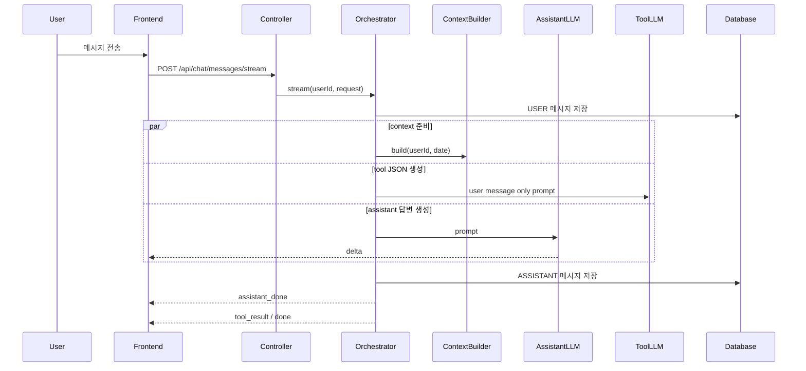

# 017 스트리밍 첫 표출 지연 단축 실험

## Status

in_progress

## Goal

스트리밍 채팅에서 사용자가 메시지를 보낸 뒤 첫 답변 조각이 보이기까지의 시간을 줄인다.

현재 병목 로그를 기준으로 가능한 가설을 세우고, 각 변경을 독립 실험으로 적용하여 `first_delta_ms`, `context_wait_ms`, `tool_join_wait_ms`, `total_ms`가 얼마나 감소하는지 비교한다.

단, assistant 답변에는 user context가 반드시 필요하다는 전제를 유지한다. context가 오래 걸린다는 이유만으로 context를 생략하거나 timeout fallback으로 넘어가지 않는다.

## Read First

- `AGENTS.md`
- `PROJECT_PROFILE.md`
- `docs/PROJECT_INDEX.md`
- `tasks/014-parallel-streaming-chat-tools.md`
- `docs/AI_CHAT/README.md`
- `backend/src/main/java/com/aihealthcoach/chat/service/ChatStreamingOrchestrator.java`
- `backend/src/main/java/com/aihealthcoach/chat/service/ChatStreamingServiceImpl.java`
- `backend/src/main/java/com/aihealthcoach/chat/service/PromptBuilderImpl.java`
- `frontend/src/stores/chatStore.js`
- `frontend/src/views/chat/ChatView.vue`
- `data/chat-stream-latency/README.md`
- `data/chat-stream-latency/utterances.jsonl`

## Current Behavior

스트리밍 채팅은 사용자 메시지 저장 후 context build와 tool LLM을 병렬로 처리한다. assistant LLM은 context build가 끝난 뒤 시작한다.

`ContextBuilderImpl` 내부는 현재 다음 작업을 순차 실행한다.

1. daily summary refresh
2. user profile 조회
3. daily goal 조회
4. daily meals 조회
5. daily exercises 조회
6. recent daily summaries 조회
7. recent chat turns 조회
8. active memories 조회

이 중 상당수는 서로 의존성이 없으므로 병렬화 가능성이 있다.

최근 관측값:

| metric | observed | interpretation |
|---|---:|---|
| `context_wait_ms` | 701ms | timeout fallback 제거 전 관측된 context 대기 시간 |
| `first_delta_ms` | 2037ms | 사용자 요청 후 첫 delta까지 약 2.0초 |
| `tool_join_wait_ms` | 835ms | assistant 저장 후 tool 결과를 기다리는 시간 |

현재 첫 표출 지연은 대략 `context_wait_ms` 700ms와 provider 첫 토큰 지연 약 1300ms가 합쳐진 형태로 보인다.

## Target Behavior

- context를 포함한 상태에서 첫 답변 표출 시간이 현재보다 유의미하게 감소한다.
- context, assistant, tool 각각의 지연 원인을 분리해서 설명할 수 있다.
- 적용 후보별 개선폭과 trade-off를 기록하여 최종 선택의 근거를 남긴다.
- tool 결과가 느려도 일반 답변의 체감 완료를 불필요하게 늦추지 않는다.

## Target Sequence



## Measurement Contract

| Metric | Meaning | Primary Use |
|---|---|---|
| `user_save_ms` | USER 메시지 저장 시간 | DB 저장이 첫 표출을 막는지 확인 |
| `context_wait_ms` | assistant 시작 전 context 대기 시간 | context wait cap 조정 효과 확인 |
| `assistant_prompt_ms` | assistant prompt 생성 시간 | prompt assembly 비용 확인 |
| `first_delta_ms` | 요청 시작 후 첫 delta까지 | 핵심 사용자 체감 지표 |
| `assistant_stream_ms` | assistant stream 전체 시간 | 답변 생성 완료 시간 |
| `assistant_save_ms` | ASSISTANT 메시지 저장 시간 | 저장 병목 확인 |
| `tool_total_ms` | tool LLM + parse + proposal 처리 시간 | tool 병목 확인 |
| `tool_join_wait_ms` | assistant 후 tool 결과 대기 시간 | 마지막 완료 지연 확인 |
| `total_ms` | 전체 stream 처리 시간 | end-to-end 비교 |

로그 검색:

```bash
docker logs ai-health-backend --tail 500 | grep -E "chat_stream_timing|chat_stream_emitter"
```

context build 내부 단계별 로그:

```bash
docker logs ai-health-backend --tail 500 | grep chat_context_build_timing
```

## Experiment Dataset

반복 실험 발화는 `data/chat-stream-latency/utterances.jsonl`을 사용한다.

dataset은 다음 유형을 포함한다.

| Category | Purpose |
|---|---|
| `general_coaching` | tool 호출이 거의 없는 일반 코칭 지연 |
| `history_question` | context 의존 답변 지연 |
| `meal_record` | meal tool 후보 요청 |
| `exercise_record` | exercise tool 후보 요청 |
| `weight_record` | weight tool 후보 요청 |
| `memory_save` | memory 저장 후보 요청 |
| `mixed_record` | 여러 tool 후보가 섞인 요청 |
| `ambiguous_context` | context가 답변 품질에 중요한 모호한 요청 |
| `long_user_message` | 긴 사용자 발화에서 prompt/provider 지연 |

각 발화는 같은 실험 조건에서 `N`회 반복한다.

권장 반복 수:

- 빠른 smoke: `N=3`
- baseline/후보 비교: `N=10`
- 최종 판단: `N=30`

결과는 category별 p50/p95/p99/max와 전체 p50/p95/p99/max를 모두 기록한다.

## Hypotheses

| ID | Hypothesis | Expected Impact | Risk |
|---|---|---|---|
| H1 | context build 내부의 독립 조회를 병렬화하면 context를 유지하면서 첫 표출이 감소한다. | `context_wait_ms` 감소 | executor 경합, DB pool 점유 증가 |
| H2 | daily summary refresh를 context critical path에서 분리하면 context build가 빨라진다. | `context_wait_ms` 감소 | summary freshness 정책 필요 |
| H3 | daily summary/context cache hit ratio를 높이면 context build가 빨라진다. | `context_wait_ms` 감소 | cache 무효화 정책 필요 |
| H4 | context 구성 요소별 timing 로그를 추가하면 실제 병목 조회를 특정할 수 있다. | 원인 식별 | 로그 노이즈 증가 |
| H5 | assistant prompt 길이를 줄이면 provider first token latency가 감소한다. | `first_delta_ms - context_wait_ms` 감소 | 답변 품질/근거 부족 |
| H6 | assistant model/provider 변경 또는 옵션 조정으로 first token latency가 감소한다. | provider 첫 토큰 지연 감소 | 비용, 품질, 안정성 차이 |
| H7 | USER 메시지 저장을 LLM 시작 후로 미루면 첫 표출이 줄어든다. | `first_delta_ms` 소폭 감소 가능 | 실패 복구/대화 일관성 위험 큼 |
| H8 | tool 결과를 `done` 이후 별도 상태로 처리하면 답변 완료 체감이 빨라진다. | `tool_join_wait_ms` 체감 제거 | 프론트 상태/UX 정책 변경 필요 |
| H9 | SSE flush/프론트 파서/타이핑 큐가 첫 화면 표시를 늦추는지 확인한다. | 실제 화면 first paint 감소 가능 | backend metric만으로는 확인 불가 |
| H10 | context와 tool LLM의 thread pool 경합이 assistant 첫 토큰을 늦춘다. | `first_delta_ms` 감소 가능 | executor 분리/튜닝 필요 |
| H11 | context 내부 병렬화가 단일 요청은 빠르게 만들지만 동시 요청에서 DB pool 대기와 p99 지연을 키울 수 있다. | tail latency/DB pool risk 식별 | 부하 조건을 운영 규모와 맞춰 해석해야 함 |

## Experiment Plan

각 실험은 가능한 한 한 변수만 바꾼다. 동일 입력을 최소 10회 이상 반복하고 p50/p95/p99/max를 기록한다.

| Experiment | Change | Compare Metrics | Decision Rule |
|---|---|---|---|
| E0 baseline | 현재 코드 그대로 측정 | all metrics | 기준값 확정 |
| E1 component timing | context build 구성 요소별 timing 로그 추가 | profile/goal/meal/exercise/summary/turn/memory ms | 병목 조회 1~2개 특정 |
| E2 context parallel build | context 내부 독립 조회 병렬화 | `context_wait_ms`, DB pool usage | context 유지 + p50 first delta 300ms 이상 감소하면 우선 후보 |
| E3 refresh off critical path | daily summary refresh를 비동기/사전 refresh로 분리 | `context_wait_ms`, summary freshness | freshness 유지 가능하면 후보 |
| E4 context cache | context build/cache 경로 개선 | `context_wait_ms` | context를 유지하면서 first delta가 감소하면 우선 후보 |
| E5 prompt slim | assistant prompt 최소화 | provider first token component | 답변 품질 유지 시 후보 |
| E6 tool late delivery | assistant `done`과 tool 결과 분리 | `tool_join_wait_ms`, UX | tool 대기로 인한 하단 이동/완료 지연이 줄면 후보 |
| E7 executor isolation | assistant/context/tool executor 분리 또는 제한 | `first_delta_ms`, variance | p90 지연 감소 시 후보 |
| E8 frontend first paint | delta 수신 시점과 DOM 표시 시점 측정 | browser timing | backend first delta와 화면 표시 차이가 크면 프론트 개선 |
| E9 concurrent load | `REQUESTS`, `CONCURRENCY`를 올려 동시 SSE 요청 실행 | p50/p90/p95/p99, error rate, `hikaricp_connections_*` | p99 또는 pending connection이 튀면 executor/pool 크기 재조정 |

## Scope

- `backend/src/main/java/com/aihealthcoach/chat/service/ChatStreamingOrchestrator.java`
- `backend/src/main/java/com/aihealthcoach/chat/service/ChatStreamingServiceImpl.java`
- `backend/src/main/java/com/aihealthcoach/chat/service/ContextBuilderImpl.java`
- `backend/src/main/java/com/aihealthcoach/chat/service/PromptBuilderImpl.java`
- `backend/src/test/java/com/aihealthcoach/chat/service/ChatStreamingOrchestratorTest.java`
- `frontend/src/api/chatApi.js`
- `frontend/src/stores/chatStore.js`
- `frontend/src/views/chat/ChatView.vue`
- `data/chat-stream-latency/`
- 필요 시 `docs/experiments/`에 측정 결과 문서 추가
- 필요 시 `data/` 또는 `backend/harness/scripts/`에 반복 측정 스크립트 추가

## Do Not Implement

- 새로운 intent routing 정책 도입
- tool calling에 user context 추가
- 실험 전 provider/model을 무작정 교체
- context 없는 assistant 답변을 최종 정책으로 채택
- context wait timeout fallback 재도입
- 일반 `/error` endpoint를 공개적으로 허용하는 보안 완화

## Related Tables

- `chat_messages`
- daily summary/context 관련 테이블이 사용되는 경우 해당 task에서 확인

## Invariants

- USER 메시지와 ASSISTANT 메시지 저장 순서/실패 정책은 실험별로 명시적으로 검토한다.
- assistant 답변에는 user context가 포함되어야 한다.
- assistant stream 실패 시 ASSISTANT 저장은 없어야 한다.
- tool 실패는 assistant 답변을 깨뜨리지 않아야 한다.
- SSE 완료 후 Tomcat/Security async redispatch 오류가 재발하지 않아야 한다.
- 프론트 표시 순서는 `내 메시지 -> 일반 답변 -> tool 결과`를 유지해야 한다.

## Acceptance Criteria

- [ ] baseline 측정값을 p50/p95/p99/max로 기록한다.
- [ ] `data/chat-stream-latency/utterances.jsonl`의 모든 발화를 동일 조건에서 N회 반복 측정한다.
- [ ] context build 구성 요소별 timing을 기록하여 병목 조회를 특정한다.
- [ ] context 유지 조건에서 최소 3개 이상의 지연 단축 가설을 독립 실험으로 측정한다.
- [ ] 각 실험별 감소폭을 `first_delta_ms`, `context_wait_ms`, `tool_join_wait_ms`, `total_ms` 기준으로 기록한다.
- [ ] 최종 선택 후보와 버린 후보의 이유를 문서화한다.
- [ ] 채택한 변경에 대한 회귀 테스트를 추가/수정한다.

## Verification

```bash
cd backend && mvn test
cd frontend && npm run build
```

반복 실험은 로컬 Docker 환경에서 동일 입력으로 수행한다.

```bash
docker compose up --build
docker logs ai-health-backend --tail 500 | grep chat_stream_timing
```

dataset 기반 반복 실행은 별도 스크립트를 추가할 수 있다.

```bash
N=10 data/chat-stream-latency/run-chat-stream-latency.sh
```

동시 요청 부하와 tail latency는 아래 스크립트로 확인한다.

```bash
REQUESTS=100 CONCURRENCY=5 data/chat-stream-latency/run-chat-stream-load.sh
```

동시성 단계를 바꿔가며 p50/p95/p99를 비교한다.

```bash
REQUESTS=100 CONCURRENCIES="1 3 5 10" data/chat-stream-latency/run-chat-stream-load-matrix.sh
```

## Tests

- 추가:
  - assistant가 context build 완료 전 시작하지 않는 테스트
  - context build 내부 병렬화가 동일한 context shape을 반환하는 테스트
  - assistant/tool 완료 순서 테스트
  - tool 지연이 assistant stream을 막지 않는 테스트
  - SSE 완료 후 Security async redispatch 회귀 테스트
- 수정:
  - `ChatStreamingOrchestratorTest`
  - 필요 시 frontend store 테스트 또는 수동 검증 체크리스트
- 추가하지 않은 이유:
  - provider latency 자체는 real provider 의존성이 있으므로 단위 테스트가 아니라 실험 로그로 검증한다.

## Notes / Risks

- `first_delta_ms`는 backend 기준 첫 delta 생성 시점이다. 실제 화면 표출은 frontend 파서/DOM update/typewriter queue 때문에 더 늦을 수 있다.
- context build 내부 병렬화는 DB pool 점유를 늘릴 수 있으므로 p95/p99와 pool pressure를 같이 본다.
- tool 결과를 늦게 표시하면 답변 완료감은 좋아질 수 있지만, 기록 제안 UX는 별도 상태 설계가 필요하다.
- provider/model 변경은 비용과 품질 비교가 필요하므로 마지막 후보로 둔다.
