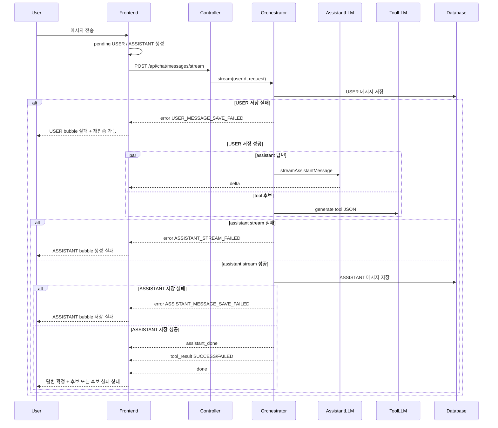

# 018 채팅 스트리밍 실패 fallback 정책 구현

## Status

ready

## Goal

`POST /api/chat/messages/stream`의 실패 케이스별 fallback을 명확히 구현한다.

현재 서버는 주요 실패를 SSE `error` 또는 `tool_result.status=FAILED`로 구분하지만, 프론트는 대부분 하나의 전역 `chatStore.error`와 `markPendingMessageFailed()`로 처리한다. 이 작업은 실패 종류별로 사용자가 이해할 수 있는 상태와 재시도 동선을 제공한다.

작업은 한 번에 구현하지 않고 아래 slice를 하나씩 진행한다.

1. F1: USER 메시지 저장 실패 fallback
2. F2: tool 실패 fallback
3. F3: assistant stream 실패 fallback
4. F4: ASSISTANT 메시지 저장 실패 fallback
5. F5: client disconnect / emitter timeout 서버 fallback 검증

## Read First

- `AGENTS.md`
- `PROJECT_PROFILE.md`
- `docs/PROJECT_INDEX.md`
- `docs/AI_CHAT/README.md`
- `tasks/014-parallel-streaming-chat-tools.md`
- `tasks/017-streaming-first-token-latency-experiment.md`
- `backend/src/main/java/com/aihealthcoach/chat/service/ChatStreamingOrchestrator.java`
- `backend/src/main/java/com/aihealthcoach/chat/service/SseEmitterChatStreamEventSink.java`
- `backend/src/test/java/com/aihealthcoach/chat/service/ChatStreamingOrchestratorTest.java`
- `backend/src/test/java/com/aihealthcoach/chat/service/SseEmitterChatStreamEventSinkTest.java`
- `frontend/src/api/chatApi.js`
- `frontend/src/stores/chatStore.js`
- `frontend/src/views/chat/ChatView.vue`

## Current Behavior

서버 스트리밍 정책은 대략 다음과 같다.

- USER 저장 실패: `error` event, code `USER_MESSAGE_SAVE_FAILED`
- assistant stream 실패: `error` event, code `ASSISTANT_STREAM_FAILED`
- ASSISTANT 저장 실패: `error` event, code `ASSISTANT_MESSAGE_SAVE_FAILED`
- tool 생성/파싱/proposal 실패: `tool_result.status=FAILED`, reason `GENERATION_FAILED` / `PARSE_FAILED` / `PROPOSAL_FAILED`
- client disconnect 또는 send 실패: `SseEmitterChatStreamEventSink`가 예외를 올리고, `completeWithError()`는 `SseEmitter.complete()`로 suppress

프론트는 현재 `sendMessage()`에서 pending USER와 pending ASSISTANT를 먼저 추가한다. SSE `error`가 오면 `chatStore.error`를 채우고 `markPendingMessageFailed()`로 assistant bubble만 실패 처리한다.

이 때문에 실패 원인별 fallback 차이가 UI에 충분히 드러나지 않는다.

## Target Behavior

### F1. USER 메시지 저장 실패

- 서버는 기존처럼 `USER_MESSAGE_SAVE_FAILED`를 보낸다.
- 프론트는 USER bubble을 실패 상태로 표시한다.
- ASSISTANT pending bubble은 제거하거나 "전송 전 실패" 상태로 남기지 않는다.
- 사용자는 같은 입력을 다시 보낼 수 있어야 한다.

### F2. tool 실패

- assistant 답변은 성공으로 확정한다.
- `tool_result.status=FAILED`는 전역 채팅 실패로 취급하지 않는다.
- 기록 후보 영역에만 degraded 상태를 표시한다.
- reason별 표시 문구를 구분한다.
  - `GENERATION_FAILED`: 기록 후보를 만들지 못함
  - `PARSE_FAILED`: 기록 후보 형식을 해석하지 못함
  - `PROPOSAL_FAILED`: 기록 후보 변환에 실패함
- 이 실패 때문에 ASSISTANT message를 실패로 표시하지 않는다.

### F3. assistant stream 실패

- 서버는 기존처럼 `ASSISTANT_STREAM_FAILED`를 보낸다.
- partial delta가 있더라도 ASSISTANT 저장은 없어야 한다.
- 프론트는 assistant bubble을 "답변 생성 실패" 상태로 표시한다.
- USER bubble은 서버에 저장된 메시지로 보되, 필요하면 재시도 버튼을 제공한다.
- tool 결과는 사용자에게 노출하지 않는다.

### F4. ASSISTANT 메시지 저장 실패

- 서버는 기존처럼 `ASSISTANT_MESSAGE_SAVE_FAILED`를 보낸다.
- 이미 화면에 streaming delta가 보였더라도 `assistant_done`이 없으면 확정된 채팅 기록으로 취급하지 않는다.
- 프론트는 assistant bubble을 "이 답변은 저장되지 않았습니다" 상태로 표시한다.
- tool 결과는 사용자에게 노출하지 않는다.
- 새로고침 후 사라질 수 있는 임시 답변임을 UI 상태로 구분한다.

### F5. client disconnect / emitter timeout

- 서버는 async error dispatch를 만들지 않고 조용히 stream을 닫는다.
- client disconnect는 사용자에게 추가 fallback을 보내려 하지 않는다.
- 회귀 테스트로 `SseEmitter.completeWithError()`를 직접 호출하지 않는 정책을 유지한다.

## Target Sequence



## Communication Contract

| From | To | Method/Call | Input | Output | Error |
|---|---|---|---|---|---|
| Frontend | Backend | `POST /api/chat/messages/stream` | `{content}` | SSE events | HTTP error before stream |
| Backend | Frontend | SSE `delta` | assistant chunk | `{content}` | no direct fallback |
| Backend | Frontend | SSE `assistant_done` | saved assistant | `{message}` | absent when save failed |
| Backend | Frontend | SSE `tool_result` | proposal result | `{status, mealProposal, exerciseProposal, weightProposal, memorySave, reason}` | `status=FAILED` |
| Backend | Frontend | SSE `error` | stream failure | `{code, message}` | terminal stream error |
| Store | View | `chatStore` state | stream event | bubble/proposal/error state | per-message failure state |

## Scope

- `frontend/src/api/chatApi.js`
- `frontend/src/stores/chatStore.js`
- `frontend/src/views/chat/ChatView.vue`
- 관련 CSS: `frontend/src/styles*.css`
- `backend/src/main/java/com/aihealthcoach/chat/service/ChatStreamingOrchestrator.java`
- `backend/src/main/java/com/aihealthcoach/chat/service/SseEmitterChatStreamEventSink.java`
- `backend/src/test/java/com/aihealthcoach/chat/service/ChatStreamingOrchestratorTest.java`
- `backend/src/test/java/com/aihealthcoach/chat/service/SseEmitterChatStreamEventSinkTest.java`
- 필요 시 `frontend` 테스트 또는 store 단위 테스트 추가

## Do Not Implement

- tool JSON을 `chat_messages`에 저장하지 않는다.
- assistant 실패 시 tool 결과만 단독으로 노출하지 않는다.
- USER 저장 실패 후 assistant/tool 생성을 진행하지 않는다.
- context 없는 assistant fallback 답변을 만들지 않는다.
- SSE 오류 처리를 위해 `/error` endpoint를 보안 permit list에 추가하지 않는다.
- provider/model 교체나 latency optimization을 이 작업에 섞지 않는다.

## Related Tables

- `chat_messages`

## Invariants

- `chat_messages`에는 USER 메시지와 ASSISTANT 메시지만 저장한다.
- tool JSON 원문은 채팅 기록으로 저장하지 않는다.
- `assistant_done`은 ASSISTANT 메시지가 DB에 저장된 뒤에만 보낸다.
- assistant stream 실패 또는 assistant 저장 실패 시 partial ASSISTANT 저장은 없어야 한다.
- tool 실패는 assistant 답변 확정을 깨뜨리지 않는다.
- `done`은 stream이 정상 완료된 경우에만 보낸다.
- client disconnect / emitter timeout은 Security async dispatch 오류를 재발시키지 않아야 한다.

## Acceptance Criteria

- [ ] F1: `USER_MESSAGE_SAVE_FAILED` 수신 시 USER bubble이 실패 상태가 되고 ASSISTANT pending bubble이 확정되지 않는다.
- [ ] F1: 같은 사용자 입력을 다시 보낼 수 있다.
- [ ] F2: `tool_result.status=FAILED` 수신 시 ASSISTANT 답변은 성공 상태로 유지된다.
- [ ] F2: tool 실패 reason별 사용자 표시 상태가 기록 후보 영역에만 반영된다.
- [ ] F3: `ASSISTANT_STREAM_FAILED` 수신 시 partial assistant는 저장/확정 상태로 보이지 않는다.
- [ ] F4: `ASSISTANT_MESSAGE_SAVE_FAILED` 수신 시 streamed assistant bubble은 저장 실패 상태로 표시되고 `assistant_done` 없이 확정되지 않는다.
- [ ] F5: `SseEmitterChatStreamEventSink.completeWithError()`는 `SseEmitter.completeWithError()`를 직접 호출하지 않는다.
- [ ] 각 실패 케이스의 backend 회귀 테스트가 존재한다.
- [ ] frontend store/view 상태 전이가 테스트되거나, 수동 검증 절차가 문서화된다.

## Verification

Backend targeted:

```bash
cd backend
mvn -Dmaven.repo.local=/tmp/m2-aihealthcoach -Dtest=ChatStreamingOrchestratorTest,SseEmitterChatStreamEventSinkTest test
```

Frontend targeted:

```bash
cd frontend
npm run build
```

가능하면 최종 검증:

```bash
./scripts/check
```

전체 검증이 OAuth/client id 등 환경값 때문에 실패하면, 실패 원인과 통과한 targeted command를 기록한다.

## Tests

- 추가:
  - frontend store 테스트: SSE `error.code`별 pending message 상태 전이
  - frontend store 테스트: `tool_result.status=FAILED`가 assistant bubble을 실패 처리하지 않는지
  - backend 회귀 테스트: 이미 있는 stream failure / save failure / tool failure / emitter completion 정책 유지
- 수정:
  - `ChatStreamingOrchestratorTest`에 누락된 실패 케이스가 있으면 보강
  - `SseEmitterChatStreamEventSinkTest` 유지
- 추가하지 않은 이유:
  - 브라우저 실제 disconnect는 자동화가 어려우면 서버 sink 단위 테스트와 수동 검증으로 대체 가능

## Implementation Slices

### F1. USER 메시지 저장 실패 fallback

- SSE error code를 프론트에서 보존하도록 `postChatMessageStream` 또는 handler contract를 정리한다.
- `chatStore.sendMessage()`에서 `USER_MESSAGE_SAVE_FAILED`를 별도 처리한다.
- pending USER bubble에 `failed`, `retryable`, `failureCode`를 부여한다.
- pending ASSISTANT bubble은 제거한다.

### F2. tool 실패 fallback

- `applyToolResult()`가 `status=FAILED`일 때 전역 `error`를 건드리지 않게 유지한다.
- tool failure state를 별도 필드로 둔다. 예: `toolProposalError`.
- `ChatView.vue`에서 proposal 영역 또는 assistant 아래 보조 상태로 표시한다.

### F3. assistant stream 실패 fallback

- `ASSISTANT_STREAM_FAILED`에서 pending ASSISTANT bubble을 실패 상태로 둔다.
- partial content가 있으면 그대로 보여주되 저장/확정 상태와 구분한다.
- `assistant_done`이 없는 상태에서는 `completeStreamingMessages()`가 성공 처리하지 않도록 한다.

### F4. ASSISTANT 메시지 저장 실패 fallback

- `ASSISTANT_MESSAGE_SAVE_FAILED`에서 pending ASSISTANT bubble에 `notPersisted` 또는 `saveFailed` 상태를 둔다.
- 사용자가 새로고침하면 사라질 수 있는 임시 답변임을 UI로 구분한다.
- tool result는 무시한다.

### F5. client disconnect / emitter timeout fallback

- 현재 서버 정책을 유지한다.
- `SseEmitterChatStreamEventSinkTest`가 `complete()` 호출과 `completeWithError()` 미호출을 검증한다.
- 필요 시 로그 레벨과 메시지를 정리한다.

## Notes / Risks

- 현재 `chatStore.error`는 채팅 thread 상단 전역 에러로 표시된다. 모든 stream 실패를 여기에만 넣으면 이미 보이는 bubble 상태와 중복될 수 있다.
- `assistant_done` 전까지 assistant bubble은 임시 상태다. 이 구분이 흐려지면 저장 실패 후 새로고침 시 사용자가 "답변이 사라졌다"고 느낄 수 있다.
- tool 실패는 사용자가 대화 자체를 실패로 느끼지 않도록 좁게 표시해야 한다.
- backend targeted test는 통과해도 전체 `mvn test`는 OAuth test property 문제로 실패할 수 있다. 이 경우 환경 실패와 작업 실패를 분리해서 보고한다.
