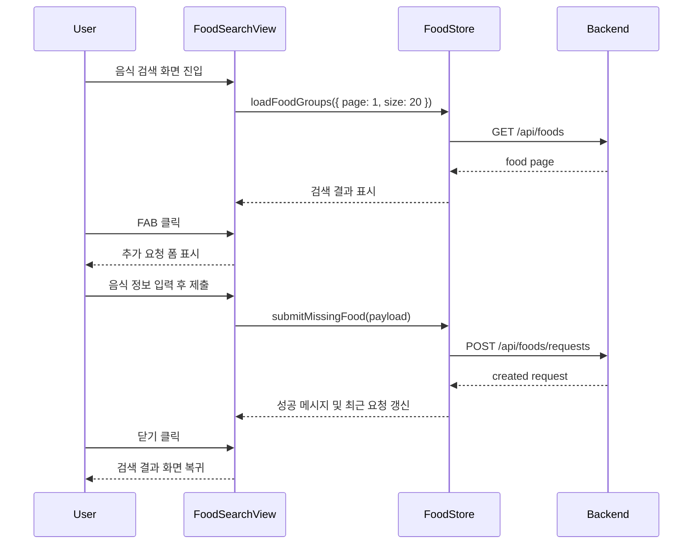

# 019 음식 검색 디자인 핸드오프 반영

## Status

in_progress

## Goal

`design_handoff_health_coach`의 메인 화면 디자인 레퍼런스를 기준으로 음식 검색 화면을 먼저 정리한다.

이번 작업의 1차 목표는 전체 5개 뷰 리디자인이 아니라, 현재 구현된 음식 검색 기능을 유지하면서 handoff의 핵심 변경점인 **우하단 FAB → 음식 추가 요청 폼 전환** 흐름을 Vue 3 코드에 반영하는 것이다.

## Read First

- `AGENTS.md`
- `PROJECT_PROFILE.md`
- `docs/PROJECT_INDEX.md`
- `design_handoff_health_coach/README.md`
- `design_handoff_health_coach/reference/AI 헬스코치 메인.dc.html`
- `design_handoff_health_coach/reference/screenshot-food-search-fab.png`
- `design_handoff_health_coach/reference/screenshot-food-add-form.png`
- `frontend/src/views/foods/FoodSearchView.vue`
- `frontend/src/stores/foodStore.js`
- `frontend/src/api/foodApi.js`
- `frontend/src/styles.css`
- `frontend/src/styles/app.css`

## Current Behavior

`FoodSearchView.vue`는 현재 다음 흐름을 제공한다.

- `/foods` 진입 시 음식 목록을 `GET /api/foods`로 조회한다.
- 검색어 입력은 debounce 후 `foodStore.loadFoodGroups()`를 호출한다.
- 검색 결과 카드를 클릭하면 우측 영양 미리보기와 식단 기록 패널이 갱신된다.
- 찾는 음식 등록 요청은 검색 결과 아래의 `food-submission-panel`에서 접기/펼치기 방식으로 표시된다.
- 등록 요청 제출은 이미 `POST /api/foods/requests`와 `foodStore.submitMissingFood()`에 연결되어 있다.
- 검색 결과가 없으면 `POST /api/foods/search-misses`로 누락 검색어 기록을 예약한다.

현재 화면은 기존 앱 톤의 카드형 2열 레이아웃이고, handoff의 `position:absolute` FAB나 메인 영역 전체 폼 전환 구조는 아직 없다.

## Target Behavior

음식 검색 화면은 handoff의 음식 검색 화면을 우선 반영한다.

- 전체 리디자인은 기능 회귀를 줄이기 위해 단계적으로 진행한다.
  - 1단계: 기존 DOM/동작을 최대한 유지하면서 `AppShell` 뼈대를 추가한다.
  - 2단계: 인증 필요 화면을 `AppShell`로 점진 이관한다.
  - 3단계: handoff의 `TopBar`, `SideNav`, `RightPanel` 구조를 공통 shell로 확장한다. 현재는 `TopBar`와 `SideNav`까지 이관하고, `RightPanel`은 다음 slice로 분리한다.
  - 4단계: 화면별 hifi CSS를 적용한다.
- shell 이관 단계에서는 색상/간격/카드 모양을 크게 바꾸지 않고, 라우팅/로그아웃/API 호출/선택 상태가 그대로 동작하는지 먼저 확인한다.
- 음식 검색 메인 영역은 `position: relative` 기반으로 구성하고 검색 상태와 추가 요청 상태를 전환한다.
- 검색 상태에서는 검색 바, 인기 검색어 칩, 결과 헤더, 결과 목록, 페이지네이션, 우측 영양 미리보기를 유지한다.
- 검색 상태 우하단에는 회색 확장형 FAB를 표시한다.
  - 텍스트: `찾는 음식이 없나요?`
  - 우측 원형 영역 안에 `+` 아이콘
  - 클릭 시 `foodAdd` 또는 동등한 로컬 상태가 `true`가 되어 추가 요청 폼으로 전환된다.
- 추가 요청 상태에서는 검색 결과 영역을 숨기고 음식 추가 요청 폼을 메인 영역에 표시한다.
  - 제목: `찾는 음식이 없나요?`
  - 설명: `음식 정보를 입력해 등록 요청을 보내면 관리자가 검토합니다.`
  - 우측 `닫기` 버튼 클릭 시 검색 상태로 돌아간다.
  - 기존 `submitMissingFood()` API 흐름과 validation은 유지한다.
- `/foods`에 다시 진입하거나 음식 검색 사이드바 링크를 누르면 검색 상태가 기본값이어야 한다.
- 등록 요청 성공/실패 메시지와 최근 요청 목록은 새 폼 구조 안에서 자연스럽게 확인할 수 있어야 한다.

## Target Sequence



## Communication Contract

| From | To | Method/Call | Input | Output | Error |
|---|---|---|---|---|---|
| `FoodSearchView` | `foodStore` | `loadFoodGroups` | `{ query, page, size }` | `foodPage.items`, `totalItems`, `totalPages` | `foodStore.error` |
| `FoodSearchView` | `foodStore` | `submitMissingFood` | 음식명, 브랜드, 기준, 영양성분 | 생성된 요청, `submissionMessage` | `submissionError` |
| `FoodSearchView` | `foodStore` | `loadMyFoodSubmissions` | `{ page, size }` | `submissionPage.items` | `submissionError` |
| `FoodSearchView` | `mealStore` | `saveMealItems` | `mealDate`, `mealType`, `items` | 저장된 일일 식단 | `mealStore.saveMealError` |

## Scope

- `frontend/src/components/app/AppShell.vue`
- `frontend/src/views/foods/FoodSearchView.vue`
- `frontend/src/styles/app.css`
- 필요 시 `frontend/src/styles.css`의 색상/폰트 토큰
- 필요 시 `frontend/src/components/app/AppSidebar.vue`의 `/foods` 재진입 동작

## Do Not Implement

- 전체 5개 뷰를 한 번에 hifi 디자인으로 갈아엎지 않는다.
- `AppShell` 1차 작업에서 `RightPanel`의 실제 기능을 한 번에 구현하지 않는다.
- shell 이관과 hifi CSS 재작성은 한 커밋/한 slice에 섞지 않는다.
- `ChatView`, `CalendarView`, `DailyRecordView`, `ProfileView` 리디자인은 이번 작업에 포함하지 않는다.
- 음식 등록 요청 backend API, DB schema, admin approval flow를 변경하지 않는다.
- 검색 결과 API contract를 바꾸지 않는다.
- 실제 API가 이미 연결된 흐름을 더미 데이터로 되돌리지 않는다.
- handoff의 React/HTML 프로토타입 마크업을 그대로 복사하지 않는다.

## Related Tables

- `foods`
- 음식 등록 요청 관련 테이블
- `meals`
- `meal_items`

## Invariants

- `AppShell` 이관 후에도 기존 라우트의 인증 guard와 `RouterLink` 이동은 유지되어야 한다.
- 로그아웃은 기존처럼 auth/chat/dailyGoal/exercise/meal/profile/weight stores를 정리해야 한다.
- 음식 검색은 계속 `GET /api/foods?query=&page=&size=`의 paging 결과를 사용한다.
- 기본 page size는 현재처럼 `20`을 유지한다.
- 검색 결과 행 또는 카드 선택은 우측 영양 미리보기를 갱신해야 한다.
- 선택한 음식의 오늘 식단 기록 기능은 유지해야 한다.
- 음식 추가 요청은 기존 `POST /api/foods/requests` payload 의미를 유지한다.
- 검색 결과 없음 상태의 search miss 기록은 기존 debounce/중복 방지 정책을 유지한다.
- 모바일/좁은 화면에서 FAB, 폼, 우측 영양 패널이 서로 겹쳐 조작 불가능한 상태가 되면 안 된다.

## Acceptance Criteria

- [x] `AppShell` 뼈대가 추가되고, 최소 한 화면이 기존 기능을 유지한 채 이 shell을 사용한다.
- [x] `AppShell`이 `App.vue`의 `RouterView` 바깥으로 올라가 라우트 전환 시 shell이 유지된다.
- [x] `TopBar`와 `SideNav`가 추가되고 기존 로그아웃/store 정리 및 라우팅이 유지된다.
- [ ] `/foods` 검색 상태 우하단에 handoff와 같은 `찾는 음식이 없나요?` FAB가 표시된다.
- [ ] FAB 클릭 시 검색 결과 영역이 숨겨지고 음식 추가 요청 폼이 메인 영역에 표시된다.
- [ ] 추가 요청 폼의 `닫기` 버튼 클릭 시 검색 상태로 돌아간다.
- [ ] 추가 요청 폼은 9개 입력 필드와 `관리자에게 요청` 제출 버튼을 가진다.
- [ ] 기존 `foodStore.submitMissingFood()` 성공/실패 메시지가 새 폼 흐름에서도 표시된다.
- [ ] 음식 검색, 페이지 이동, 결과 선택, 우측 영양 미리보기, 오늘 식단 기록 기능이 회귀하지 않는다.
- [ ] `frontend/src/styles.css` 또는 `frontend/src/styles/app.css`의 색상/간격은 handoff 토큰과 크게 어긋나지 않는다.
- [ ] 데스크톱과 모바일 폭에서 텍스트 겹침이나 버튼 잘림이 없다.

## Verification

Frontend targeted:

```bash
cd frontend
npm run build
```

가능하면 최종 검증:

```bash
./scripts/check
```

전체 검증이 WSL `cmd.exe` 또는 환경 문제로 막히면, 실패 원인을 기록하고 `cd frontend && npm run build` 결과를 우선 남긴다.

## Tests

- 추가:
  - 자동화된 frontend 테스트 인프라가 있으면 `FoodSearchView`의 검색/추가폼 상태 전환 테스트
- 수정:
  - 기존 음식 검색 store/API contract가 깨질 경우 관련 테스트 또는 수동 검증 절차 보강
- 추가하지 않은 이유:
  - 현재 frontend 테스트 harness가 build 중심이면, 이번 UI slice는 `npm run build`와 브라우저 수동 확인으로 검증한다.

## Notes / Risks

- `design_handoff_health_coach`는 현재 untracked handoff 자료이므로 task에서는 읽기 자료로만 참조한다.
- handoff는 전체 앱 shell과 5개 뷰를 포함하지만, 이 task는 음식 검색 화면의 핵심 변경점만 구현 대상으로 삼는다.
- 현재 `food-submission-panel`은 이미 API까지 연결되어 있으므로, 구현 시 기능을 새 UI 위치로 이동하는 작업에 가깝다.
- 다음 후속 task로 전체 shell hifi 정리, 우측 패널 접기/펼치기, 프로필 탭/슬라이더 리디자인을 별도 분리할 수 있다.
