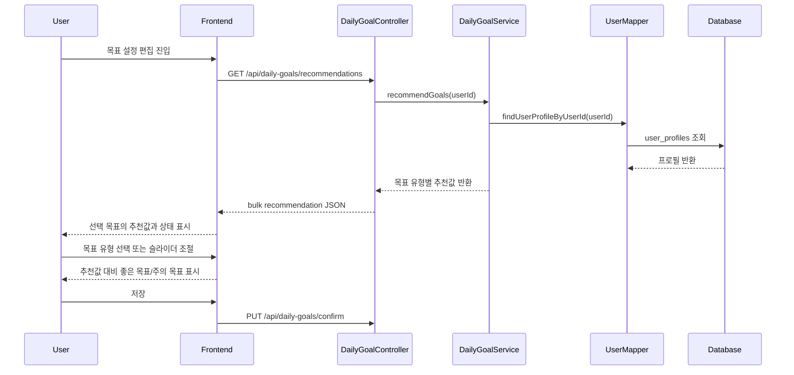

# 020 일일 목표 추천값 일괄 조회

## Status

done

## Goal

목표 설정 화면에 진입할 때 감량, 유지, 근육 증가 목표의 추천 섭취/운동 칼로리를 한 번에 받아오고, 사용자가 조절한 목표가 추천값의 `0.9`~`1.1`배 범위인지에 따라 좋은 목표/주의 목표 상태를 표시한다.

## Read First

- `AGENTS.md`
- `PROJECT_PROFILE.md`
- `docs/PROJECT_INDEX.md`
- `backend/src/main/java/com/aihealthcoach/dailygoal/controller/DailyGoalController.java`
- `backend/src/main/java/com/aihealthcoach/dailygoal/service/DailyGoalService.java`
- `backend/src/main/java/com/aihealthcoach/dailygoal/service/DailyGoalServiceImpl.java`
- `backend/src/main/java/com/aihealthcoach/dailygoal/dto/DailyGoalDto.java`
- `frontend/src/api/dailyGoalApi.js`
- `frontend/src/stores/dailyGoalStore.js`
- `frontend/src/views/profile/ProfileView.vue`
- `frontend/src/components/shared/GoalTypeSelector.vue`

## Current Behavior

- 백엔드는 `GET /api/daily-goals/recommendation?goalType=...`에서 목표 유형 하나의 추천값만 계산한다.
- 추천 섭취 칼로리는 사용자 프로필의 키, 현재 몸무게, 성별, 나이를 사용해 유지 칼로리를 추정한 뒤 목표 유형별로 보정한다.
- 프론트 프로필 목표 설정 화면은 이 추천 API를 사용하지 않고 `ProfileView.vue`의 `GOAL_PRESETS` 고정값을 적용한다.
- 목표 선택 시 감량 `1600/300`, 유지 `2100/250`, 근육 증가 `2800/300` 값이 바로 폼에 들어간다.
- 슬라이더 안내 문구는 현재 슬라이더 위치 비율만 보고 표시하며, 사용자 개인 추천값 대비 적절한지 판단하지 않는다.

## Target Behavior

- 기존 단건 추천 API는 더 이상 사용하지 않는 방향으로 개편하고, 목표 설정 편집에 진입할 때 프론트는 추천값 API를 한 번 호출해서 `WEIGHT_LOSS`, `MAINTENANCE`, `MUSCLE_GAIN` 추천값을 모두 받는다.
- 사용자가 목표 유형을 바꾸면 프론트 고정 프리셋 대신 서버에서 받은 해당 목표 유형의 추천값을 기본값으로 적용한다.
- 추천값 로드가 성공하면 목표별 기준값은 같은 편집 세션 안에서 재사용하고, 목표 유형 변경마다 추가 추천 API를 호출하지 않는다.
- 사용자가 슬라이더로 섭취/운동 목표를 조절하면 선택된 목표 유형의 추천값 대비 `0.9`~`1.1`배 범위이면 좋은 목표로 표시한다.
- `0.9`배 미만 또는 `1.1`배 초과이면 주의/나쁜 목표 상태로 표시한다.
- 좋은 목표가 아닐 때도 저장은 막지 않는다. 대신 해당 목표 항목의 안내 문구, 색상, 상태 배지를 즉시 바꿔 사용자가 조정 방향을 알 수 있게 한다.
- 슬라이더가 움직일 수 있는 `min`/`max` 범위는 현재 `GOAL_RANGE_CONFIG`의 목표 유형별 offset 정책을 유지한다.
- 저장 API는 사용자가 최종 조정한 `goalType`, `calorieIntakeGoal`, `exerciseCalorieGoal` 값을 그대로 저장한다.

## Frontend UX Rules

추천값 대비 상태는 섭취 목표와 운동 목표를 각각 독립적으로 계산한다.

| 상태 | 조건 | UI 표시 | 안내 문구 방향 | 저장 |
|---|---|---|---|---|
| 좋은 목표 | `recommended * 0.9 <= value <= recommended * 1.1` | 초록 계열 상태 배지와 슬라이더 강조색 | 현재 목표가 추천 범위 안에 있음을 알려준다. | 가능 |
| 너무 낮음 | `value < recommended * 0.9` | 노랑/주의 계열 상태 배지와 슬라이더 강조색 | 목표가 추천보다 낮으니 조금 올리는 방향을 제안한다. | 가능 |
| 너무 높음 | `value > recommended * 1.1` | 빨강/위험 계열 상태 배지와 슬라이더 강조색 | 목표가 추천보다 높으니 낮추거나 부담을 확인하라고 안내한다. | 가능 |

- 섭취 목표와 운동 목표가 모두 좋은 목표이면 전체 목표 상태를 좋은 목표로 보여준다.
- 둘 중 하나라도 너무 낮음 또는 너무 높음이면 전체 목표 상태를 주의 목표로 보여준다.
- 상태 변화는 슬라이더 조작 즉시 반영한다.
- 상태 문구는 현재 선택된 `goalType`의 추천값을 기준으로 한다. 목표 유형을 바꾸면 추천 기준과 상태도 함께 다시 계산한다.
- 슬라이더의 이동 가능 범위는 기존처럼 선택된 목표 유형의 기준값에 `GOAL_RANGE_CONFIG` offset을 더해 계산한다. 좋은 목표 범위와 슬라이더 이동 가능 범위는 같은 개념이 아니다.
- 좋은 목표가 아닐 때 저장 버튼을 비활성화하지 않는다. 버튼 근처 또는 footer 문구에서 “저장은 가능하지만 추천 범위를 벗어났어요” 수준의 안내만 제공한다.
- 추천값을 불러오지 못한 경우에는 기존 저장 흐름을 막지 않고, 추천 범위 상태 대신 추천값을 불러오지 못했다는 오류/안내를 보여준다.
- 구현 시 기존 `profile-goal-slider-copy` 안내 문구와 슬라이더 색상을 재사용해도 되지만, 섭취/운동 각각의 상태가 화면에서 구분되어야 한다.

## Target Sequence



## Communication Contract

| From | To | Method/Call | Input | Output | Error |
|---|---|---|---|---|---|
| Frontend | Controller | `GET /api/daily-goals/recommendations` | 인증 토큰 | 목표 유형별 추천 섭취/운동 칼로리 | `401/403`, 프로필 필수값 누락 시 기존 daily goal 오류 |
| Frontend | Controller | `PUT /api/daily-goals/confirm` | `{ goalType, calorieIntakeGoal, exerciseCalorieGoal }` | 저장된 현재 목표 | 기존 validation/auth 오류 |
| Service | UserMapper | `findUserProfileByUserId` | 인증된 `userId` | `UserProfile` | 프로필 없음/필수값 누락 |

응답 DTO 예시:

```json
{
  "WEIGHT_LOSS": {
    "calorieIntakeGoal": 1600,
    "exerciseCalorieGoal": 300
  },
  "MAINTENANCE": {
    "calorieIntakeGoal": 2100,
    "exerciseCalorieGoal": 250
  },
  "MUSCLE_GAIN": {
    "calorieIntakeGoal": 2400,
    "exerciseCalorieGoal": 300
  }
}
```

구현 시 JSON 필드명을 `recommendations` 배열 형태로 바꿔도 되지만, 프론트에서 목표 유형 키로 안정적으로 찾을 수 있어야 한다.

## Scope

- Backend:
  - 기존 `GET /api/daily-goals/recommendation?goalType=...` 단건 추천 API를 목표 유형별 일괄 추천 API로 개편
  - `dailygoal` controller/service/DTO에 목표 유형별 추천값 일괄 조회 응답 추가
  - 기존 추천 계산식 재사용
  - 관련 controller/service 테스트 추가 또는 수정
- Frontend:
  - `dailyGoalApi.js`와 `dailyGoalStore.js`에서 단건 추천 호출을 제거하고 일괄 추천값 로드로 교체
  - `ProfileView.vue`에서 목표 설정 편집 진입 시 추천값 1회 로드
  - 목표 유형 선택 시 서버 추천값을 기본값으로 적용
  - 슬라이더 `min`/`max`는 기존 `GOAL_RANGE_CONFIG` offset 방식 유지
  - 추천값 대비 `0.9`~`1.1` 상태 문구, 상태 배지, 슬라이더 색상, footer 안내 적용

## Do Not Implement

- 활동량 입력 UI나 `DEFAULT_ACTIVITY_FACTOR` 저장 기능
- 목표 체중까지의 기간 계산
- 탄단지 목표 추천값 계산
- AI Chat 응답 로직 변경
- `daily_goals` 테이블 구조 변경

## Related Tables

- `user_profiles`
- `daily_goals`

## Invariants

- 추천 계산은 인증된 `userId`의 프로필만 사용하고, 클라이언트가 보낸 사용자 식별자를 신뢰하지 않는다.
- 추천값 조회는 `daily_goals`를 저장하거나 갱신하지 않는다.
- 목표 저장은 기존처럼 사용자가 최종 확정한 값을 저장한다.
- 기존 `PUT /api/daily-goals/confirm`과 `GET /api/daily-goals/progress` 응답 계약은 깨지지 않아야 한다.
- 단건 추천 API를 유지하기 위한 별도 호환 레이어는 만들지 않는다.
- 추천값 대비 상태 판단은 선택된 `goalType`의 추천값을 기준으로 해야 한다.

## Acceptance Criteria

- [x] 목표 설정 편집 진입 시 프론트가 한 번의 API 호출로 세 목표 유형 추천값을 모두 받는다.
- [x] 프론트에서 기존 단건 추천 API 호출 경로가 제거된다.
- [x] 백엔드 단건 추천 API는 일괄 추천 API로 개편되며, 단건 호출을 위한 별도 유지 코드가 남지 않는다.
- [x] 감량/유지/근육 증가 선택 시 하드코딩 프리셋 대신 서버 추천값이 섭취/운동 목표 기본값으로 들어간다.
- [x] 추천값 로드 성공 후 같은 편집 세션에서 목표 유형을 바꿔도 추천 API를 반복 호출하지 않는다.
- [x] 슬라이더의 이동 가능 `min`/`max` 범위는 기존 `GOAL_RANGE_CONFIG` offset 정책을 유지한다.
- [x] 섭취 목표와 운동 목표 각각 추천값의 `0.9`~`1.1`배 범위이면 좋은 목표로 표시된다.
- [x] 섭취 목표 또는 운동 목표가 추천값의 `0.9`배 미만이면 해당 항목이 너무 낮음 상태로 표시되고, 목표를 올리는 방향의 안내 문구가 보인다.
- [x] 섭취 목표 또는 운동 목표가 추천값의 `1.1`배 초과이면 해당 항목이 너무 높음 상태로 표시되고, 목표를 낮추거나 부담을 확인하라는 안내 문구가 보인다.
- [x] 좋은 목표가 아니어도 저장 버튼은 활성 상태를 유지하며, 저장 가능하지만 추천 범위를 벗어났다는 안내가 보인다.
- [x] 추천값 로드 실패 시 저장 흐름은 막지 않고, 추천 범위 상태 대신 로드 실패 안내가 보인다.
- [x] 추천값 API가 프로필 필수값 누락을 기존 daily goal 추천 오류와 일관되게 처리한다.
- [x] 기존 목표 저장, 목표 진행 조회, 프로필 목표 유형 반영 흐름이 유지된다.

## Verification

```bash
./scripts/check
```

전체 검증을 실행할 수 없다면, 이유를 기록하고 가장 좁은 관련 명령을 실행한다.

```bash
cd backend && mvn test
cd frontend && npm ci && npm run build
```

## Tests

- 추가:
  - `DailyGoalServiceImplTest`: 목표 유형별 추천값을 한 번에 반환하고 기존 계산식을 재사용하는지 검증
  - `DailyGoalControllerTest`: 일괄 추천 API 응답 shape 검증
  - 프론트는 별도 단위 테스트 대신 `npm run build`로 컴파일 검증
- 수정:
  - 기존 단건 추천 테스트는 일괄 추천 API 기준으로 교체
- 추가하지 않은 이유:
  - 프론트 테스트 하네스가 없는 경우 `npm run build`와 수동 확인 항목을 Notes에 남긴다.

## Notes / Risks

- 현재 `docs/PROJECT_INDEX.md`에는 `backend/docs/daily-goal-tracking-plan.md`가 안내되어 있지만 현재 체크아웃에는 해당 파일이 없다. 구현 전 문서가 복구되면 함께 확인한다.
- 단건 추천 API는 사용하지 않는 방향으로 정리한다. 구현 전 `rg "fetchDailyGoalRecommendation|/api/daily-goals/recommendation|recommendGoal"`로 내부 사용처를 확인하고, 남은 사용처를 일괄 추천 흐름으로 이동한다.
- `0.9`~`1.1` 판단은 섭취/운동 목표 각각에 적용한다. 두 값 중 하나라도 범위를 벗어나면 전체 저장을 막지는 않고 경고 상태만 표시한다.
- 문구는 구현 시 다듬을 수 있지만, 너무 낮음/너무 높음의 조정 방향은 반드시 분리해서 보여준다.
